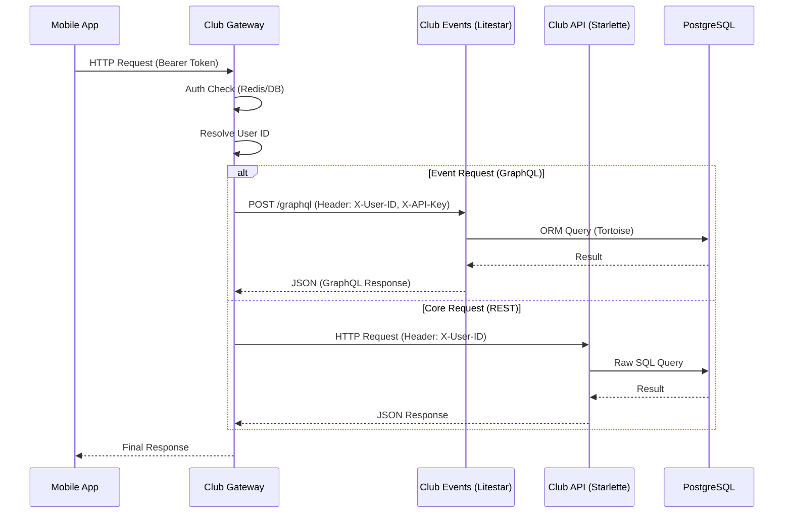

# Потоки Данных (Data Flow)

## 1. Request Lifecycle (Общий поток)

## 2. Аутентификация и Безопасность

1.  **Клиент -> Gateway**: Использует сессионный токен. Gateway валидирует его через Redis/DB и извлекает `user_id`.
2.  **Gateway -> Microservices**:
    *   **Authentication**: Gateway добавляет заголовок `X-API-Key` (секретный ключ сервера).
    *   **Context**: Gateway добавляет заголовок `X-User-ID` (ID текущего пользователя).
3.  **Club Events Middleware**:
    *   Проверяет `X-API-Key`. Если неверен -> 403 Forbidden.
    *   Доверяет `X-User-ID` и инжектит его в контекст GraphQL резолверов.
