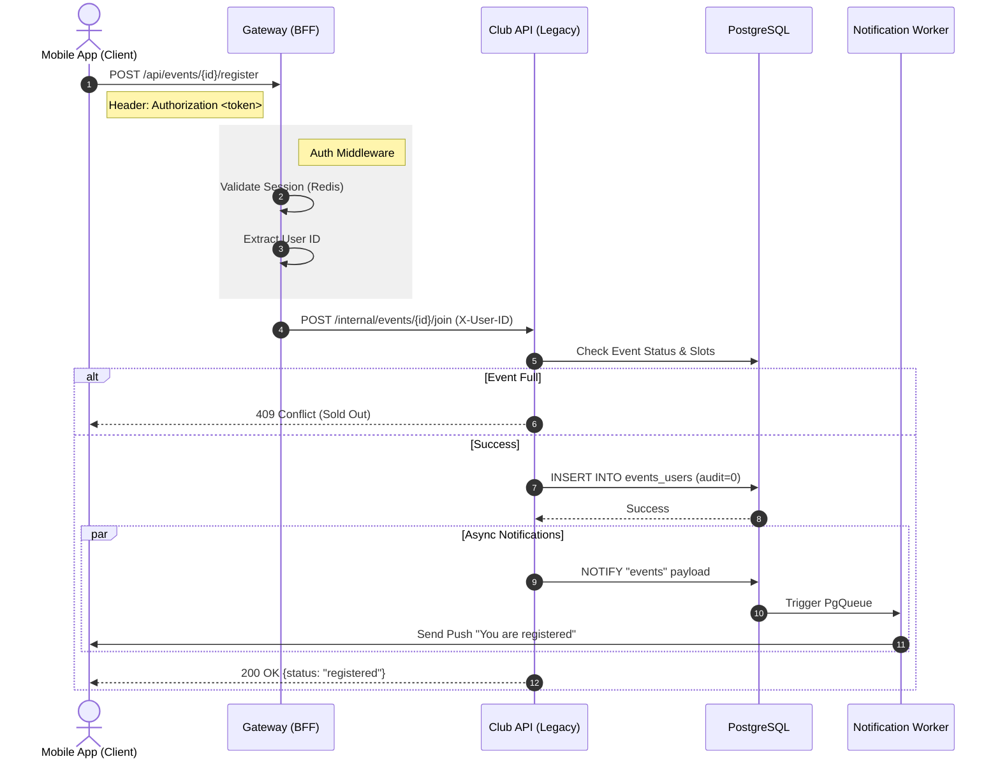

# Поток данных: Регистрация на событие

В этом документе описывается путь данных от нажатия кнопки "Пойду" в мобильном приложении до записи в базу данных PostgreSQL.

## Диаграмма последовательности

## 1. Инициирование запроса (Mobile App)

Пользователь нажимает "Записаться" на экране события.
*   **Source:** `club-client`
*   **Target:** `club-gateway-m` (порт 8004 в dev)
*   **Payload:** Зависит от метода (REST в legacy или GraphQL в будущем).
*   **Auth Header:** `Authorization: Bearer <session_token>`

## 2. Прохождение через Gateway (`club-gateway-m`)

Гейтвей выступает как центральная точка входа (BFF):
1.  **Auth Middleware:** Проверяет токен в Redis.
2.  **Context Injection:** Извлекает `user_id` и добавляет его в заголовок `X-User-ID`.
3.  **Routing:** Проксирует запрос в основной сервис `club-api` (порт 8000).

## 3. Обработка в `club-api` (Legacy Core)

Запрос попадает в обработчик `backend/apps/club-api/app/routes/endpoints/event.py`.

### Валидация и бизнес-логика
1.  **Проверка события:** Существует ли `event_id` и открыта ли еще регистрация.
2.  **Проверка прав:** Не заблокирован ли пользователь.
3.  **Запись в БД:** Основная логика записи находится в модуле `app/models/user.py` (методы работы с участием пользователя). Выполняется `INSERT` в таблицу связей `events_users`.

## 4. Слой Базы Данных (PostgreSQL)

*   **Таблица:** `events_users`
*   **Поля:**
    *   `event_id`: ID мероприятия.
    *   `user_id`: ID пользователя.
    *   `audit`: Статус (0 - зарегистрирован, 1 - подтвержден).
    *   `time_create`: Время записи.

## 5. Побочные эффекты (Side Effects)

После успешной записи в БД могут срабатывать следующие механизмы:

*   **Postgres NOTIFY:** Система может отправить сигнал через `LISTEN/NOTIFY`.
*   **Push-уведомления:** Сервис `club-api` (через `app/helpers/push.py`) может инициировать отправку пуша менеджеру события или самому пользователю.
*   **Email:** Если настроено, отправляется подтверждение на почту.