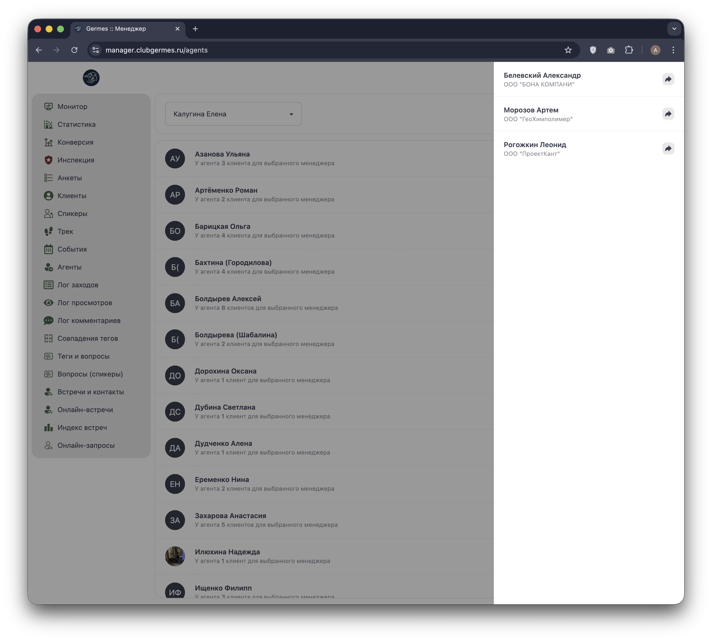
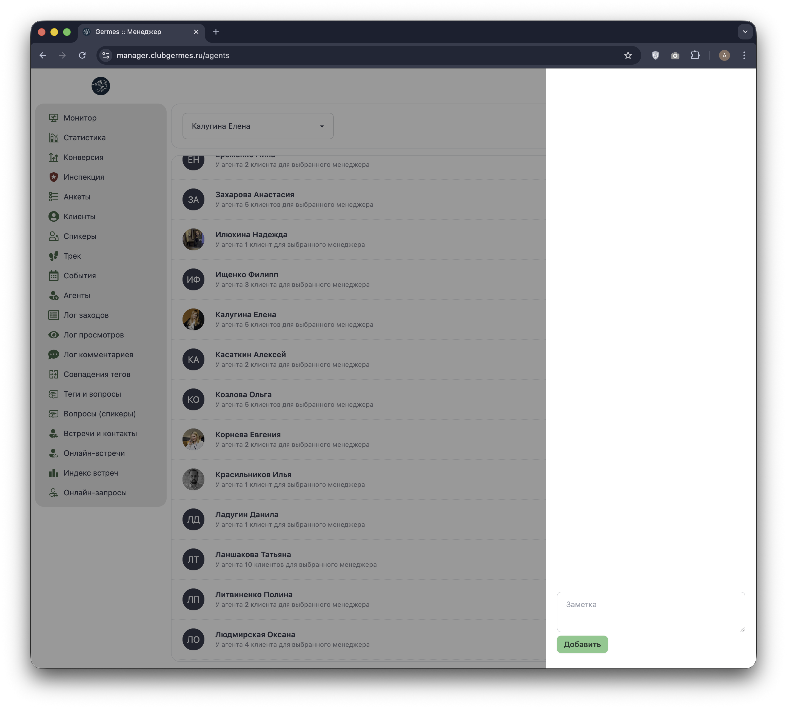

# 🤝 Менеджер: Агенты (Agents)

**Код:** `src/views/Agents.svelte`  
**Роут:** `/agents` (Layout: `Main`)

Модуль **Агенты** предназначен для управления партнерами (агентами), которые привлекают новых резидентов в Клуб. Интерфейс позволяет просматривать список агентов, фильтровать их по ответственным менеджерам, видеть закрепленных клиентов и вести историю взаимодействия (заметки).

## Список агентов

Основной экран отображает реестр всех зарегистрированных агентов.


{style="block"}

### Фильтрация и отображение

*   **Фильтр по менеджеру:** Выпадающий список вверху позволяет отфильтровать агентов.
    *   Логика: Агент показывается, если у него есть хотя бы один клиент, закрепленный за выбранным Коммьюнити-менеджером (КМ).
    *   Опции: "Все менеджеры", "Нет менеджера", конкретные КМ.
*   **Карточка агента:**
    *   **Аватар и Имя:** Данные агента из профиля.
    *   **Статистика:** Количество клиентов ("У агента N клиентов..."). Текст склоняется в зависимости от числа (функция `nwfi`).
    *   **Кнопки действий (справа):**
        1.  👤 **Список клиентов:** Открывает боковую панель со списком рефералов.
        2.  📝 **Журнал:** Открывает боковую панель с заметками по агенту.

## Управление агентом (Drawer)

При выборе действия открывается боковая панель (Drawer). Содержимое панели зависит от выбранного режима (`formData.type`).

### Режим: Список клиентов

Отображает список пользователей, которых привел данный агент.


{style="block"}

*   **Карточка клиента:** Показывает ФИО и компанию.
*   **Навигация:** Клик по кнопке справа (стрелка) перенаправляет в профиль этого клиента (`/users/:id`).

### Режим: Журнал заметок

Интерфейс для ведения истории взаимодействия с агентом (договоренности, условия, комментарии).


{style="block"}

*   **История:** Список прошлых заметок с датой и автором.
*   **Добавление:** Поле ввода "Заметка" и кнопка "Добавить" (зеленая).
*   **Редактирование:** Менеджер может редактировать свои заметки (иконка карандаша в списке).

## Техническая реализация

### Данные и API
*   **Список агентов:** `agentList` (Endpoint: `/ma/user/agent/list`). Возвращает список агентов и список их клиентов для построения фильтров на клиенте.
*   **Заметки:**
    *   `agentNotesList` (Получение).
    *   `agentNoteCreate` (Создание).
    *   `agentNoteUpdate` (Редактирование).

### Логика фильтрации
Фильтрация происходит на клиенте (`createAgentsList`).
```typescript
// Логика проверки принадлежности агента менеджеру
if (
    filter.communityManager == -1 ||
    (filter.communityManager == 0 && ag.communityManagers['0']) || // Клиенты без менеджера
    (filter.communityManager > 0 && ag.communityManagers[filter.communityManager.toString()])
) { ... }
```

### Компоненты
*   Используется стандартный layout `Drawer` (реализован через CSS классы DaisyUI `drawer`, `drawer-side`).
*   Переменная `formState` управляет видимостью боковой панели.
*   Переменная `formData.type` переключает контент между `'clients'` и `'notes'`.
