# 👥 Менеджер: Клиенты (CRM)

**Код:** `Users.svelte` (список), `User.svelte` (карточка) (frontend/club-manager/src/views/)  
**Роуты:** `/users` (список), `/users/:id` (карточка)

## Назначение
Центральный экран системы для управления клиентами клуба. Предоставляет полный функционал CRM: от поиска и просмотра списка клиентов до детального управления каждым клиентом через воронку продаж, планирование встреч, управление тарифами, контроль активности и коммуникации.

> **Визуализация UI**

### Список клиентов
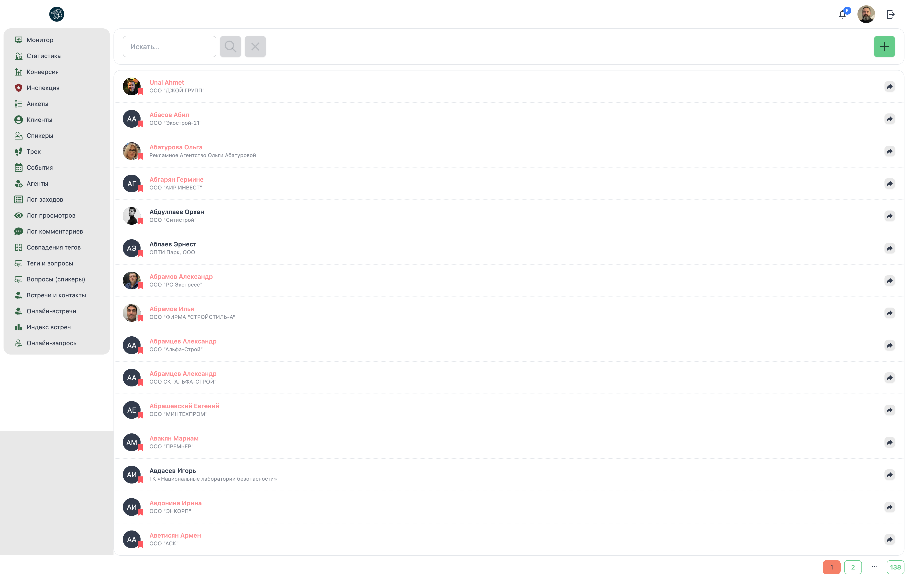
{style="block"}

### Детальная карточка клиента
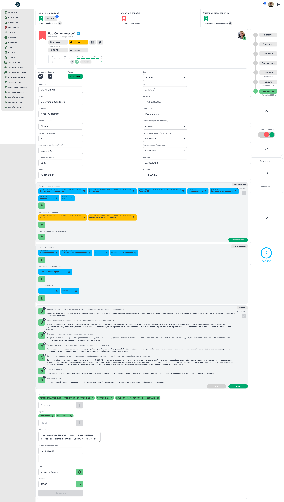
{style="block"}

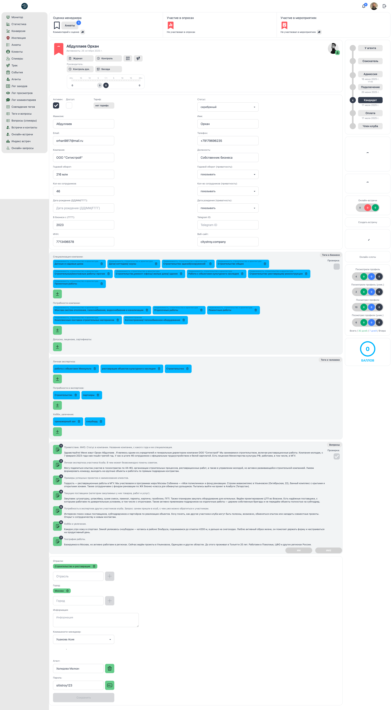
{style="block"}

---

## Список клиентов (Users.svelte)

### Элементы интерфейса

#### Поиск
Текстовое поле с автодополнением в верхней части экрана.

**Функциональность:**
*   **Автодополнение:** При вводе более 1 символа через 500мс запускается поиск.
*   **Результаты:** Отображается до 7 подсказок в выпадающем списке.
*   **Клик по подсказке:** Переход на карточку клиента.
*   **Поиск по Enter:** Отображение полного списка результатов с пагинацией.

**Кнопки:**
*   **Лупа** (🔍): Выполнить поиск.
*   **Крестик** (✕): Очистить поле поиска.

#### Карточка клиента в списке

**Структура карточки:**
*   **Аватар:** Круглое фото клиента (или инициалы).
*   **Имя:** Нормализованное имя клиента.
*   **Статус:** Неактивные клиенты отображаются с пониженной прозрачностью и красным цветом.
*   **Компания:** Название компании под именем.
*   **Иконка перехода:** Стрелка справа для открытия карточки.

**Сортировка:** По алфавиту.

#### Пагинация

Расположена внизу списка.

**Логика:**
*   **15 клиентов на страницу.**
*   **Умная пагинация:** Показывает текущую страницу, соседние страницы и первую/последнюю.
*   **Многоточие (...):** Пропуск страниц между текущей и крайними.

**Пример:** `1 ... 3 4 5 ... 146`

**Кнопки:**
*   **Цифры:** Переход на конкретную страницу.
*   **0 (многоточие):** Неактивная кнопка-разделитель.

---

## Детальная карточка клиента (User.svelte)

### Общая структура

Карточка клиента состоит из:
1. **Заголовок** с основной информацией и действиями
2. **Боковая панель** с быстрыми действиями
3. **Основной контент** с вкладками и секциями
4. **Модальные окна** для различных операций

---

### Заголовок карточки

#### Левая часть

**Аватар:**
*   Круглое фото клиента (или инициалы).
*   Кнопка для загрузки нового аватара (компонент `UploadAvatar`).

**Основная информация:**
*   **Имя:** Жирный шрифт, крупный размер.
*   **Дата подключения:** Формат "Активен: 25 в июля 2024".
*   **Стадия воронки:** Цветной бейдж с названием стадии.
    *   Клик открывает модальное окно смены стадии.

**Индикаторы:**
*   **Рейтинг:** Цветная закладка (зеленая/желтая/красная).
*   **Количество встреч:** Счетчик в синем кружке.
*   **Иконки:**
    *   Telegram (если есть `link_telegram`).
    *   Календарь (если есть запланированные встречи).
    *   Другие индикаторы активности.

#### Правая часть

**Вкладки:**
*   **Онлайн-события** (иконка календаря): Список предстоящих онлайн-мероприятий.
*   **Участие в опросах** (иконка анкеты): Статистика прохождения анкет.
*   **Участие в мероприятиях** (иконка события): История посещения мероприятий.

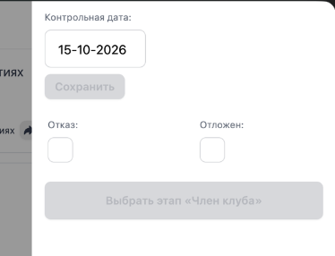
{style="block"}

---

### Боковая панель (Sidebar)

Расположена справа, содержит кнопки быстрых действий.

#### Кнопки действий

**Верхняя группа:**
*   **Закрыть** (✕): Закрыть карточку, вернуться к списку.
*   **Обновить** (🔄): Перезагрузить данные клиента.
*   **QR-код**: Сгенерировать QR-код для клиента.

**Средняя группа (Кураторы):**
*   **Список кураторов:** Аватары менеджеров, работающих с клиентом.
*   **Действия:**
    *   **Зеленая галочка** (✓): Подтвердить куратора.
    *   **Карандаш** (✎): Редактировать куратора.
    *   **Красный крестик** (✕): Удалить куратора.

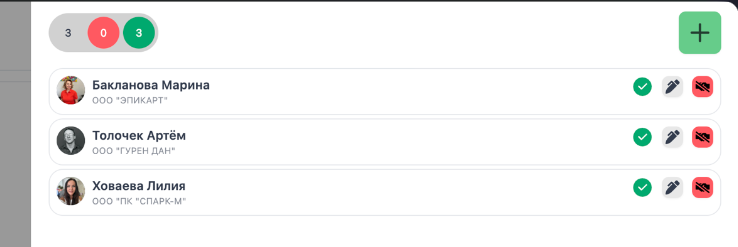
{style="block"}

**Нижняя группа:**
*   **Telegram**: Открыть чат в Telegram.
*   **Email**: Написать email.
*   **Телефон**: Позвонить клиенту.

---

### Основной контент

#### Секция: Личная информация

**Поля:**
*   **Фамилия:** Текстовое поле (компонент `InputFallback`).
*   **Имя:** Текстовое поле.
*   **Email:** Текстовое поле.
*   **Телефон:** Текстовое поле.
*   **Компания:** Текстовое поле.
*   **Город/Адрес:** Текстовое поле.
*   **Как нас нашли:** Выпадающий список.
*   **Дата рождения:** Поле даты.
*   **ИНН:** Текстовое поле.
*   **Telegram ID:** Текстовое поле (только для чтения).

**Кнопки:**
*   **Сохранить:** Сохранить изменения.
*   **Отмена:** Отменить изменения.

#### Секция: Стадии воронки

**Визуализация:**
Горизонтальная шкала с 7 стадиями (0-6).

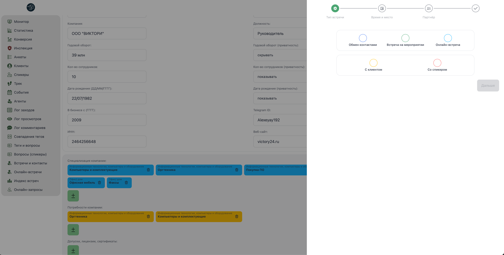
{style="block"}

**Стадии:**
1. **У агента** (0): Красный цвет.
2. **Соискатель** (1): Темно-серый.
3. **Адмиссия** (2): Желтый.
4. **Подключение** (3): Голубой.
5. **Кандидат** (4): Синий.
6. **Оплата** (5): Светло-зеленый.
7. **Член клуба** (6): Зеленый.

**Индикаторы на стадии:**
*   **Дата:** Когда клиент перешел на эту стадию.
*   **Иконка "Пауза"**: Стадия отложена (`postopen`).
*   **Иконка "Крестик"**: Отказ на этой стадии (`rejection`).

**Клик по стадии:** Открывает модальное окно с деталями и возможностью редактирования.

---

### Модальные окна (Поп-апы)

#### Смена стадии

Открывается при клике на текущую стадию или кнопку "Выбрать этап".

**Содержимое:**
*   **Контрольная дата:** Поле даты (когда нужно проверить прогресс).
*   **Время:** Часы и минуты (для собеседований/встреч).
*   **Чекбоксы:**
    *   **Отказ:** Клиент отказался на этой стадии.
    *   **Отложен:** Работа с клиентом приостановлена.
*   **Кнопка:** "Выбрать этап «[Название стадии]»".
*   **Комментарий:** Текстовое поле для заметок.

**Примеры:**

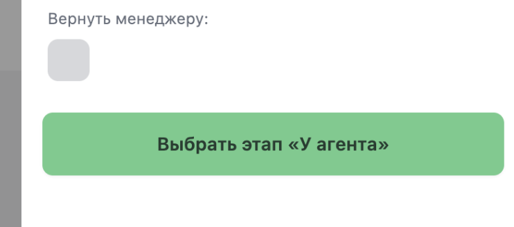
{style="block"}

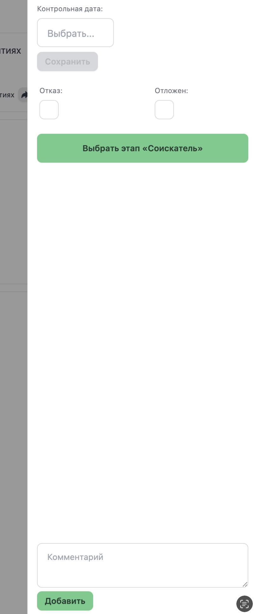
{style="block"}

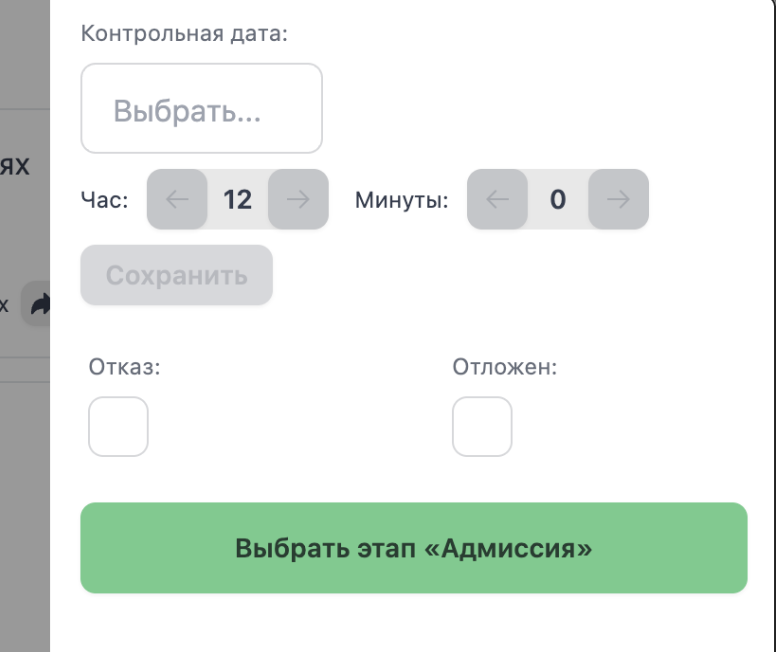
{style="block"}

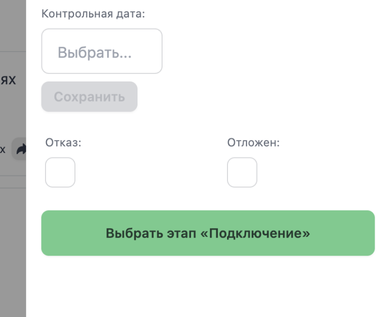
{style="block"}

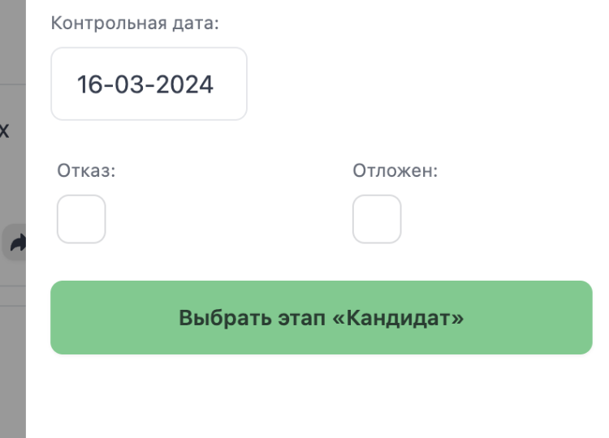
{style="block"}

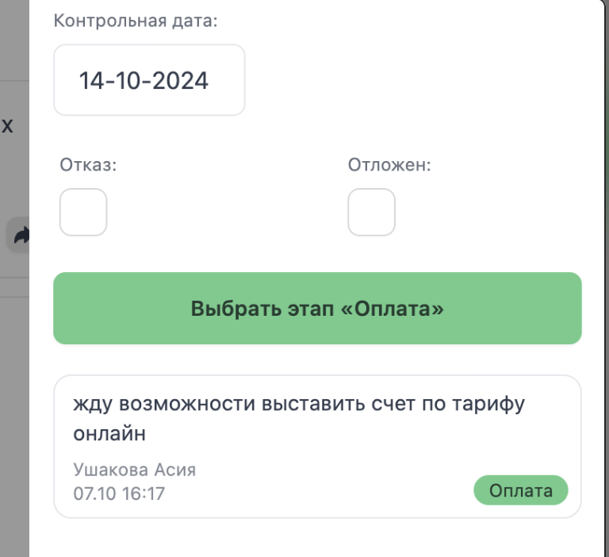
{style="block"}

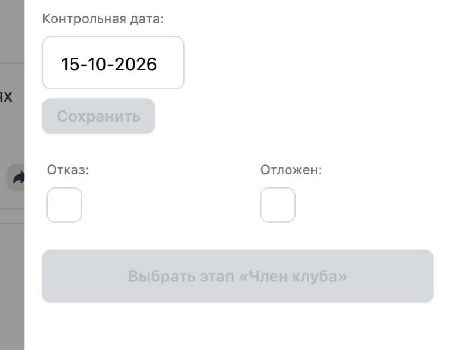
{style="block"}

#### Календарь встреч

Открывается при клике на иконку календаря.

**Визуализация:**
*   **Сетка календаря:** Месячный вид с днями недели.
*   **Индикаторы:**
    *   **Синие кружки:** Дни с запланированными встречами.
    *   **Зеленые плюсы (+):** Возможность добавить встречу.
*   **Навигация:** Стрелки влево/вправо для смены месяца.
*   **Счетчики вверху:**
    *   Серый: Всего встреч.
    *   Красный: Отмененные встречи.
    *   Зеленый: Состоявшиеся встречи.

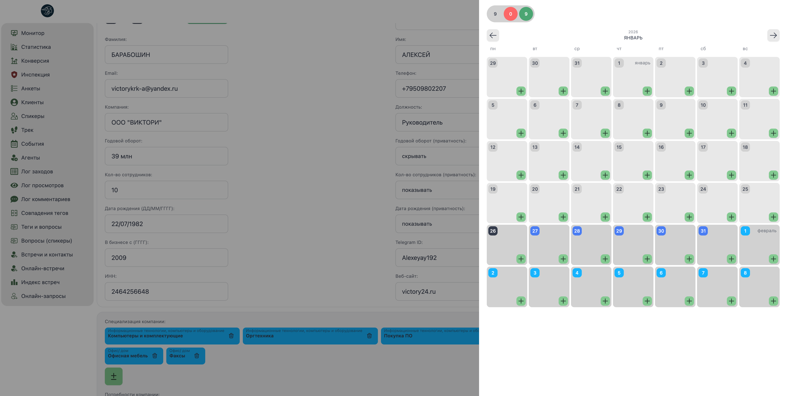
{style="block"}

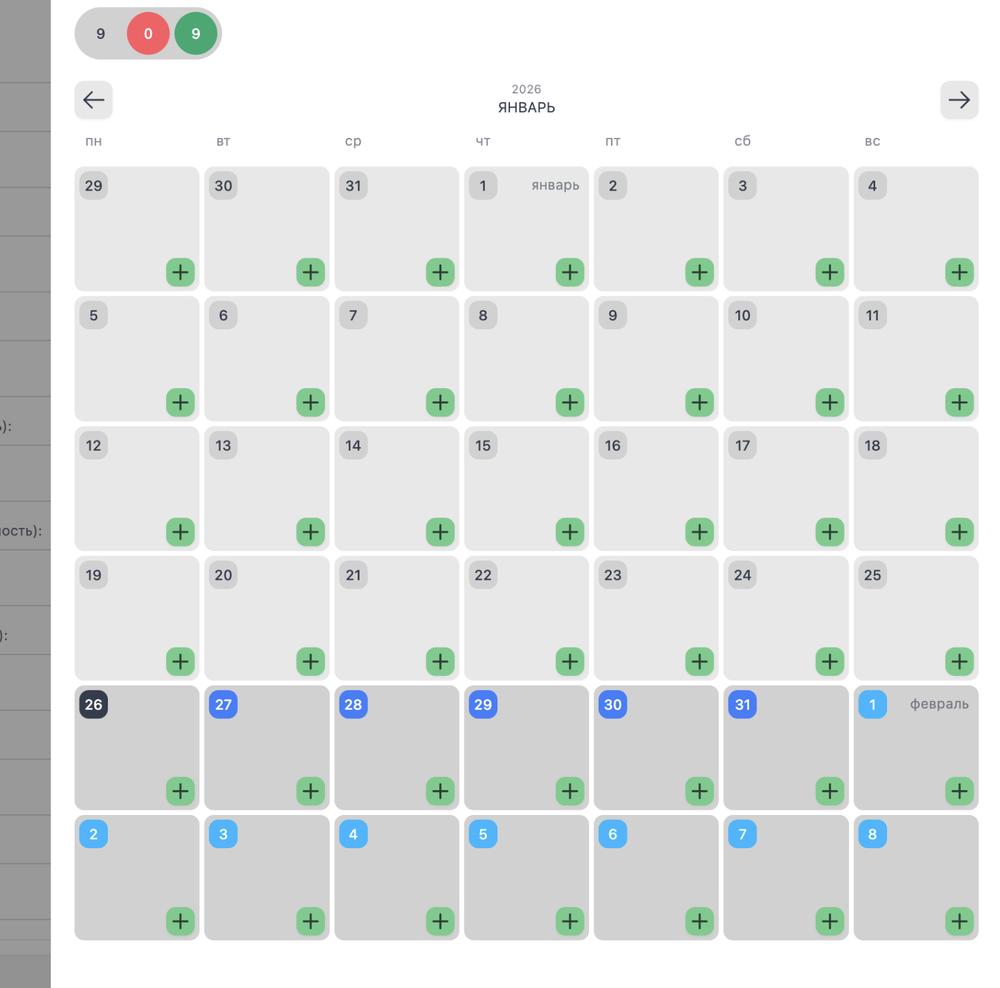
{style="block"}

**Клик по дню:** Открывает форму добавления встречи.

#### Добавление встречи

**Шаг 1: Тип встречи**

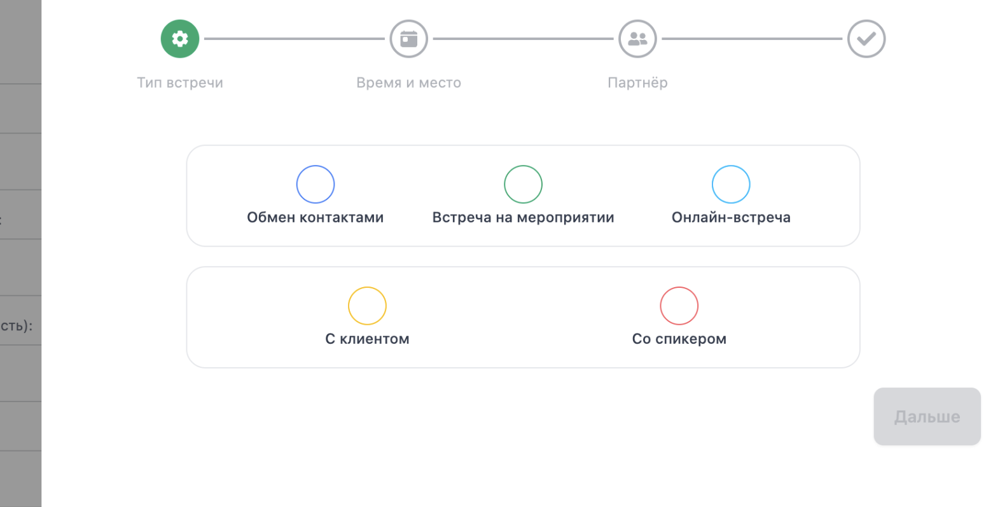
{style="block"}

**Варианты:**
*   **Обмен контактами** (синий).
*   **Встреча на мероприятии** (синий).
*   **Онлайн-встреча** (голубой).
*   **С клиентом** (желтый).
*   **Со спикером** (розовый).

**Шаг 2: Время и место**
*   Выбор времени (часы и минуты).
*   Выбор места проведения.

**Шаг 3: Партнер**
*   Выбор второго участника встречи (если применимо).

**Шаг 4: Подтверждение**
*   Финальная проверка и сохранение.

#### Тариф и оплата

Открывается при клике на секцию "Тариф".

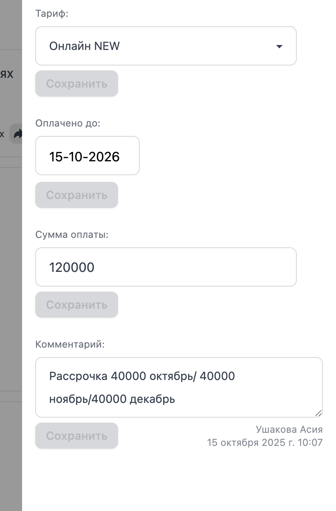
{style="block"}

**Поля:**
*   **Тариф:** Выпадающий список (например: "Онлайн NEW").
*   **Кнопка "Сохранить":** Применить выбранный тариф.
*   **Оплачено до:** Поле даты (формат: 15-10-2026).
*   **Кнопка "Сохранить":** Обновить дату оплаты.
*   **Сумма оплаты:** Текстовое поле (например: 120000).
*   **Кнопка "Сохранить":** Зафиксировать сумму.
*   **Комментарий:** Многострочное текстовое поле.
    *   Показывается автор и дата последнего комментария.
*   **Кнопка "Сохранить":** Сохранить комментарий.

**Пример комментария:**
```text
Рассрочка 40000 октябрь/ 40000 ноябрь/40000 декабрь
Ушакова Асия
15 октября 2025 г. 10:07
```

#### Собеседование с руководством

Открывается при клике на кнопку "Собеседование".

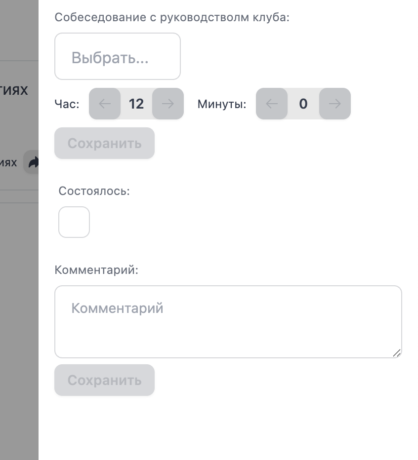
{style="block"}

**Поля:**
*   **Выбор руководителя:** Выпадающий список (может быть пустым).
*   **Часы и минуты:** Время собеседования.
*   **Кнопка "Сохранить":** Запланировать собеседование.
*   **Состоялось:** Чекбокс (отметить после проведения).
*   **Комментарий:** Текстовое поле для заметок.
*   **Кнопка "Сохранить":** Сохранить результаты собеседования.

#### История комментариев

Открывается при клике на кнопку "История" или "Комментарии".

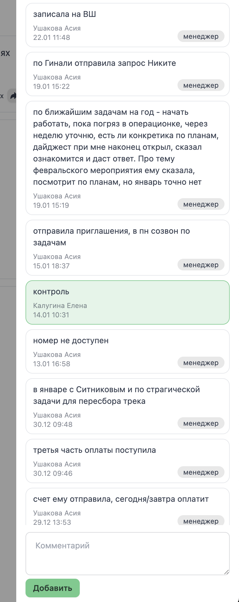
{style="block"}

**Структура:**
*   **Лента комментариев:** Хронологический список всех заметок менеджеров.
*   **Каждый комментарий содержит:**
    *   Текст комментария.
    *   Имя автора (например: "Ушакова Асия").
    *   Дата и время (например: "22.01 11:48").
    *   Метка "менеджер" (для комментариев от менеджеров).
*   **Специальные комментарии:**
    *   **Зеленый фон:** Системные события (например: "контроль").
*   **Поле ввода:** Внизу для добавления нового комментария.
*   **Кнопка "Добавить":** Сохранить новый комментарий.

**Примеры комментариев:**
```text
записала на ВШ
Ушакова Асия
22.01 11:48
менеджер

по Гинали отправила запрос Никите
Ушакова Асия
19.01 15:22
менеджер

контроль
Калугина Елена
14.01 10:31
```

#### Контакты

Открывается при клике на кнопку "Контакты".

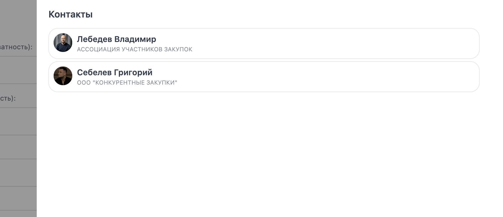
{style="block"}

**Содержимое:**
*   **Список контактных лиц:** Связанные с клиентом люди.
*   **Каждый контакт содержит:**
    *   Аватар.
    *   Имя.
    *   Организация.

**Пример:**
```text
Лебедев Владимир
АССОЦИАЦИЯ УЧАСТНИКОВ ЗАКУПОК

Себелев Григорий
ООО "КОНКУРЕНТНЫЕ ЗАКУПКИ"
```

#### Онлайн-слоты

Открывается при клике на кнопку "Онлайн-слоты".

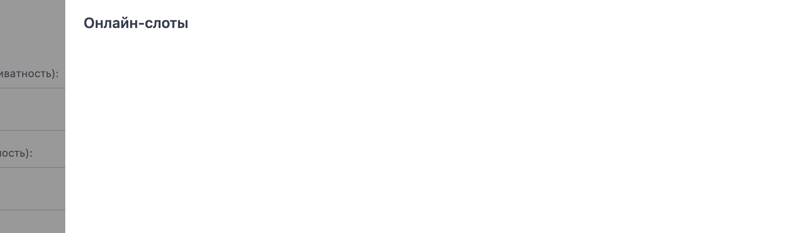
{style="block"}

**Содержимое:**
*   **Заголовок:** "Онлайн-слоты".
*   **Пустое состояние:** Если нет доступных слотов.

#### Посмотрели профиль

Открывается при клике на кнопку "Посмотрели профиль".

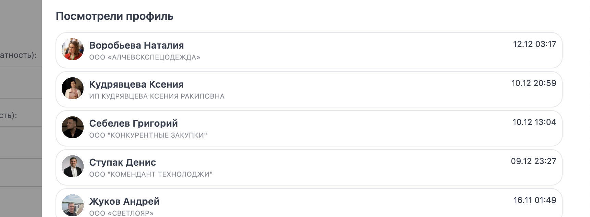
{style="block"}

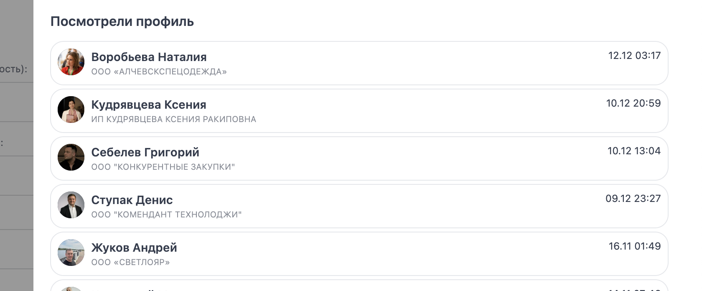
{style="block"}

**Содержимое:**
*   **Список пользователей:** Кто просматривал профиль клиента.
*   **Каждая запись содержит:**
    *   Аватар.
    *   Имя.
    *   Организация.
    *   Дата и время просмотра.

**Пример:**
```text
Воробьева Наталия
ООО «АЛЧЕВСКСПЕЦОДЕЖДА»
12.12 03:17

Кудрявцева Ксения
ИП КУДРЯВЦЕВА КСЕНИЯ РАКИПОВНА
10.12 20:59
```

#### Участники мероприятий

Открывается при клике на вкладку "Участие в мероприятиях".

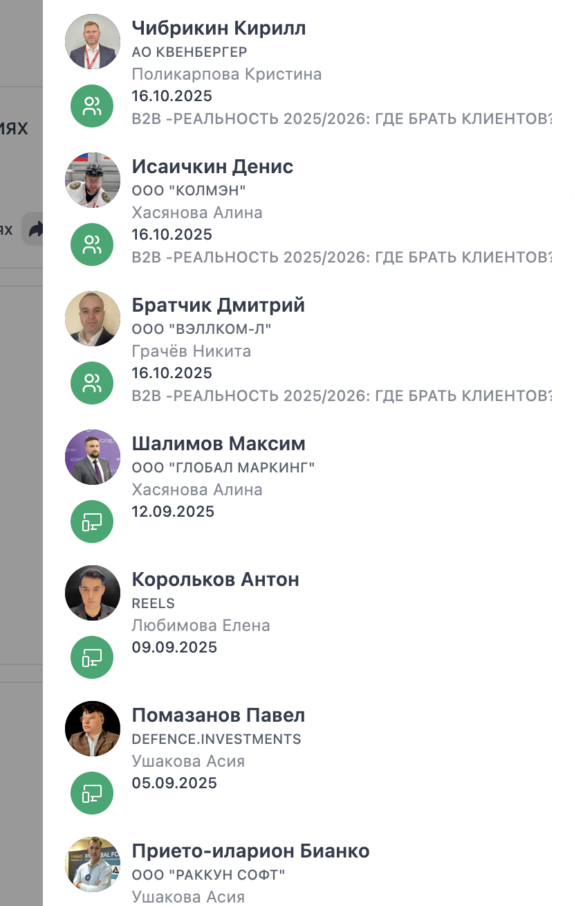
{style="block"}

**Содержимое:**
*   **Список участников:** Люди, с которыми клиент встречался на мероприятиях.
*   **Каждая запись содержит:**
    *   Аватар.
    *   Имя.
    *   Организация.
    *   Имя менеджера.
    *   Дата мероприятия.
    *   **Иконки:**
        *   Группа людей: Участие в групповом мероприятии.
        *   Презентация: Участие в форуме/конференции.

**Пример:**
```text
Чибрикин Кирилл
АО КВЕНБЕРГЕР
Поликарпова Кристина
16.10.2025
B2B -РЕАЛЬНОСТЬ 2025/2026: ГДЕ БРАТЬ КЛИЕНТОВ?
```

#### Список онлайн-событий

Открывается при клике на вкладку "Онлайн-события".

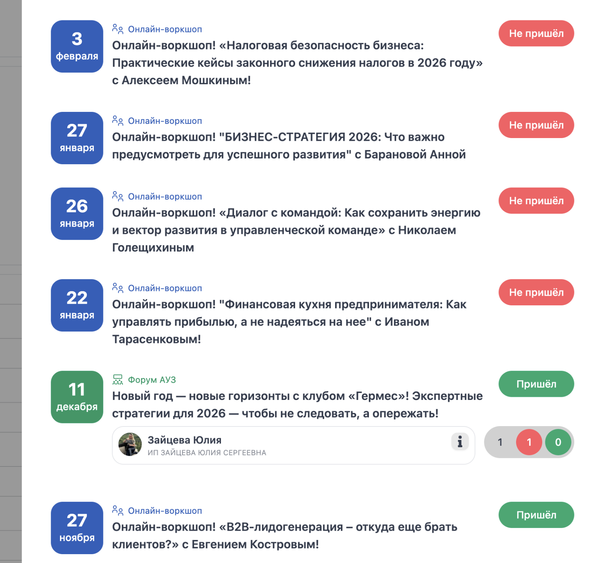
{style="block"}


{style="block"}

**Содержимое:**
*   **Список мероприятий:** Предстоящие онлайн-воркшопы и форумы.
*   **Каждое мероприятие содержит:**
    *   **Дата:** Крупный синий/зеленый квадрат с датой.
    *   **Тип:** "Онлайн-воркшоп" или "Форум АУЗ".
    *   **Название:** Полное название мероприятия.
    *   **Спикер:** Имя и фамилия спикера (если есть).
    *   **Статус:**
        *   **Красная кнопка "Не пришёл"**: Клиент не посетил мероприятие.
        *   **Зеленая кнопка "Пришёл"**: Клиент посетил мероприятие.
    *   **Счетчики реакций:** Иконка информации + цифры.

#### Поиск клиентов для подключения

Открывается при клике на кнопку "Поиск клиентов" или "Подключить".

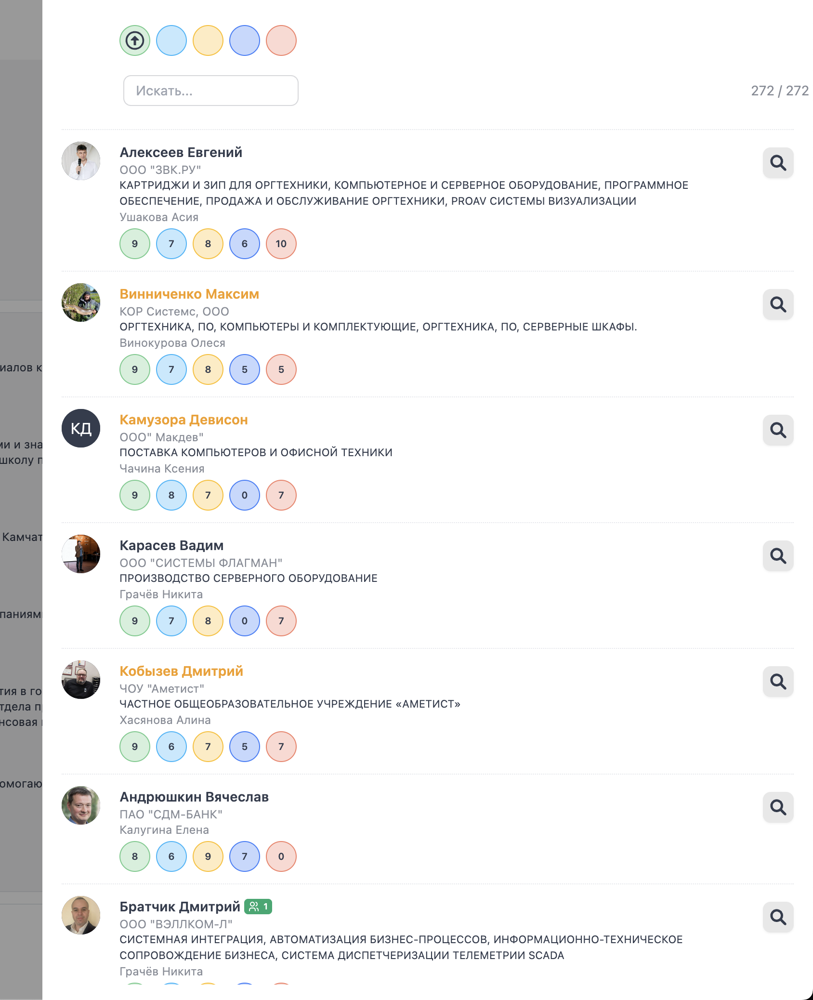
{style="block"}

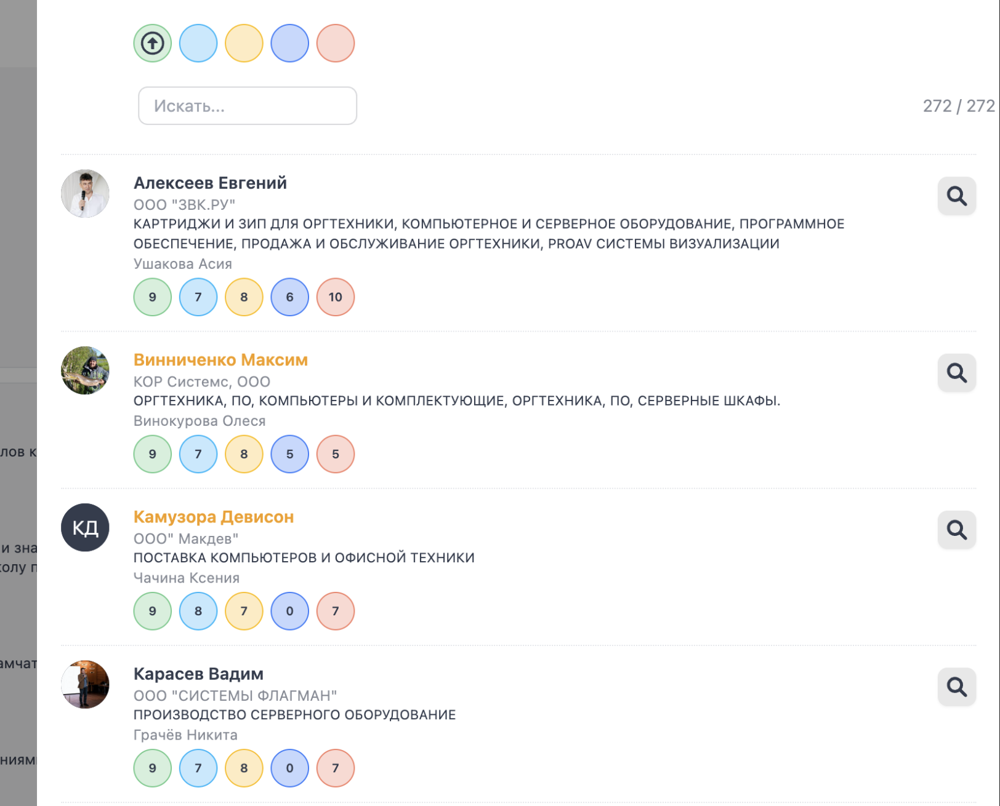
{style="block"}

**Функциональность:**
*   **Поиск:** Текстовое поле "Искать..." вверху.
*   **Фильтры:** Цветные кружки для фильтрации по типу.
*   **Счетчик:** Количество результатов.
*   **Список клиентов:**
    *   Аватар.
    *   Имя.
    *   Организация.
    *   Сфера деятельности.
    *   Имя менеджера.
    *   **Цветные кружки с цифрами:** Индикаторы совпадений.
    *   **Иконка лупы:** Открыть детальную карточку клиента.

#### Оффлайн-подключения

Открывается при клике на кнопку "Оффлайн-подключения".

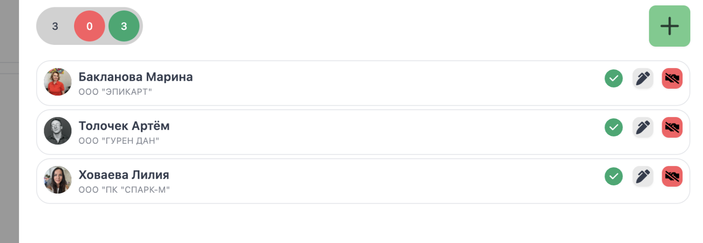
{style="block"}

**Содержимое:**
*   **Счетчики вверху:** Всего / Отклоненные / Успешные.
*   **Список подключений:**
    *   Аватар.
    *   Имя клиента.
    *   Организация.
    *   **Действия:** Подтвердить / Редактировать / Отклонить.

#### Возврат менеджеру

Открывается при клике на кнопку "Вернуть менеджеру".

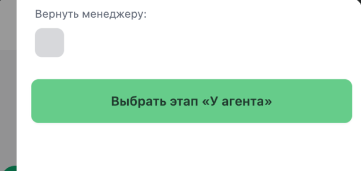
{style="block"}

**Содержимое:**
*   **Выбор менеджера:** Выпадающий список.
*   **Кнопка:** "Выбрать этап «У агента»".
*   **Комментарий:** Текстовое поле для причины возврата.

#### Контрольная дата

Открывается при установке контрольной даты для стадии.

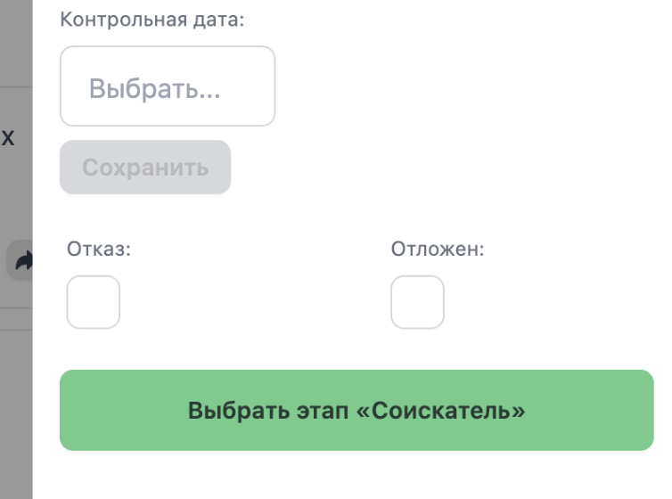
{style="block"}

**Содержимое:**
*   **Контрольная дата:** Поле даты.
*   **Чекбоксы:** Отказ / Отложен.
*   **Кнопка:** "Выбрать этап".

---

## Техническая реализация

### Архитектура

**Компоненты:**
*   `Users.svelte`: Список клиентов с поиском и пагинацией.
*   `User.svelte`: Детальная карточка клиента.
*   `UserProfile`: Компонент профиля клиента.
*   `Calendar`: Компонент календаря встреч.
*   `Comments`: Компонент ленты комментариев.
*   `Polls`: Компонент анкет и опросов.
*   `AIRating`: Компонент AI-рейтинга.

### API запросы (Queries)

#### userSearch
Поиск клиентов.

**Эндпоинт:** `/ma/user/search`

**Возврат:**
```javascript
const userSearchResponse = {
    users: [],  // Массив клиентов
    amount: 0,  // Общее количество
    community_managers: [],  // Список менеджеров
};
```

#### userStageUpdate
Обновление стадии клиента.

**Эндпоинт:** `/ma/user/stage/update`

#### userRatingUpdate
Обновление рейтинга клиента.

**Эндпоинт:** `/ma/user/rating/update`

#### userTariffUpdate
Обновление тарифа клиента.

**Эндпоинт:** `/ma/user/tariff/update`

#### userEventsSummary
Получение статистики по мероприятиям.

**Эндпоинт:** `/ma/user/events/summary`

**Возврат:**
```javascript
const userEventsSummaryResponse = {
    events: [],  // Массив мероприятий
    stats: {
        events: [0, 0, 0], // [total, attended, missed]
        connections: [0, 0, 0] // [total, confirmed, pending]
    }
};
```

#### userMeetings
Получение списка встреч.

**Эндпоинт:** `/ma/user/meetings`

#### userMeetingAdd
Добавление новой встречи.

**Эндпоинт:** `/ma/user/meeting/add`

### Стадии воронки

```javascript
const stages = [
    { id: 0, name: 'У агента' },
    { id: 1, name: 'Соискатель' },
    { id: 2, name: 'Адмиссия' },
    { id: 3, name: 'Подключение' },
    { id: 4, name: 'Кандидат' },
    { id: 5, name: 'Оплата' },
    { id: 6, name: 'Член клуба' },
];
```

### Реактивность

**Svelte Stores:**
*   `$user`: Текущий пользователь (менеджер).
*   `$loading`: Состояние загрузки.

**Реактивные переменные:**
*   `$: isChief`: Проверка роли руководителя.
*   `$: today`: Текущая дата.

---

## Особенности и ограничения

### Производительность
*   ⚠️ **Большой объем кода:** Более 6000 строк в `User.svelte`.
*   **Оптимизация:** Ленивая загрузка данных (встречи, мероприятия загружаются по требованию).

### Технический долг
*   **Монолитный компонент:** Вся логика карточки клиента в одном файле.
*   **Дублирование кода:** Множество похожих модальных окон.

### Доступ
Экран доступен пользователям с ролями: `admin`, `manager`, `moderator`, `chief`, `community manager`, `curator`, `agent`.