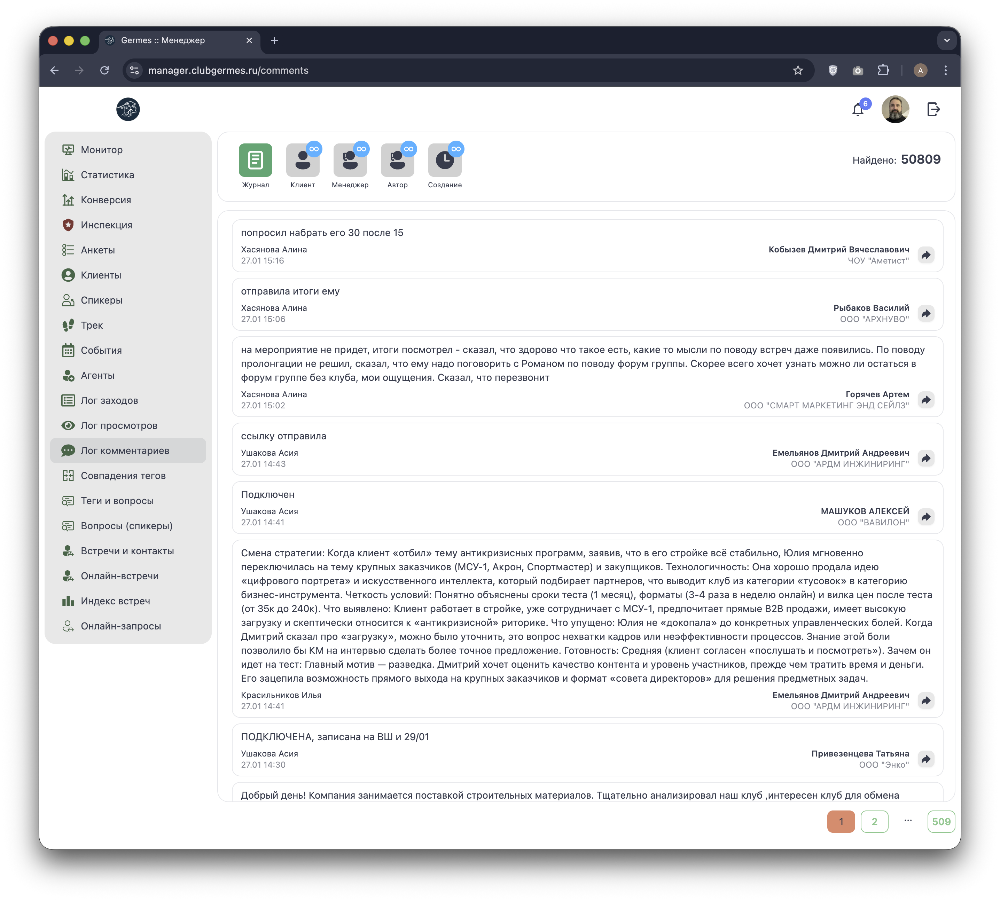

# 💬 Менеджер: Лог комментариев (Comments)

**Код:** `src/views/Comments.svelte`  
**Роут:** `/comments` (Layout: `Main`)

Модуль **Лог комментариев** предоставляет доступ к истории заметок и комментариев, оставленных менеджерами по клиентам. Это ключевой инструмент для контроля качества работы менеджеров и восстановления контекста общения.

{style="block"}

## 1. Панель фильтров

Верхняя часть экрана содержит мощный набор фильтров для поиска нужной информации.

### Основные фильтры

| Иконка | Название | Функция | Код |
| :--- | :--- | :--- | :--- |
| 📄 | **Журнал** | Сброс фильтров, показ всех записей. | `showFilters = ''` |
| 👤 | **Клиент** | Поиск по имени или компании клиента. | `filter.name` (фильтрация по `target`) |
| 🎧 | **Менеджер** | Фильтр по ответственному коммьюнити-менеджеру клиента. | `filter.communityManager` |
| ✍️ | **Автор** | Фильтр по автору комментария (кто написал). | `filter.author` |
| 🕒 | **Создание** | Фильтр по дате создания комментария (диапазон). | `filter.dateCreation` |

> **Индикаторы:** На кнопках фильтров есть синие кружки (badges), показывающие, что фильтр активен.

### Детальная настройка

При нажатии на иконку фильтра открывается панель настройки. Например, для даты создания (`showFilters == 'date-creation'`) появляются два календаря: "С:" и "По:".

{style="block"}

## 2. Список комментариев

Основная область экрана отображает ленту комментариев.

### Карточка комментария

Каждая запись содержит:

1.  **Текст комментария:** Основное содержание заметки.
2.  **Мета-данные (слева):**
    *   Автор комментария.
    *   Дата и время создания.
    *   Дата и время последнего редактирования (если было).
3.  **Контекст (справа):**
    *   **Имя клиента:** Ссылка на профиль клиента, к которому относится комментарий.
    *   **Компания:** Название компании клиента.
    *   **Действие:** Кнопка перехода в профиль клиента (`/users/:id`).

> **Автообновление:** Список комментариев автоматически обновляется в реальном времени при поступлении новых событий через WebSocket (`subscribe('events', refresh)`). Если появляются новые записи, система показывает уведомление "Новых комментариев: N" и кнопку "Показать".

## 3. Техническая реализация

### API Запросы
Модуль использует специфический endpoint для "бесконечной ленты" с курсорной пагинацией:
*   **Загрузка:** `ajaxRequest('/comments/fetch')`.
    *   Параметры: `cursor` (ID последнего загруженного комментария), `limit` (обычно 50), `subfilter` (параметры фильтрации).
*   **Проверка новых:** `ajaxRequest('/comments/fresh')`. Проверяет наличие записей новее текущего `cursor`.

### Особенности
*   **Кэширование:** Данные о клиентах (`clients`), менеджерах (`managers`) и авторах (`authors`) приходят вместе с первой пачкой комментариев и кэшируются локально, чтобы не дублировать их в каждой записи.
*   **Пагинация:** Реализована классическая постраничная навигация внизу экрана, но логика загрузки гибридная (курсор + страница).

### Права доступа
*   **Admin/Chief/Manager:** Видят все комментарии и могут фильтровать по любому менеджеру.
*   **Community Manager:** Видит комментарии только по своим клиентам (логика на бэкенде + предустановка фильтра `communityManager` при инициализации).
