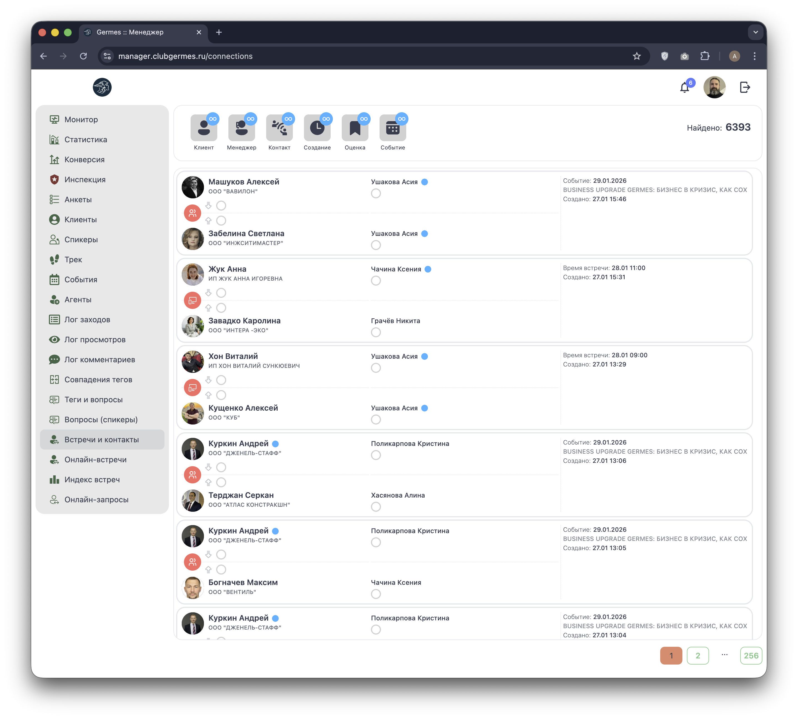
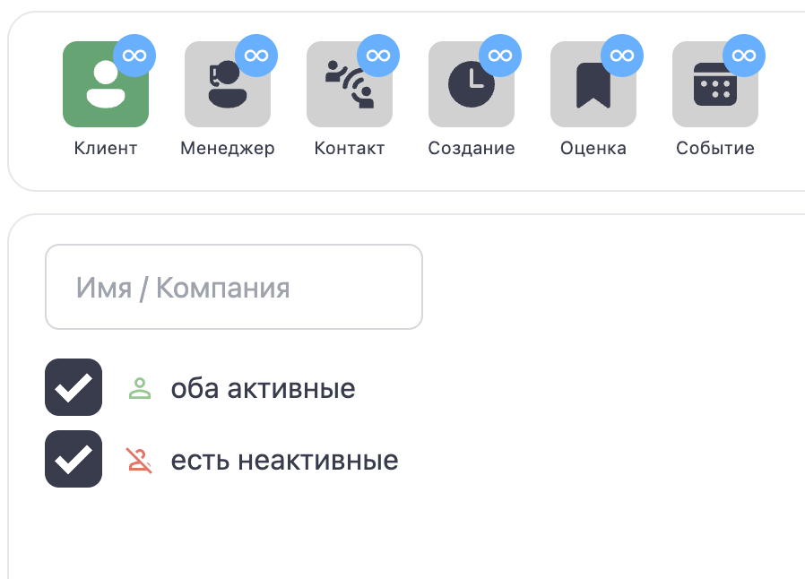
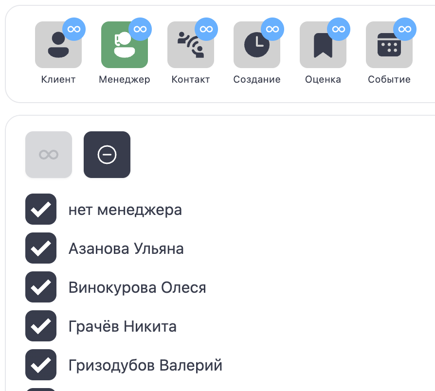
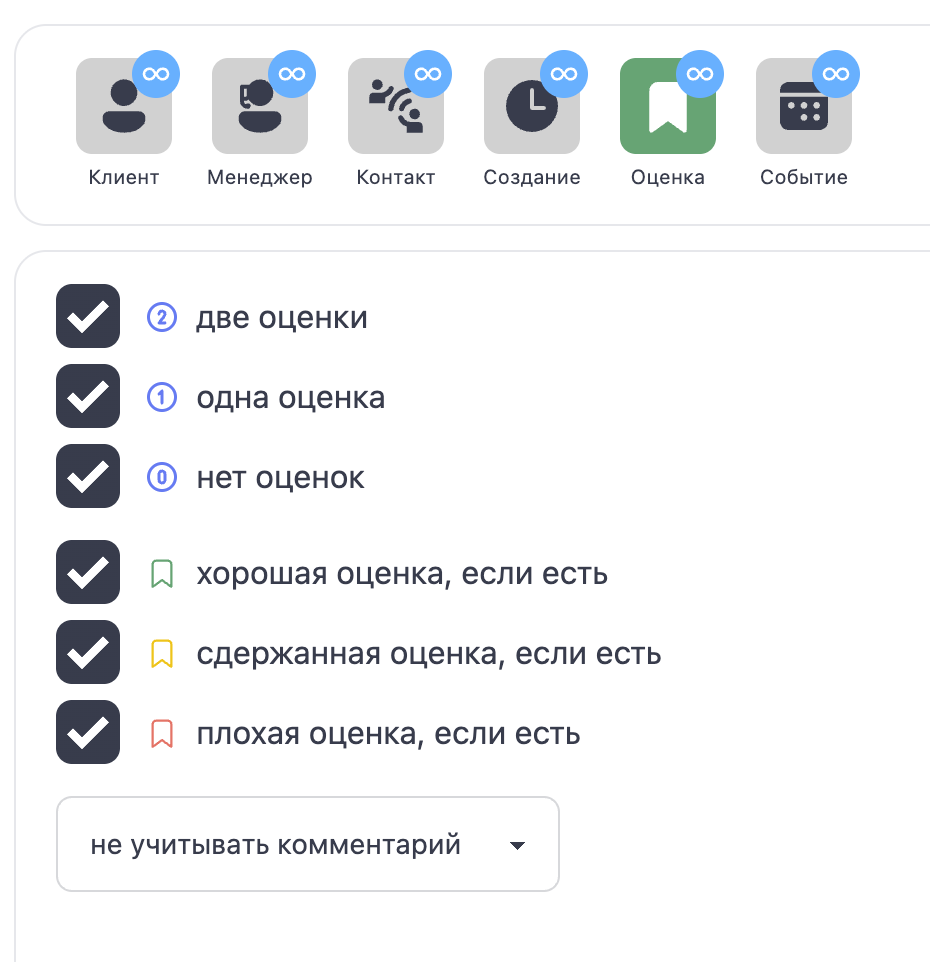
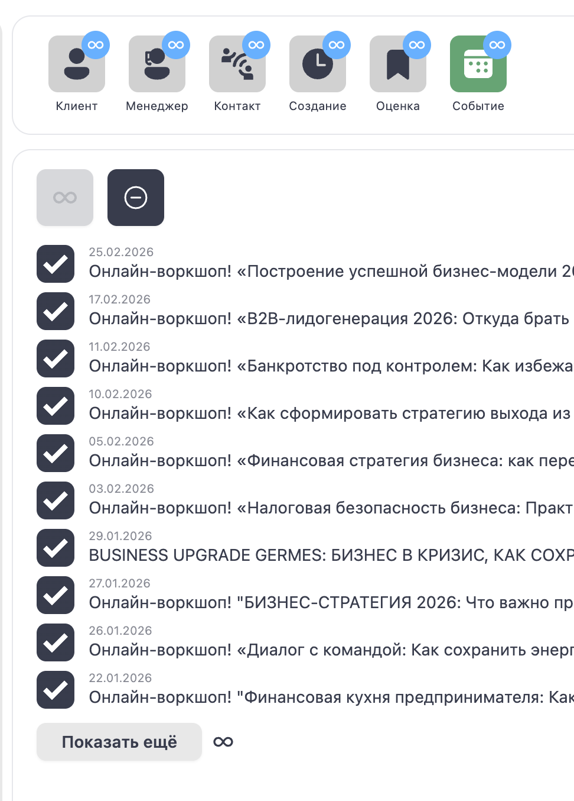

# 🤝 Менеджер: Встречи и контакты (Connections)

**Код:** `src/views/Connections.svelte`  
**Роут:** `/connections` (Layout: `Main`)

Модуль **Встречи и контакты** — это единый реестр всех взаимодействий между резидентами Клуба. Здесь фиксируются обмены контактами в приложении, встречи на мероприятиях и онлайн-сессии.

{style="block"}

## 1. Панель фильтров

Инструменты для сегментации базы взаимодействий.

| Иконка | Название | Функция | Код |
| :--- | :--- | :--- | :--- |
| 👤 | **Клиент** | Поиск по имени или компании участника. | `filter.name` |
| 🎧 | **Менеджер** | Фильтр по ответственному менеджеру. | `filter.communityManager` |
| 📞 | **Контакт** | Фильтр по типу и статусу взаимодействия. | `filter.form` |
| 🕒 | **Создание** | Фильтр по дате создания взаимодействия. | `filter.dateCreation` |
| 🏷️ | **Оценка** | Фильтр по наличию/отсутствию оценки встречи. | `filter.evaluation` |
| 📅 | **Событие** | Фильтр по конкретному мероприятию. | `filter.event` |
| **Счетчик** | "Найдено: N" — показывает количество найденных взаимодействий. | `amount` |

> **Индикаторы (Badges):** На иконках фильтров появляются синие кружки `∞`, если фильтр активен.

## 2. Детальная настройка фильтров

При нажатии на иконку фильтра открывается боковая панель с детальными настройками.

### Клиент
Поиск по текстовому входу (Имя/Компания). Дополнительно можно фильтровать по активности участников ("Оба активные", "Есть неактивные").

{style="block"}

### Менеджер
Выбор одного или нескольких ответственных менеджеров из списка.

{style="block"}

### Контакт (Тип и Статус)
Позволяет выбрать тип взаимодействия (Обмен контактами, Встреча на событии, Онлайн) и его статус (Состоялось / Не состоялось).

{style="block"}

### Создание (Дата)
Выбор диапазона дат создания записи (С... По...).

{style="block"}

### Оценка
Фильтрация по наличию оценок (Одна, Две, Нет оценок) и их качеству (Хорошая, Сдержанная, Плохая).

{style="block"}

### Событие
Выбор конкретного мероприятия, на котором произошла встреча.

{style="block"}

## 3. Список взаимодействий

Основная область отображает хронологию нетворкинга.

### Карточка взаимодействия

Каждая строка представляет собой **связь** между двумя участниками.

1.  **Участники (Слева):** Две карточки (Инициатор и Визави).
    *   Аватар, Имя, Компания.
    *   Имя менеджера (или "Нет менеджера").
    *   **Оценка:** Цветной кружок с галочкой показывает, как участник оценил встречу (Зеленый - хорошо, Желтый - нормально, Красный - плохо).
2.  **Менеджеры (Центр):**
    *   Информация об ответственных менеджерах с обеих сторон.
    *   **Статус обработки:** Цветной кружок показывает, обработал ли менеджер эту встречу.
3.  **Контекст (Справа):**
    *   **Тип:** Иконка (Онлайн, Офлайн, Контакт).
    *   **Дата:** Когда произошло взаимодействие.
    *   **Тема/Событие:** На каком мероприятии встретились.

## 4. Техническая реализация

### API Запросы
*   **Список:** `connectionsList` (Endpoint: `/ma/connections/control`).
*   **Редактирование:**
    *   `connectionsUpdate`: Обновление статуса/оценки (для типов event/contact).
    *   `meetingsUpdate`: Обновление для типа `online`.

### Особенности
*   **Разделение типов:** Модуль агрегирует данные из разных таблиц, приводя их к единому интерфейсу списка.
*   **Двойная ответственность:** У каждого взаимодействия есть две стороны. Менеджер стороны А может редактировать оценку только своего клиента.