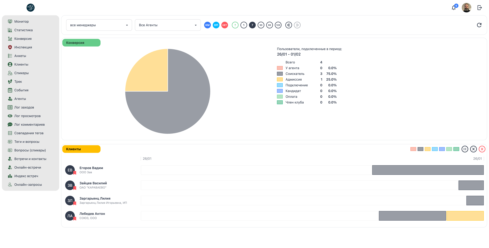

# 📊 Менеджер: Конверсия (Воронка продаж)

**Код:** `Conversion.svelte` (frontend/club-manager/src/views/Conversion.svelte)  
**Роут:** `/conversion` (Layout: `Main`)

## Назначение
Экран предназначен для анализа конверсии клиентов по воронке продаж. Показывает распределение пользователей по стадиям в выбранном временном периоде и визуализирует их путь через воронку с помощью временной шкалы (timeline). Основная задача — оценить эффективность привлечения клиентов и выявить проблемные этапы конверсии.

> **Визуализация UI**


{style="block"}

---

## Элементы интерфейса

### 1. Панель фильтров
Управляет выборкой данных для анализа конверсии.

#### Выбор менеджера
Выпадающий список для фильтрации по конкретному сотруднику.

*   **Все менеджеры** (`id: -1`): Показать статистику по всем менеджерам.
*   **Нет менеджера** (`id: 0`): Клиенты без назначенного менеджера.
*   **Список менеджеров**: Динамически загружается из `data.community_managers`. Для менеджеров Отдела Продаж добавляется метка `(ОП)`.

#### Выбор агента
Выпадающий список для фильтрации по агенту (рефералу).

*   **Все агенты** (`id: -1`): Показать всех клиентов.
*   **Нет агента** (`id: 0`): Клиенты без агента.
*   **Список агентов**: Динамически формируется из данных пользователей (`agent_id`, `agent_name`). Сортируется по алфавиту.

> **Примечание:** Для пользователей с ролью только `agent` вместо выпадающего списка отображается их имя.

#### Тип менеджера (Тогглы)
Круглые кнопки-фильтры для быстрого переключения отображения по департаментам:

*   **КМ** (Синий, `border-secondary`): Community Manager (department = 1).
*   **ОП** (Бирюзовый, `border-info`): Отдел Продаж (department ≠ 1).
*   **НЕТ** (Красный, `border-error`): Пользователи без назначенного менеджера.

#### Период (Интервалы)
Круглые кнопки для выбора временного диапазона:

*   **?** (Фиолетовый, `border-primary`): Кастомный диапазон. При активации появляются два поля `DateInput`.
*   **1** (Серый, `border-neutral`): День.
*   **7** (Серый, `border-neutral`): Неделя (активен по умолчанию).
*   **30** (Серый, `border-neutral`): Месяц.
*   **90** (Серый, `border-neutral`): Квартал (3 месяца).
*   **120** (Серый, `border-neutral`): Полугодие (6 месяцев).

> **Важно:** В отличие от экрана "Статистика", здесь анализируются пользователи, **подключенные** (созданные) в выбранном периоде, а не находившиеся на стадиях.

#### Навигация по времени
*   **Стрелки влево (<<)**: Сдвигает временной интервал в прошлое (`filterOffset--`).
*   **Стрелки вправо (>>)**: Сдвигает временной интервал в будущее (`filterOffset++`). Неактивна при `filterOffset == 0`.

#### Обновить
Кнопка с иконкой обновления в правом верхнем углу. Принудительно перезагружает данные с сервера через `get()`.

---

### 2. График "Конверсия" (Pie Chart)

Круговая диаграмма, показывающая текущее распределение пользователей по стадиям воронки.

#### Визуализация
*   **Тип:** Pie Chart (круговая диаграмма).
*   **Цвета:** Каждый сегмент окрашен в цвет соответствующей стадии.
*   **Пустое состояние:** Если нет данных, отображается серый круг.

#### Легенда справа от графика
Содержит детальную информацию о распределении:

*   **Заголовок:** "Пользователи, подключенные в период:" + метка периода (например: "26/01 - 07/02").
*   **Всего:** Общее количество пользователей в выборке (`dataConversionAmount`).
*   **Список стадий:** Для каждой стадии (0-6) отображается:
    *   Цветной квадратик (индикатор стадии).
    *   Название стадии.
    *   Количество пользователей (абсолютное значение).
    *   Процент от общего числа.

**Пример:**
```
Соискатель    5    75.0%
Адмиссия      0     0.0%
```

---

### 3. Раздел "Клиенты" (Timeline View)

Список пользователей с визуализацией их пути через воронку продаж в виде временной шкалы.

#### Панель фильтров клиентов
Расположена в правом верхнем углу раздела:

*   **Фильтры по стадиям:** 7 цветных квадратиков (по одному на каждую стадию). Клик переключает видимость пользователей на этой стадии.
*   **Фильтр "Отложен"** (иконка паузы): Показать только пользователей с флагом `postopen`.
*   **Фильтр "Отказ"** (иконка крестика): Показать только пользователей с флагом `rejection`.
*   **Фильтр "Неактивные"** (красный крестик): Показать только неактивных пользователей (`active: false`).

> **Примечание:** Фильтры "Отложен", "Отказ" и "Неактивные" взаимоисключающие — активация одного отключает остальные.

#### Временная шкала
Показывает период от даты подключения пользователя (`time_create`) до текущего момента.

*   **Левая граница:** Дата начала выбранного периода (например: "26/01").
*   **Правая граница:** Текущая дата (например: "07/02").
*   **Границы:** Отображаются пунктирными вертикальными линиями.

#### Карточка пользователя
Каждая строка содержит:

**Левая часть (320px):**
*   **Аватар:** Компонент `Avatar` с индикатором рейтинга (закладка: зеленая/желтая/красная).
*   **Имя:** Нормализованное имя. Неактивные пользователи отображаются с пониженной прозрачностью и красным цветом.
*   **Иконка Telegram:** Если есть `link_telegram`.
*   **Счетчик встреч:** Если `meetings_amount > 0`.
*   **Компания:** Название компании или прочерк.

**Правая часть (Timeline):**
Горизонтальная полоса, разделенная на сегменты по стадиям:
*   **Цвет сегмента:** Соответствует цвету стадии из `CHART_COLORS`.
*   **Ширина сегмента:** Пропорциональна времени нахождения на стадии (в процентах от общего времени).
*   **Серый сегмент:** Период до первого изменения стадии (начальное состояние).

**Пример:**
```
[Серый 20%][Соискатель 50%][Адмиссия 30%]
```

#### Бесконечная прокрутка (Infinite Scroll)
Используется `Observer` для ленивой загрузки:
*   Изначально отображается 50 пользователей (`dataUsersSlice = 50`).
*   При прокрутке до конца списка загружается еще 50 (`dataUsersSlice += 50`).
*   Индикатор загрузки: "..." с пониженной прозрачностью.

---

## Бизнес-логика и Стадии

Стадии воронки идентичны экрану "Статистика" (ID 0-6):

| ID | Название | Цвет | Описание |
| :--- | :--- | :--- | :--- |
| **0** | У агента | 🔴 Красный | Лид передан агенту |
| **1** | Соискатель | ⚫️ Темно-серый | Заполнил первичную анкету |
| **2** | Адмиссия | 🟡 Желтый | Проходит проверку |
| **3** | Подключение | 🔵 Голубой | Оформление документов |
| **4** | Кандидат | 🔵 Синий | Утвержден, ожидает оплаты |
| **5** | Оплата | 🟢 Светло-зеленый | Процесс оплаты |
| **6** | Член клуба | 🟢 Зеленый | Действующий резидент |

---

## Техническая реализация

### Архитектура данных (Client-Side Aggregation)
Экран работает по принципу **толстого клиента**.

1.  **Запрос:** Entity `userMonitorSales` (`src/queries/user.ts`) загружает сырой массив логов (`log`) и пользователей (`users`).
    *   **Эндпоинт:** `/ma/user/monitor/sales`.
    *   **Параметры:** `filter` (включая `time_create`), `showMeetingsAmount: true`.
    *   **Возврат:** `{ log: [], users: {}, community_managers: [] }`.

2.  **Фильтрация:** Функция `createMonitor(interval, log)` фильтрует пользователей по критериям:
    *   Менеджер (`filter.communityManager`).
    *   Агент (`filter.agent`).
    *   Департамент (КМ/ОП/НЕТ).
    *   **Дата создания:** `interval.min <= u.time_create < interval.max` — ключевое отличие от экрана "Статистика".

3.  **Агрегация конверсии:**
    *   Подсчитывается количество пользователей на каждой стадии (`dataConversion[0][stage_id]`).
    *   Вычисляется процент от общего числа (`dataConversion[1][stage_id]`).
    *   Формируется конфигурация для Pie Chart (`conversionConfig`).

4.  **Построение Timeline:**
    *   Для каждого пользователя из `cacheLog` извлекаются все события изменения стадии.
    *   Вычисляется ширина каждого сегмента как процент от общего времени:
        ```typescript
        const scaleLen = scaleMax - scaleMin;
        const width = (mark - item.time_log) / scaleLen * 100;
        ```
    *   Результат сохраняется в `dataUsersLog[user_id]`.

5.  **Реактивность:** Svelte автоматически пересчитывает данные при изменении фильтров.
    *   `$: interval = createIntervals(filterIntervals, filterOffset, filterDates)`
    *   `$: interval, log, filter, createMonitor(interval, log)`
    *   `$: dataUsers, filterUsers, getFilteredUsers()`

### Функция createIntervals
Генерирует один временной интервал (в отличие от экрана "Статистика", где массив интервалов).

**Параметры:**
*   `f`: Тип периода (`'day'`, `'week'`, `'month'`, `'quarter'`, `'half'`, `'custom'`).
*   `os`: Смещение (`filterOffset`).
*   `fd`: Массив дат для кастомного диапазона `[dateStart, dateEnd]`.

**Возврат:** Объект `{ min: timestamp, max: timestamp, label: string }`.

**Логика:**
*   **День:** Текущий день + смещение. Метка: `"01/01"`.
*   **Неделя:** Текущая неделя (с понедельника) + смещение. Метка: `"01/01 - 07/01"`.
*   **Месяц:** Текущий месяц + смещение. Метка: `"ЯНВ, 24"`.
*   **Квартал:** Текущий квартал (3 месяца) + смещение. Метка: `"ЯНВ, 24 - МАР, 24"`.
*   **Полугодие:** Текущее полугодие (6 месяцев) + смещение. Метка: `"ЯНВ, 24 - ИЮН, 24"`.
*   **Кастомный:** От `fd[0]` до `fd[1] + 1 день`. Метка: `"01/01/2024 - 15/01/2024"`.

### Функция getFilteredUsers
Фильтрует список пользователей на основе `filterUsers`:

```typescript
filterUsers.stages[stage] &&  // Стадия включена
(!filterUsers.post || stage.postopen) &&  // Отложен (если фильтр активен)
(!filterUsers.reject || stage.rejection) &&  // Отказ (если фильтр активен)
(!filterUsers.inactive || !u.active)  // Неактивные (если фильтр активен)
```

### Библиотеки
*   **Chart.js**: Основная библиотека визуализации (`chart.js/auto`).
*   **chartjs-plugin-datalabels**: Плагин для отображения значений (отключен для Pie Chart).
*   **@kurkle/color**: Утилита для работы с цветами (функция `transparentize`).
*   **date-picker-svelte**: Компонент `DateInput` для выбора дат в кастомном режиме.

---

## Особенности и ограничения

### Производительность
*   ⚠️ **Heavy Client Logic:** Вся фильтрация и построение timeline происходит в браузере. При большом объеме данных возможны задержки.
*   **Оптимизация:** Используется бесконечная прокрутка (Infinite Scroll) для рендеринга только видимых пользователей.
*   **Observer:** Компонент `Observer` отслеживает видимость элемента "..." и подгружает следующую порцию данных.

### Особенности UI
*   **Адаптивность:** На мобильных устройствах легенда отображается под графиком, а не справа.
*   **Timeline масштабирование:** Ширина сегментов пропорциональна времени, а не количеству событий.
*   **Сортировка:** Пользователи сортируются по имени в алфавитном порядке (`toSorted((a, b) => a.name < b.name ? -1 : 1)`).

### Технический долг
*   **Дублирование кода:** Карточки пользователей рендерятся инлайн. Изменения UI требуют правки в одном месте (лучше, чем в экране "Статистика").
*   **Жестко закодированные стадии:** Массив `stages` и цвета `CHART_COLORS` зашиты в компоненте.
*   **Отсутствие кэширования:** При каждом изменении фильтра пересчитывается весь timeline для всех пользователей.

### Доступ
Экран доступен пользователям с ролями: `admin`, `manager`, `moderator`, `chief`, `community manager`, `curator`.

**Особенности для агентов:**
*   Пользователи с ролью только `agent` видят только своих клиентов.
*   Вместо выпадающего списка агентов отображается их имя.

---

## Отличия от экрана "Статистика"

| Параметр | Статистика | Конверсия |
| :--- | :--- | :--- |
| **Фильтр по времени** | Пользователи, находившиеся на стадиях в периоде | Пользователи, **созданные** в периоде |
| **Визуализация** | Линейный график + столбчатые диаграммы | Круговая диаграмма + Timeline |
| **Количество интервалов** | Массив (5 или 7 интервалов) | Один интервал |
| **Детализация** | Динамика по времени | Путь каждого пользователя |
| **Фильтр агентов** | Отсутствует | Присутствует |
| **Дополнительные периоды** | Нет | Квартал (90), Полугодие (120) |
| **Интерактивность** | Клик по столбцу → список пользователей | Фильтры по стадиям/статусам |
