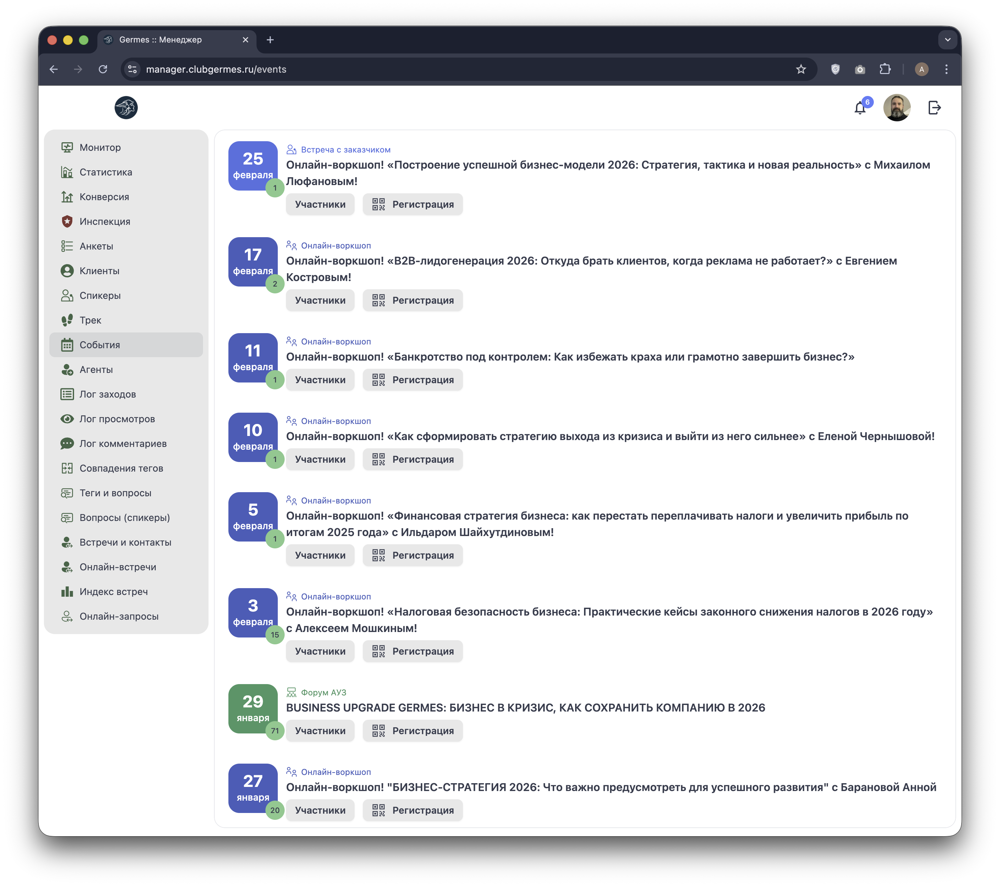
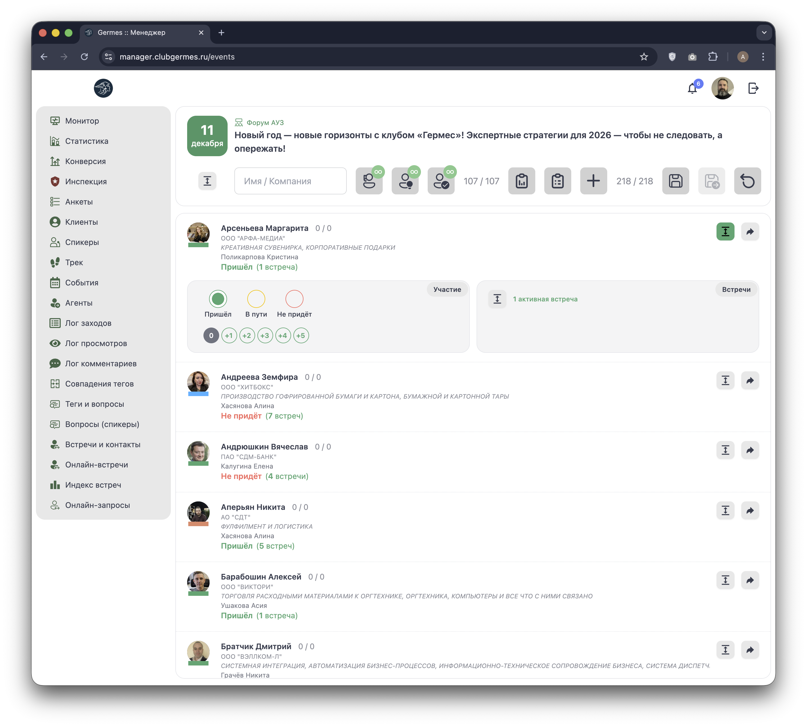
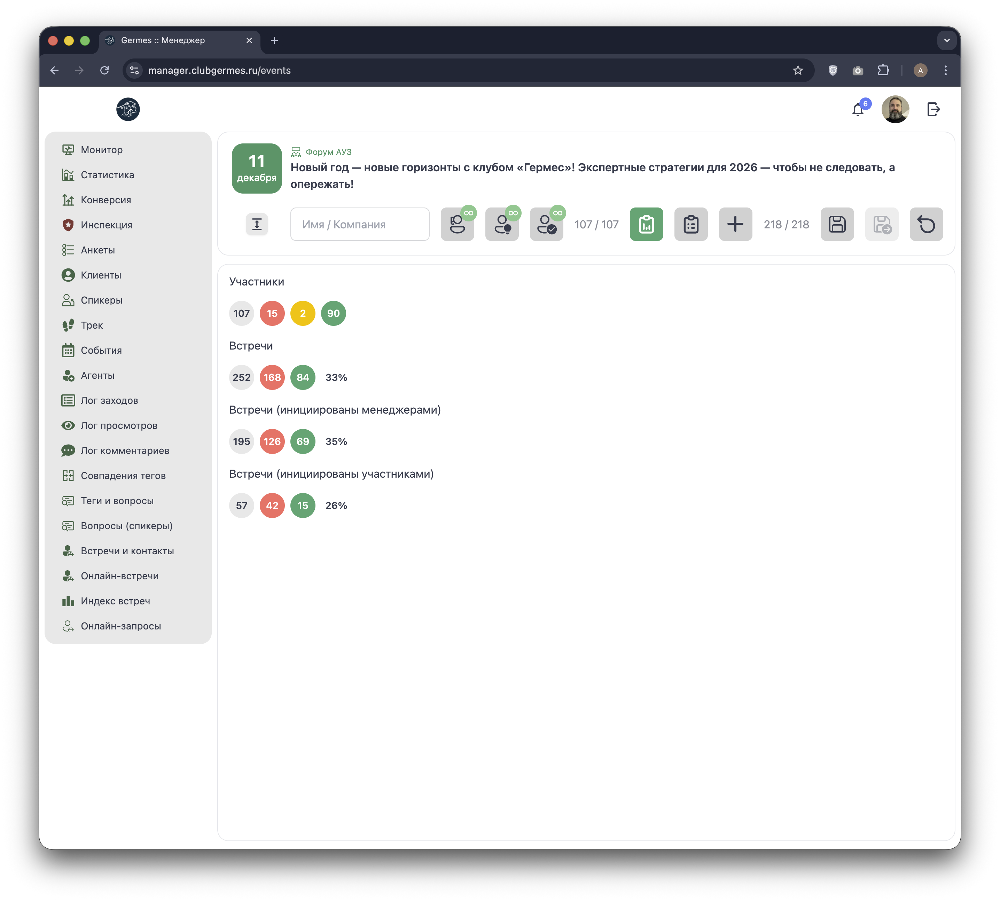
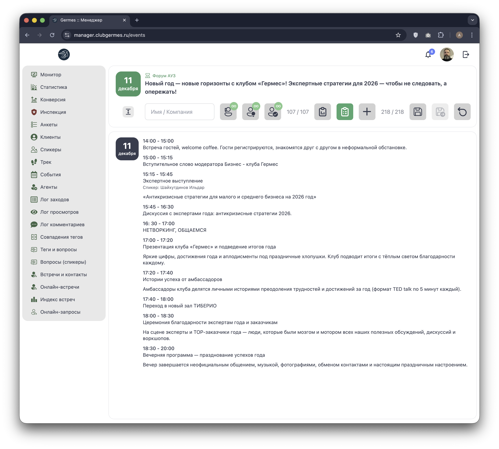
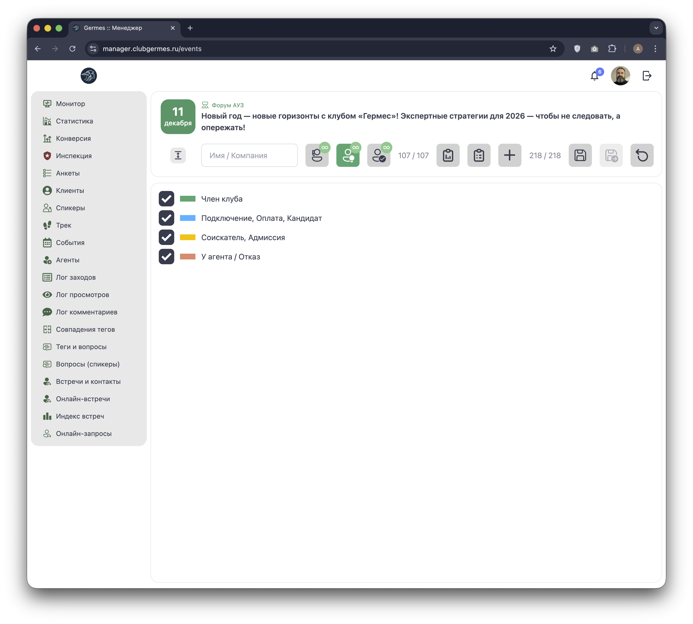

# 📅 Менеджер: События (Events)

**Код:** `Events.svelte` (frontend/club-manager/src/views/Events.svelte)  
**Роут:** `/events` (Layout: `Main`)

Модуль **События** — это центр управления мероприятиями Клуба. Он позволяет менеджерам и администраторам контролировать весь жизненный цикл события: от публикации до проведения (Check-in) и пост-анализа нетворкинга.

## 1. Список событий

Экран отображает хронологический список мероприятий.

{style="block"}

### Карточка события
За отображение отвечает компонент `src/components/EventCard/index.svelte`.

| Элемент | Описание | Логика / Код |
| :--- | :--- | :--- |
| **Формат** | Цветной блок слева (Форум, Воркшоп, Встреча). | `eventFormats` (сопоставление `format` с цветом/иконкой). |
| **Статистика** | Цветные кружки справа внизу (План / В пути / Пришли). | `event['stats']` (массив `[plan, on_way, arrived]`). |
| **Управление** | Кнопка **"Участники"** открывает дашборд события. | Устанавливает `currentEvent`. |
| **QR-код** | Кнопка справа. Генерирует ссылку для регистрации. | `createQRCode` (API `/ma/qr/create`). |

> **Архив:** Переключатель "Архив событий" вверху списка загружает прошедшие мероприятия (`eventsList` с `archive: true`).

## 2. Дашборд события (Detail View)

При клике на "Участники" открывается интерфейс управления конкретным событием.

{style="block"}

### Панель инструментов (Toolbar)

Верхняя панель содержит инструменты для фильтрации списка участников и переключения режимов отображения.

| Иконка | Название | Функция | State Variable |
| :--- | :--- | :--- | :--- |
| 🔍 | **Поиск** | Фильтр по имени или компании. | `nameFilter` |
| 👤 | **Менеджеры** | Фильтр по ответственному менеджеру. | `showManagers` |
| 📊 | **Статусы** | Фильтр по стадии в CRM (Член, Кандидат...). | `showStages` |
| ✅ | **Аудит** | Фильтр по статусу посещения (Пришел/Не пришел). | `showAudit` |
| 📊 | **Сводка** | Показывает блоки с цифрами статистики сверху. | `showStats` |
| 📅 | **Программа** | Переключает вид на расписание спикеров. | `showProgram` |
| 👥 | **Посетители** | Упрощенный вид списка (только аватары). | `showVisitors` |
| 💾 / 📂 | **Фильтры** | Сохранить/Загрузить/Сбросить текущий набор фильтров. | `filtersSave` / `filtersLoad` |

**Счетчики в toolbar:**
*   Первое число: Количество участников, прошедших модерацию / Всего заявок.
*   Второе число (если есть): Текущие участники на площадке / Общая вместимость.

### Расширенные фильтры

При клике на соответствующие иконки открываются панели детальной фильтрации:

*   **Фильтр по менеджерам:** Позволяет выбрать конкретных менеджеров (чекбоксы) или использовать кнопки "Выбрать всех" / "Сбросить".
*   **Фильтр по аудиту:** Позволяет отобрать гостей по статусу: "Не придет" (Красный), "В пути" (Желтый), "Пришел" (Зеленый).
*   **Фильтр по стадиям:** Фильтрация по статусу членства (Член клуба, Кандидат, Гость и т.д.).

## 3. Режимы работы

### А. Сводка (Stats Mode)
Активируется кнопкой `showStats`. Предоставляет аналитику в реальном времени.

{style="block"}

**Блоки статистики:**
1.  **Участники:** Общее количество (например, 107). Разбивка по статусу аудита:
    *   🔴 Не пришли / Отказ.
    *   🟡 В пути / Подтвердили.
    *   🟢 Пришли на площадку.
2.  **Встречи (Всего):** Общее число запланированных встреч и процент состоявшихся (конверсия).
3.  **Встречи (Менеджеры):** Встречи, инициированные командой Клуба.
4.  **Встречи (Участники):** Встречи P2P, инициированные самими резидентами.

> *Кликабельность:* Кружки в блоках статистики работают как быстрые фильтры списка участников.

### Б. Программа (Schedule)
Активируется кнопкой `showProgram`. Использует компонент `Program` для отображения таймлайна.

{style="block"}

**Структура расписания:**
*   **Временные слоты:** Четкое разделение по времени (например, 14:00-15:00).
*   **Сессии:** Названия блоков программы.
*   **Спикеры:** Аватары и имена спикеров (подтягиваются из базы пользователей).
*   **Описание:** Краткое содержание выступления.

### В. Список участников (Check-in & Networking)
Основной рабочий режим. Карточка участника разворачивается (кнопка справа) для доступа к управлению.

{style="block"}

#### Функционал карточки участника:

1.  **Check-in (Аудит):**
    *   Радио-кнопки: **Не придет** (Red) / **В пути** (Yellow) / **Пришел** (Green).
    *   API: `userEventAudit`.
    *   *Гости:* Кнопки `+1`, `+2`... для учета гостей резидента (`userEventGuests`).

2.  **Подтверждение (Confirmation):**
    *   Если участник зарегистрировался сам, но менеджер не подтвердил — видна кнопка "Подтвердить" (`userEventConfirm`).

3.  **Нетворкинг (Встречи):**
    *   Внутри карточки отображается список **встреч** (`eventConnections`), запланированных у этого участника.
    *   **Типы встреч:** Инициированные менеджером или самим участником.
    *   **AI Rating:** Показывает степень совместимости (если рассчитана).
    *   **Статус:** Менеджер отмечает факт встречи (Состоялась / Не состоялась).
    *   **Комментарии:** Поле для заметок по итогам встречи.
    *   API: `userConnectionState`, `userConnectionComment`.

4.  **Профиль:** Клик по аватару открывает полную карточку клиента в новой вкладке.

## 4. Техническая реализация

### Состояние (Svelte Stores & Variables)
*   `participants`: Объект `{ [eventId]: [User, ...] }`. Кэширует списки участников.
*   `eventConnections`: Хранит связи (встречи) между участниками для текущего события. Структура: `{ [userId]: { [partnerId]: ConnectionObj } }`.
*   `loading`: Объект для локального спиннера на конкретных кнопках (чтобы не блокировать весь UI при действии с одним участником).

### API Queries
Модуль использует широкий набор запросов для управления данными в реальном времени:

*   **Данные:** `eventsFuture` (список), `eventProgram` (расписание), `userList` (для добавления новых).
*   **Управление:**
    *   `userEventAdd` / `userEventDel`: Регистрация.
    *   `userEventAudit`: Изменение статуса присутствия.
    *   `userEventGuests`: Изменение кол-ва гостей.
*   **Нетворкинг:**
    *   `userConnection`: Создание/удаление встречи.
    *   `userConnectionState`: Фиксация факта встречи (состоялась/нет).
    *   `userConnectionComment`: Комментарий менеджера.

### Права доступа
*   **isChief** (Admin/Chief): Полный доступ, включая удаление участников и редактирование любых встреч.
*   **Community Manager:** Может управлять своими клиентами и встречами, где участвуют его клиенты.