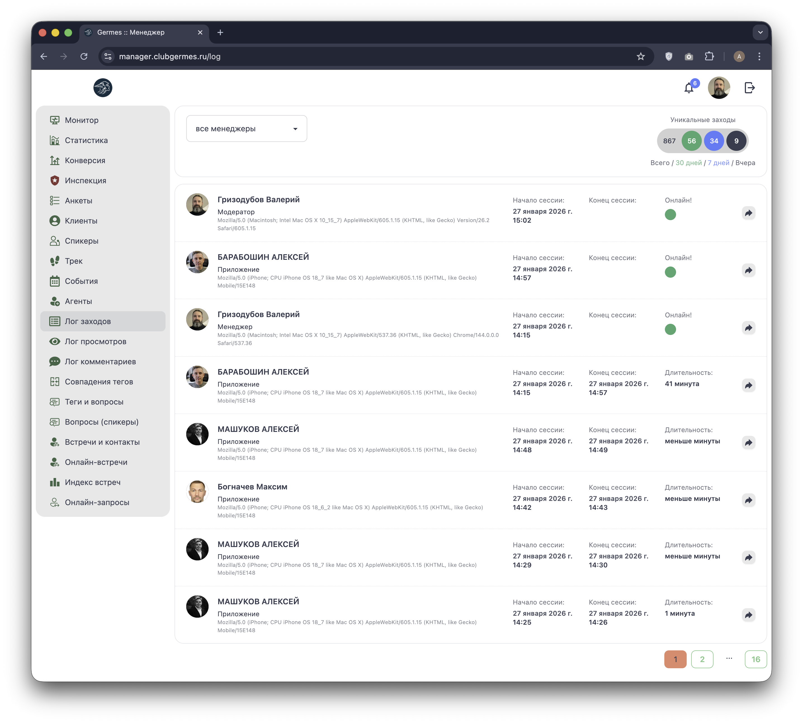

# 📋 Менеджер: Лог заходов (Log)

**Код:** `Log.svelte` (frontend/club-manager/src/views/Log.svelte)  
**Роут:** `/log` (Layout: `Main`)

Модуль **Лог заходов** предназначен для мониторинга активности пользователей в системе. Он отображает историю сессий (авторизаций) как клиентов мобильного приложения, так и менеджеров/администраторов в веб-интерфейсе.

{style="block"}

## 1. Статистика (Сводка)

В правом верхнем углу расположен блок статистики уникальных заходов (Signings Stats).

| Период | Цвет | Переменная в коде |
| :--- | :--- | :--- |
| **Всего** | Серый | `stats['signings_all']` |
| **30 дней** | Зеленый | `stats['signings_month']` |
| **7 дней** | Синий | `stats['signings_week']` |
| **Вчера** | Черный | `stats['signings_yersterday']` |

Данные загружаются отдельным запросом `signingsStats` (Endpoint: `/ma/stats/signings`) с привязкой к дате "вчера".

## 2. Фильтрация

*   **Фильтр по менеджеру:** Позволяет просматривать активность клиентов, закрепленных за конкретным коммьюнити-менеджером.
    *   *Доступ:* Роли `admin`, `manager`, `moderator`, `chief` видят выпадающий список всех менеджеров.
    *   *Ограничение:* Обычный `community manager` видит только свое имя (фиксировано).

## 3. Список сессий

Таблица отображает хронологию входов в систему.

### Элементы строки

1.  **Пользователь:**
    *   Аватар и Имя.
    *   **Тип клиента:** Подпись под именем (определяется объектом `clients` в коде):
        *   `Приложение` (Мобильный клиент).
        *   `Менеджер` (Веб-панель).
        *   `Модератор`.
    *   **Техническая информация:** Строка User-Agent (устройство, браузер, версия ОС), например: `iPhone OS 18_2`.

2.  **Время сессии:**
    *   **Начало:** Дата и время авторизации.
    *   **Конец:** Время завершения активности.

3.  **Статус и Длительность:**
    *   🟢 **Онлайн!** – Если сессия активна (поле `time_to` отсутствует).
    *   ⏱ **Длительность** – Если сессия завершена, рассчитывается разница времени (функция `toTimeLength`), например: "41 минута" или "меньше минуты".

4.  **Действие:**
    *   Кнопка со стрелкой переводит в **Профиль пользователя** (`/users/' + item.user_id`).

## 4. Техническая реализация

### API Запросы
*   **Список:** `logSignings` (`/ma/log/signings`). Поддерживает пагинацию (`page`) и фильтрацию по `communityManagerId`.
*   **Статистика:** `signingsStats` (`/ma/stats/signings`).

### Хелперы
*   `toTimeLength(seconds)`: Преобразует разницу во времени в человекочитаемую строку ("X час(ов) Y минут").
*   `toFeedDatePart...`: Форматирование дат.

### Особенности
*   Список обновляется при смене страницы пагинации или выборе менеджера в фильтре.
*   Зеленый индикатор "Онлайн" рендерится условно: `{#if item.time_to} ... {:else} Онлайн! {/if}`.
