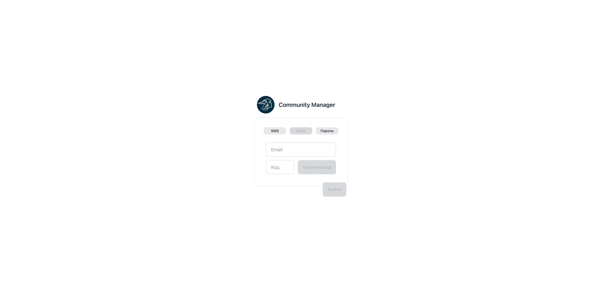
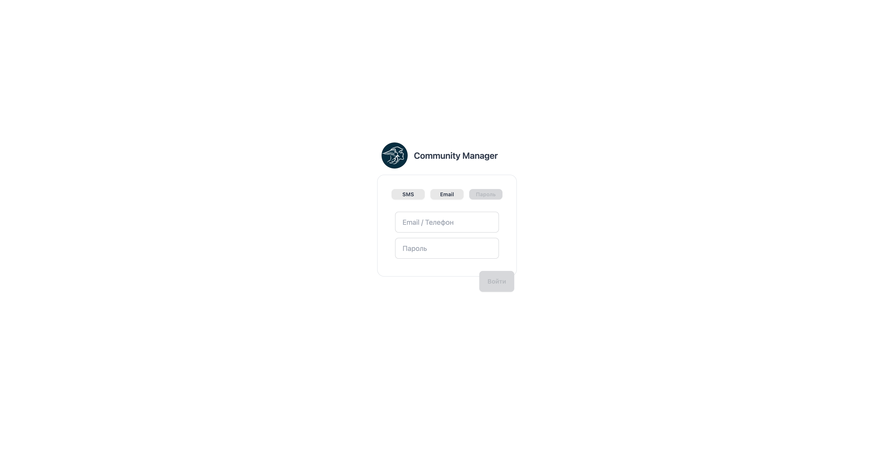

# 🔐 Менеджер: Аутентификация (Login)

**Код:** [`Login.svelte`](../../../frontend/club-manager/src/views/Login.svelte)  
**Роут:** `/auth` (Layout: `Auth`)

## 1. Общее описание
Экран входа в административную панель "Community Manager". Представляет собой компактную карточку с тремя способами аутентификации. Реализован как SPA-компонент с внутренней навигацией (табами) без перезагрузки страницы.

---

## 2. Способы входа

Пользователь переключает режимы с помощью табов в верхней части карточки. Переключение очищает введенные данные.

> **Визуализация состояний**
> 
> | SMS (OTP) | Email (OTP) | Пароль |
> | :---: | :---: | :---: |
> |  |  |  |

### 📱 Режим 1: SMS (по умолчанию)
*   **Сценарий:** Вход по номеру телефона через одноразовый код.
*   **Поля:**
    *   `Телефон`: Валидация по RegEx `[\d\s\(\)\-]{10,20}`.
    *   `Код`: Поле ввода кода появляется и кнопка меняется на "Войти" после успешной отправки запроса на код.
*   **Действие:**
    1.  Ввод телефона -> Кнопка "Получить код" (`userSetCode`).
    2.  Ввод кода -> Кнопка "Войти" (`userValidateCode`).

### 📧 Режим 2: Email
*   **Сценарий:** Вход по почте через одноразовый код.
*   **Поля:**
    *   `Email`: Валидация по стандартному RegEx.
*   **Действие:** Аналогично SMS, используется тот же эндпоинт `userSetCode` с типом `email`.

### 🔑 Режим 3: Пароль
*   **Сценарий:** Классический вход для администраторов.
*   **Поля:**
    *   `Email / Телефон`: Единое поле ввода логина.
    *   `Пароль`: Скрытое поле ввода.
*   **Действие:** Кнопка "Войти" вызывает `userLogin`.

---

## 3. Техническая реализация

### UI Компоненты
*   **Слайдер форм:** Реализован через CSS-транзишны. Контейнер `div` имеет фиксированную ширину, а внутренний блок `w-[300%]` сдвигается через `margin-left` (`ml-0`, `ml-[-100%]`, `ml-[-200%]`) в зависимости от переменной `step` (1, 2, 3).
*   **Кнопка "Войти":** Вынесена визуально за пределы карточки (снизу) с помощью класса `indicator-item`. Она активируется (`disabled={!valid}`) только когда пройдены все проверки на клиенте.

### Логика (`Login.svelte`)

*   **State:**
    *   `step`: Текущая вкладка (1 - SMS, 2 - Email, 3 - Пароль).
    *   `code`: Флаг, показывающий, что код отправлен и нужно показать поле для ввода OTP.
    *   `waitFlag`: Блокировка повторной отправки кода на 10 секунд.

### API Queries (`src/queries/auth.ts`)

| Метод | Query | Описание |
| :--- | :--- | :--- |
| **Отправка кода** | `userSetCode` | `POST /login/{type}`. Отправляет OTP. |
| **Проверка кода** | `userValidateCode` | `POST /man/login/{type}/validate`. Обменивает OTP на токен. |
| **Вход по паролю** | `userLogin` | `POST /man/login`. Обменивает пару логин/пароль на токен. |

---

## 4. Валидация
Кнопка "Войти" и "Получить код" блокируются атрибутом `disabled` на основе реактивных переменных:
*   `validPhone`: Проверка формата телефона.
*   `validEmail`: Проверка формата почты.
*   `valid`: Комбинированное условие (выбранный шаг + заполненность полей + длина кода = 4 символа).