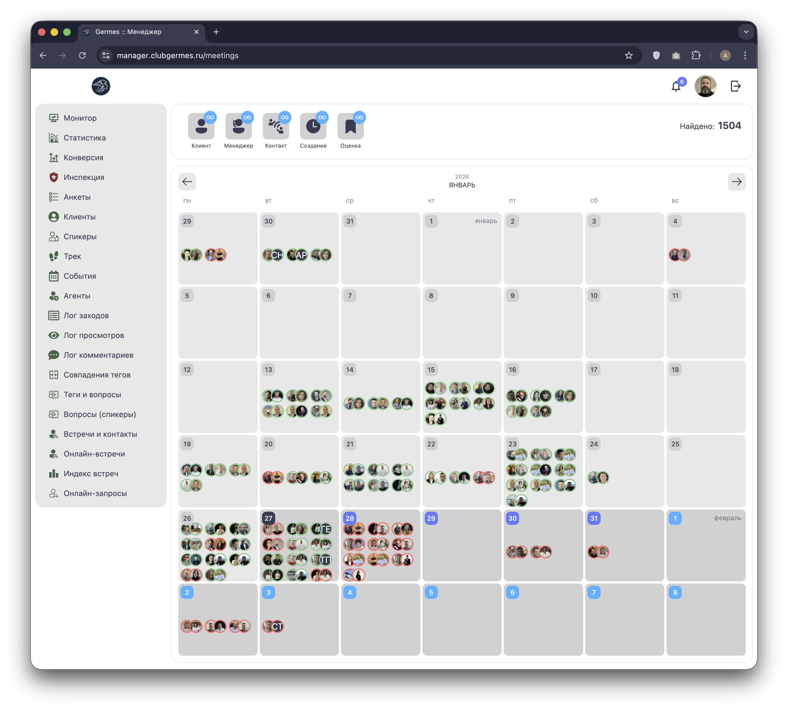
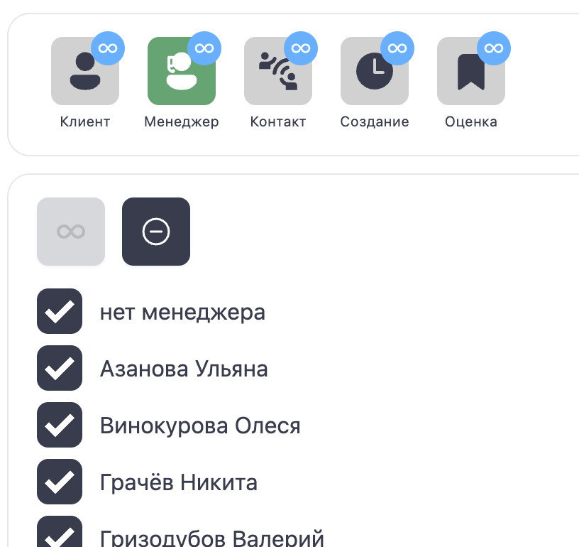
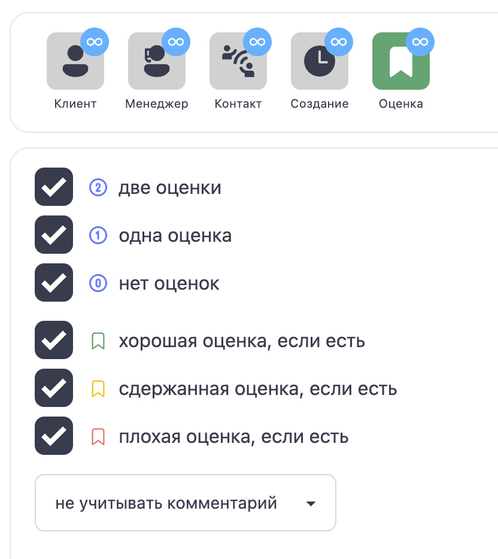
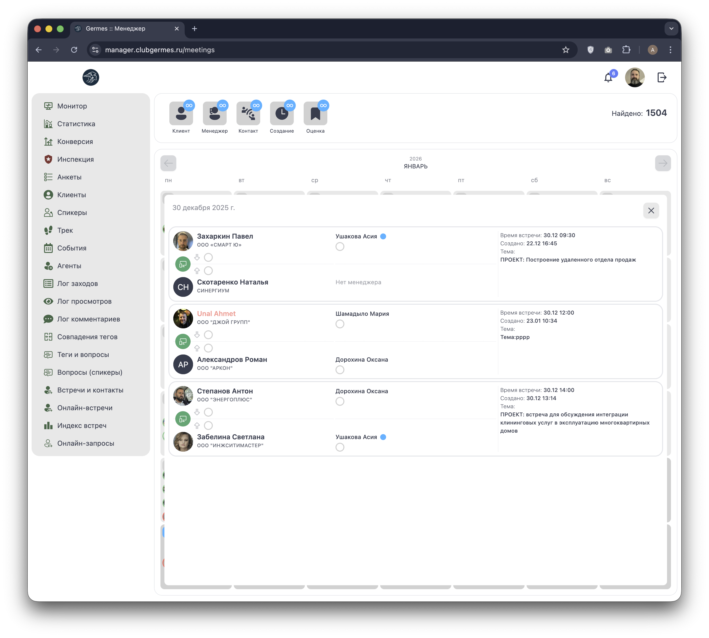

# 💻 Менеджер: Онлайн-встречи (Meetings)

**Код:** `src/views/Meetings.svelte`  
**Роут:** `/meetings` (Layout: `Main`)

Модуль **Онлайн-встречи** предназначен для организации и контроля онлайн-нетворкинга. Он позволяет менеджерам видеть загрузку календаря, назначать встречи в свободные слоты и контролировать их проведение.

{style="block"}

## 1. Панель фильтров

Инструменты для настройки отображения календаря.

| Элемент | Описание | Привязка к коду |
| :--- | :--- | :--- |
| **Менеджер** | Фильтр по ответственному КМ. | `filter.communityManager` |
| **Поиск** | Поиск по имени или компании. | `filter.name` |
| **Статусы** | Фильтр по статусу встречи (Состоялась/Не состоялась). | `filter.state` |
| **Оценка** | Фильтр по наличию оценки от участников. | `filter.evaluation` |
| **Создание** | Фильтр по дате создания заявки. | `filter.dateCreation` |
| **Событие** | Выбор диапазона дат для отображения в календаре. | `filter.date` |
| **Счетчик** | "Найдено: N" — показывает количество найденных встреч. | `amount` |

## 2. Детальная настройка фильтров

### Клиент
Поиск по текстовому входу (Имя/Компания).

{style="block"}

### Менеджер
Выбор одного или нескольких ответственных менеджеров из списка.

{style="block"}

### Контакт (Тип и Статус)
Позволяет выбрать статус встречи (Состоялось / Не состоялось).

{style="block"}

### Создание (Дата)
Выбор диапазона дат создания записи (С... По...).

{style="block"}

### Оценка
Фильтрация по наличию и качеству оценок.

{style="block"}

## 3. Календарь встреч

Основная область — это интерактивный календарь (компонент `CalendarTable2`).

*   **Ячейки:** Дни месяца. В каждой ячейке отображаются аватары участников, у которых назначены встречи на этот день.
*   **Индикация:** Цвет обводки аватара показывает статус встречи (например, красный — не состоялась или требует внимания).
*   **Взаимодействие:**
    *   Клик по ячейке дня открывает список встреч на эту дату (внизу).
    *   Кнопка `+` в ячейке позволяет создать новую встречу.

### Список встреч на день

При выборе даты под календарем открывается детальный список (`dataMeetingsList`).

{style="block"}

**Карточка встречи содержит:**
1.  **Время:** Точное время начала.
2.  **Участники:** Карточки обоих участников с их менеджерами.
3.  **Тема:** Тема встречи (например, "ПРОЕКТ: Построение удаленного отдела продаж").
    *   *Функция:* Менеджер может редактировать тему прямо в списке (кнопка "Сохранить").
4.  **Статусы и Оценки:**
    *   Возможность отметить статус (Состоялась/Нет) — радио-кнопки.
    *   Возможность проставить оценку за своего клиента.

## 4. Техническая реализация

### API Запросы
*   **Список:** `meetingsList` (Endpoint: `/ma/meetings/control`).
*   **Слоты:** `meetingsLog` (Endpoint: `/ma/meetings/slots/log`).
    *   Загружает занятые слоты для выбранных пользователей (`usersIds`), чтобы исключить накладки.
*   **Управление:**
    *   `userMeetingAdd`: Создание встречи.
    *   `userMeetingTime`: Изменение времени.
    *   `userMeetingDel`: Удаление.
    *   `meetingsUpdateComment`: Редактирование темы встречи.

### Особенности
*   **Календарь:** Используется кастомный компонент `CalendarTable2`, оптимизированный для отображения большого количества аватарок в сетке месяца.
*   **Валидация:** Логика проверки пересечений времени (`isAvailable`) реализована на клиенте на основе загруженного лога слотов, что обеспечивает мгновенную реакцию интерфейса.
