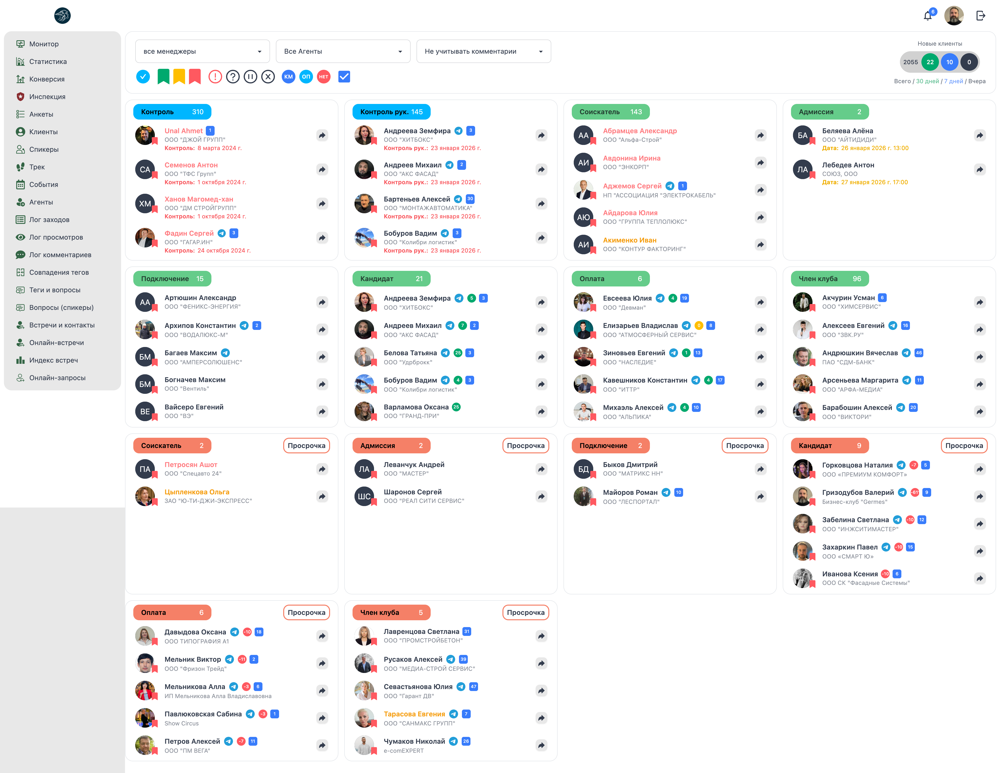

# 📊 Менеджер: Монитор (Dashboard)

**Код:** `Home.svelte` (frontend/club-manager/src/views/Home.svelte)  
**Роут:** `/home` (Layout: `Main`)

## Назначение
Главный экран приложения ("Монитор"). Представляет собой интерактивную **Канбан-доску** (или сводную таблицу) для управления жизненным циклом клиентов.
Основная задача: отображать оперативные задачи (Контроль) и распределение клиентов по стадиям воронки продаж.

> **Визуализация UI**

{style="block"}

---

## Архитектура данных

В отличие от стандартного CRUD, этот экран загружает **сырой лог событий и список пользователей**, а затем **на клиенте** собирает их в структуру колонок.

### Запрос данных
Используется паттерн `Entity/Collector`:
*   **Query:** `userMonitorSales` (`src/queries/user.ts`).
*   **Эндпоинт:** `/ma/user/monitor/sales`.
*   **Параметры:** `showMeetingsAmount: true` (подгружает статистику встреч).
*   **Возврат:** Объект с массивами `log` (события), `users` (клиенты), `community_managers`.

### Статистика (KPI)
В верхнем правом углу отображается виджет "Новые клиенты" (Всего / Месяц / Неделя / Вчера).
*   **Query:** `clientsStats` (`src/queries/stats.ts`).
*   **Эндпоинт:** `/ma/stats/clients/new`.

---

## Логика фильтрации (createMonitor)

Функция `createMonitor()` в `Home.svelte` — это ядро логики этого экрана. Она перебирает массив пользователей и распределяет их по **бакетам (buckets)** на основе состояния.

### Группы отображения (Слева направо, сверху вниз)

1.  **Контроль (Time Control)**
    *   *Условие:* `u.membership.semaphore[1].data.time_control` установлен.
    *   *UI:* Синяя плашка с заголовком "Контроль".
    *   *Сортировка:* По дате контроля.

2.  **Контроль Руководителя (Chief Control)**
    *   *Условие:* `u.membership.semaphore[1].data.time_chief_control` установлен.
    *   *UI:* Голубая плашка "Контроль рук.".

3.  **Стадии воронки (monitor.stages)**
    *   *Условие:* Пользователь находится в стадии (0-6) и **НЕ** имеет флагов `rejection` (отказ) или `postopen` (отложен).
    *   *Стадии:*
        *   0. У агента
        *   1. Соискатель
        *   2. Адмиссия
        *   3. Подключение
        *   4. Кандидат
        *   5. Оплата
        *   6. Член клуба
    *   *UI:* Зеленые заголовки.

4.  **Просрочка (monitor.stagesOutdated)**
    *   *Условие:* `stage.time < today` (время нахождения на стадии истекло).
    *   *UI:* Кнопка с красной обводкой "Просрочка".

5.  **Отказ / Отложенные**
    *   Отображаются, если включены соответствующие фильтры.

---

## Панель фильтров

Панель управления находится над сеткой карточек.

| Элемент | Переменная в коде | Описание логики |
| :--- | :--- | :--- |
| **Менеджеры** | `filter.communityManager` | Dropdown. Фильтрует по `community_manager_id`. Значение `-1` — все, `0` — без менеджера. |
| **Агенты** | `filter.agent` | Dropdown. Фильтрует по `agent_id`. |
| **Комментарии** | `filter.dateComment` | Фильтр по давности последнего комментария (3 дня, неделя, 2 недели). |
| **КМ** (Синий) | `filter.cmFlag` | Показать пользователей с привязкой к Коммьюнити Менеджеру (department = 1). |
| **ОП** (Бирюзовый) | `filter.opFlag` | Показать пользователей Отдела Продаж (department != 1). |
| **НЕТ** (Красный) | `filter.noneFlag` | Показать пользователей без менеджера. |
| **Чекбоксы** | `filter.check` | Фильтрация по статусу проверки (control). |

---

## Карточка клиента

Карточки рендерятся **инлайн** внутри цикла `#each` в `Home.svelte`.

**Ключевые элементы карточки:**
1.  **Аватар и Статус:** Используется компонент `Avatar`. Цвет кольца зависит от рейтинга.
2.  **Имя и Компания:** `nameNormalization(u.name)`.
3.  **Telegram:** Иконка самолетика, если есть `link_telegram`.
4.  **Дата контроля:** Отображается красным, если дата прошла.
5.  **Action Button:** Кнопка со стрелкой ➔ переводит на страницу профиля пользователя (`/users/:id`).

## Технический долг и Особенности

*   ⚠️ **Inline Rendering:** Код рендеринга карточки дублируется для каждой секции. Это усложняет поддержку.
*   ⚠️ **Heavy Client Logic:** Вся фильтрация и сортировка тысяч пользователей происходит в браузере при каждом изменении фильтра.
*   **Reactivity:** Используется Svelte reactivity (`$: users, filter, createMonitor()`), что обеспечивает мгновенный отклик UI.
