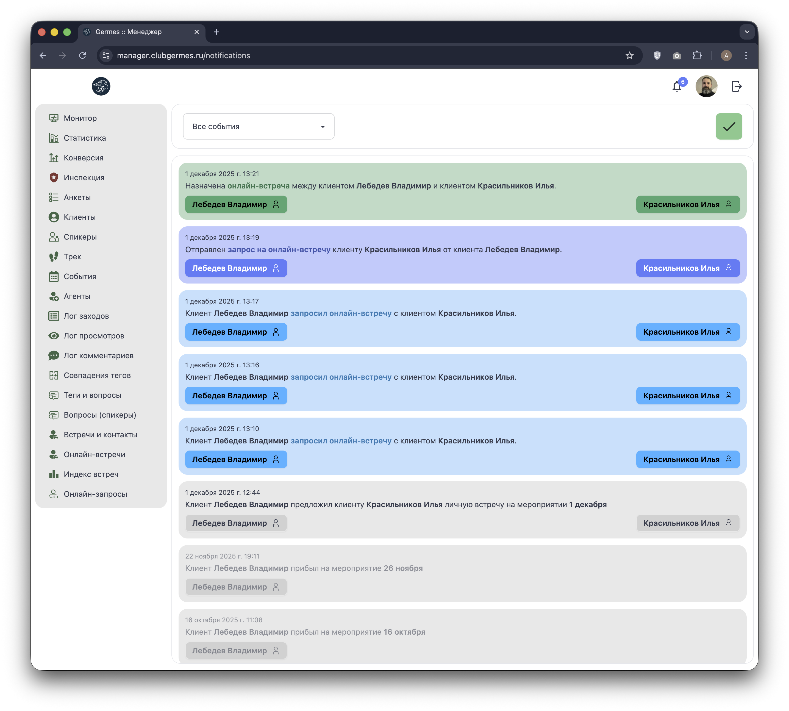

# 🔔 Менеджер: Оповещения (Notifications)

**Код:** `src/views/Notifications.svelte`  
**Роут:** `/notifications` (Layout: `Main`)

Модуль **Оповещения** — это централизованная лента событий, позволяющая менеджеру оперативно реагировать на изменения в системе: новые заявки на встречи, подтверждения, отказы и прибытие гостей на мероприятия.

{style="block"}

## 1. Панель управления

В верхней части экрана расположены инструменты для работы со списком:

1.  **Фильтр событий (`filter.event`):** Выпадающий список (Dropdown) с 9 типами уведомлений:
    - Все события
    - Запрос на онлайн-встречу
    - Отправка запроса на онлайн-встречу
    - Запрос на согласование времени
    - Отказ от встречи
    - Назначение онлайн-встречи
    - Прибытие на мероприятие
    - Предложение личной встречи
    - Согласие на личную встречу
    - Отказ от личной встречи
2.  **Отметить все прочитанными:** Зеленая кнопка с галочкой (✓) справа. Позволяет одним кликом сбросить статус "новое" со всех уведомлений в списке (`notificationViewAll`).

## 2. Список уведомлений

Лента отображает события в хронологическом порядке. Каждая карточка имеет цветовую кодировку в зависимости от типа события.

### Типы событий и цветовая кодировка

| Цвет | Тип события | Значение |
| :--- | :--- | :--- |
| 🟢 **Зеленый** | `online_confirmation` | **Назначение онлайн-встречи.** Время согласовано, встреча создана. |
| 🔵 **Голубой** | `online_request_draft` | **Запрос на онлайн-встречу.** Пользователь инициировал запрос. |
| 🟦 **Синий** | `online_request` | **Отправка запроса.** Запрос отправлен получателю. |
| 🟡 **Желтый** | `online_response_true` | **Не согласовано время.** Требуется вмешательство менеджера для выбора слота. |
| 🔴 **Красный** | `online_response_false` | **Отказ от встречи.** Пользователь отклонил запрос. |
| ⚫️ **Серый** | `arrive` | **Прибытие.** Участник прошел чек-ин на мероприятии. |
| ⚫️ **Серый** | `manager_connection_add` | **Предложение личной встречи.** Участник предложил встречу на мероприятии. |
| ⚫️ **Серый** | `manager_connection_response_true` | **Согласие на личную встречу.** Участник принял предложение. |
| ⚫️ **Серый** | `manager_connection_response_false` | **Отказ от личной встречи.** Участник отклонил предложение. |

### Структура карточки

1.  **Дата и время:** Точное время возникновения события.
2.  **Текст:** Описание события со ссылками на соответствующие разделы (например, "перейти к запросу").
3.  **Участники:** Кнопки с именами участников.
    *   Клик по кнопке открывает профиль пользователя в новой вкладке.
    *   Клик также автоматически отмечает уведомление как прочитанное (`notificationView`).

> **Статус прочитанности:** Новые уведомления отображаются ярко. Прочитанные становятся полупрозрачными (`opacity-50`).

## 3. Техническая реализация

### API Запросы
*   **Список:** `notificationList` (Endpoint: `/ma/notification/list`).
    *   Загружает список уведомлений (лимит 50 шт.).
*   **Действия:**
    *   `notificationView`: Отметить конкретное уведомление как прочитанное.
    *   `notificationViewAll`: Отметить все уведомления в списке как прочитанные.

### Особенности
*   **Real-time:** Список автоматически обновляется при поступлении новых событий через WebSocket (`subscribe('events', refresh)`).
*   **Навигация:** Ссылки внутри текста уведомлений ведут на разделы `/requests` (Онлайн-запросы) и `/meetings` (Онлайн-встречи) для быстрой обработки.