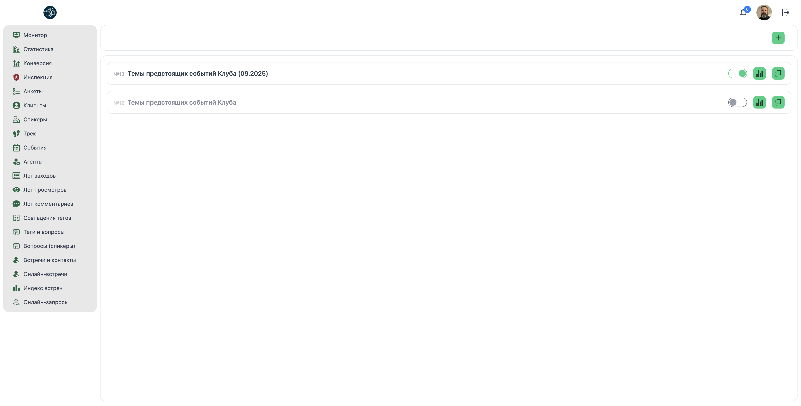
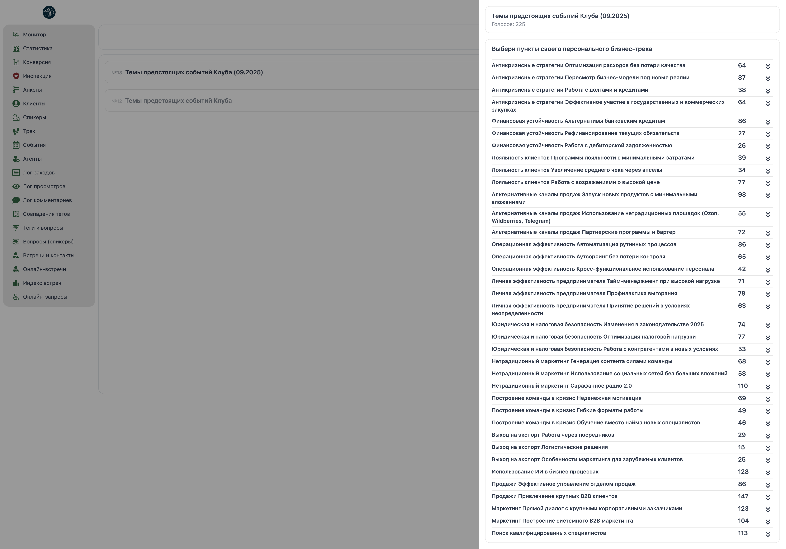
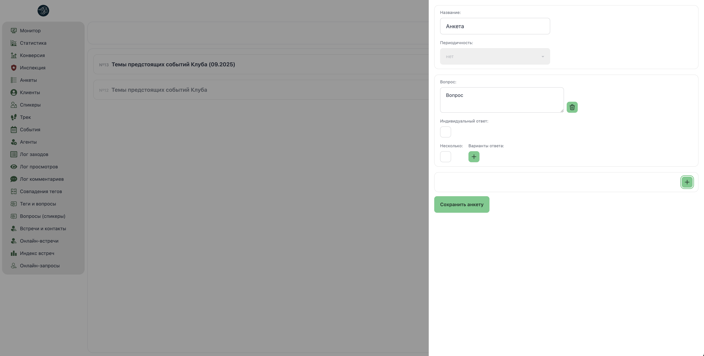
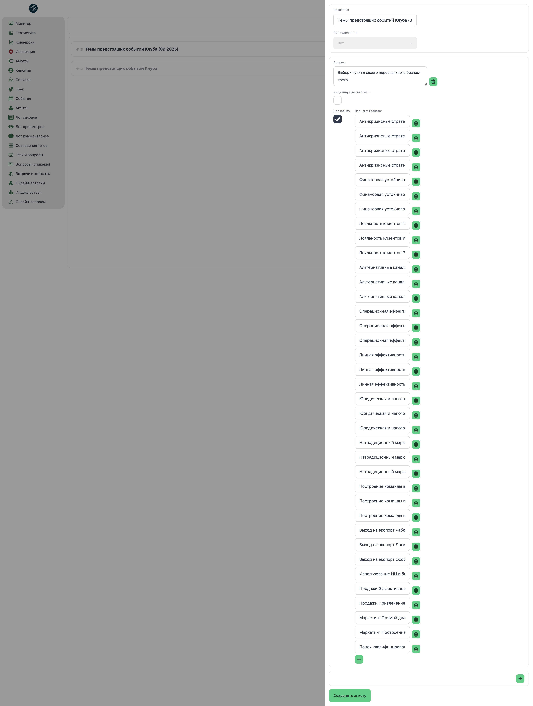

# 📋 Менеджер: Анкеты (Опросы)

**Код:** `Polls.svelte` (frontend/club-manager/src/views/Polls.svelte)  
**Роут:** `/polls` (Layout: `Main`)

## Назначение
Экран предназначен для создания, редактирования и просмотра результатов анкет (опросов) для пользователей клуба. Позволяет менеджерам собирать структурированную информацию от клиентов, анализировать ответы и экспортировать данные. Поддерживает различные типы вопросов: одиночный выбор, множественный выбор и индивидуальные текстовые ответы.

> **Визуализация UI**

### Список анкет

{style="block"}

### Детальная статистика

{style="block"}

### Создание анкеты

{style="block"}

### Экспорт данных

{style="block"}

---

## Элементы интерфейса

### Главный экран (Список анкет)

#### Кнопка "Создать анкету"
Зеленая квадратная кнопка с иконкой "+" в правом верхнем углу. Открывает боковую панель для создания новой анкеты.

#### Список анкет
Отображается в виде карточек с информацией:

**Структура карточки:**
*   **Номер анкеты:** Серый номер в формате `№123`.
*   **Название:** Название анкеты (например: "Темы предстоящих событий Клуба (09.2025)").
*   **Тоггл активности:** Переключатель для включения/отключения анкеты.
    *   Активная анкета: название отображается нормально.
    *   Неактивная анкета: название с пониженной прозрачностью (`opacity-60`).
*   **Кнопка "Статистика"** (иконка столбчатой диаграммы): Открывает боковую панель с результатами опроса.
*   **Кнопка "Копировать"** (иконка документов): Создает копию анкеты для редактирования.

---

### Боковая панель: Создание/Редактирование анкеты

Открывается справа (drawer-end) при клике на кнопку "Создать" или "Копировать".

#### Основные настройки

**Название:**
*   Текстовое поле для ввода названия анкеты.
*   Плейсхолдер: "Название".

**Периодичность:**
*   Выпадающий список (в текущей версии отключен `disabled`).
*   Единственное значение: "нет" (`null`).

> **Примечание:** Функционал периодических опросов не реализован.

#### Блок вопроса

Каждый вопрос отображается в отдельной карточке с рамкой.

**Поле "Вопрос":**
*   Многострочное текстовое поле (`textarea`).
*   Плейсхолдер: "Информация".
*   Поддерживает форматирование через теги: `[b]...[/b]` (жирный), `[br]` (перенос строки).

**Кнопка "Удалить вопрос":**
*   Иконка корзины в правом верхнем углу блока.
*   Удаляет вопрос из анкеты.

**Чекбокс "Индивидуальный ответ":**
*   Позволяет пользователям вводить свой текстовый ответ.
*   При активации появляется поле "Преамбула для индивидуального ответа".

**Преамбула для индивидуального ответа:**
*   Текстовое поле для подсказки пользователю (например: "Укажите свой вариант").

**Чекбокс "Несколько":**
*   Позволяет выбрать несколько вариантов ответа (`multiple: true`).
*   По умолчанию: одиночный выбор (`multiple: false`).

**Варианты ответа:**
*   Список текстовых полей для вариантов ответа.
*   Каждый вариант имеет кнопку удаления (иконка корзины).
*   Кнопка "+" для добавления нового варианта.

#### Кнопка "Добавить вопрос"
Квадратная кнопка с иконкой "+" внизу списка вопросов. Добавляет новый вопрос в анкету.

#### Кнопка "Сохранить анкету"
Зеленая кнопка внизу боковой панели. Отправляет данные на сервер через `savePoll()`.

---

### Боковая панель: Статистика анкеты

Открывается при клике на кнопку "Статистика" в карточке анкеты.

#### Заголовок
*   **Название анкеты:** Жирный шрифт.
*   **Количество голосов:** Серый текст (например: "Голосов: 223").

#### Блок вопроса (UI PollStatistics)

Для каждого вопроса отображается отдельная карточка.

**Заголовок вопроса:**
*   Текст вопроса с поддержкой форматирования (`[b]`, `[br]`).

**Таблица вариантов ответа:**
*   **Колонка 1:** Текст варианта ответа.
*   **Колонка 2:** Количество голосов (число).
*   **Колонка 3:** Кнопка раскрытия списка пользователей (стрелка вниз/вверх).

**Раскрывающийся список пользователей (PollOption):**

При клике на стрелку отображается список пользователей, выбравших этот вариант:

*   **Имя:** Нормализованное имя пользователя.
    *   Неактивные пользователи: пониженная прозрачность + красный цвет.
*   **Компания:** Название компании.
*   **Менеджер:** Имя менеджера, который провел опрос.
*   **Кнопка перехода:** Иконка стрелки → открывает профиль пользователя в новой вкладке.

**Индивидуальные ответы:**

Если вопрос имеет чекбокс "Индивидуальный ответ", внизу блока отображается секция:
*   **Заголовок:** "Индивидуальные ответы:" (мелкий шрифт).
*   **Список ответов:** Каждый текстовый ответ пользователя на отдельной строке.

---

## Структура данных

### Шаблон анкеты (pollTemplate)
```javascript
const pollTemplate = {
    group: 'combined',
    name: 'Анкета',
    active: true,
    repeat: null,
    questions: []
};
```

### Шаблон вопроса (questionTemplate)
```javascript
const questionTemplate = {
    body: 'Вопрос',
    multiple: false,      // Множественный выбор
    custom: false,        // Индивидуальный ответ
    customPreamble: '',   // Преамбула для индивидуального ответа
    options: []
};
```

### Шаблон варианта ответа (optionTemplate)
```javascript
const optionTemplate = {
    body: 'Ответ'
};
```

### Структура результатов (Data pollStatistics)
```javascript
const pollStatistics = {
    poll: {
        pollId: number,
        name: string,
        active: boolean,
        questions: [
            {
                questionId: number,
                body: string,
                multiple: boolean,
                custom: boolean,
                customPreamble: string,
                options: [
                    {
                        optionId: number,
                        body: string
                    }
                ]
            }
        ]
    },
    results: [
        {
            voteId: number,
            userId: number,
            target: [userId],  // ID пользователя, прошедшего опрос
            answers: [
                {
                    questionId: number,
                    options: [optionId],  // Массив выбранных вариантов
                    custom: string        // Индивидуальный ответ (если есть)
                }
            ]
        }
    ]
};
```

---

## Техническая реализация

### API запросы (GraphQL)

#### getPolls
Загружает список анкет и результаты опросов.

**Эндпоинт:** `/polls`

**Параметры:**
*   `group`: `'combined'` (тип анкеты).
*   `userId`: ID пользователя (для фильтрации, `null` для всех).
*   `active`: Статус активности (`null` для всех).

**Возврат:**
```javascript
const response = {
    polls: [],  // Массив анкет с результатами
    users: {}   // Объект пользователей { userId: userData }
};
```

#### updatePoll
Изменяет статус активности анкеты.

**Эндпоинт:** `/polls/update`

**Параметры:**
*   `pollId`: ID анкеты.
*   `active`: Новый статус (`true`/`false`).

#### savePoll
Создает новую анкету.

**Эндпоинт:** `/polls/add`

**Параметры:** Объект `pollEditable` (структура `pollTemplate`).

### Компоненты

#### Компонент PollStatistics
Отображает статистику по одному вопросу.

**Пропсы:**
*   `users`: Объект пользователей.
*   `question`: Объект вопроса.
*   `results`: Массив результатов опроса.

**Логика:**
*   Извлекает индивидуальные ответы через `findCustomAnswers()`.
*   Рендерит компонент `PollOption` для каждого варианта ответа.
*   Отображает секцию индивидуальных ответов, если они есть.

#### Компонент PollOption
Отображает один вариант ответа с возможностью раскрытия списка пользователей.

**Пропсы:**
*   `users`: Объект пользователей.
*   `question`: Объект вопроса.
*   `results`: Массив результатов опроса.
*   `option`: Объект варианта ответа.

**Логика:**
*   Вычисляет количество голосов: `amount = results.filter(...)`.
*   При раскрытии (`open = true`) парсит результаты через `parseResults()`.
*   Формирует массив `data` с информацией о пользователях, выбравших этот вариант.

### Форматирование текста

Функция `parseCustomTags()` преобразует специальные теги в HTML:

```typescript
function parseCustomTags(str) {
    return str
        .replace(/\</gi, '&gt;')
        .replace(/\</gi, '&lt;')
        .replace(/\[b\]/gi, '<strong>')
        .replace(/\[\/b\]/gi, '</strong>')
        .replace(/\[br]/gi, '<br />');
}
```

**Поддерживаемые теги:**
*   `[b]...[/b]` → `<strong>...</strong>` (жирный текст).
*   `[br]` → `<br />` (перенос строки).

### Drawer (Боковая панель)

Используется компонент DaisyUI `drawer-end`:
*   **Ширина:** Адаптивная (`90%` на мобильных, `620px-800px` на десктопе).
*   **Состояние:** Управляется переменной `formState`.
*   **Содержимое:** Либо форма редактирования (`pollEditable`), либо статистика (`pollStatistics`).

### Копирование анкеты

Функция `createPoll(p)` создает глубокую копию анкеты:

```typescript
function createPoll(p) {
    const temp = JSON.parse(JSON.stringify(pollTemplate));
    // Копирование вопросов и вариантов ответа
    temp.name = p.poll.name;
    temp.repeat = p.poll.repeat;
    temp.questions = questions;
    return temp;
}
```

> **Важно:** Копируется только структура анкеты без `pollId`, что позволяет создать новую анкету на основе существующей.

---

## Особенности и ограничения

### Функциональность
*   ✅ **Создание анкет:** Полная поддержка создания с неограниченным количеством вопросов и вариантов.
*   ✅ **Редактирование:** Через функцию копирования (создание новой анкеты на основе существующей).
*   ✅ **Статистика:** Детальная статистика по каждому вопросу с раскрывающимися списками пользователей.
*   ✅ **Индивидуальные ответы:** Поддержка текстовых ответов пользователей.
*   ✅ **Форматирование:** Поддержка базового форматирования через теги `[b]`, `[br]`.
*   ⚠️ **Периодичность:** Функционал периодических опросов не реализован (поле отключено).
*   ⚠️ **Прямое редактирование:** Нет возможности редактировать существующую анкету напрямую (только копирование).
*   ⚠️ **Удаление анкет:** Функционал удаления отсутствует.

### Производительность
*   **Легкий клиент:** Основная логика на сервере, клиент только отображает данные.
*   **Реактивность:** Автоматический пересчет количества голосов при изменении `results`.
*   **Lazy Loading:** Списки пользователей загружаются только при раскрытии варианта ответа.

### Технический долг
*   **Отсутствие валидации:** Нет проверки на пустые названия, вопросы или варианты ответа.
*   **Жестко закодированная группа:** `group: 'combined'` зашита в коде.
*   **Отсутствие сортировки:** Анкеты отображаются в обратном порядке (`reverse()`), но нет возможности изменить сортировку.
*   **Нет поиска/фильтрации:** При большом количестве анкет сложно найти нужную.

### Доступ
Экран доступен пользователям с ролями: `admin`, `manager`, `moderator`, `chief`, `community manager`.

---

## Примеры использования

### Сценарий 1: Создание анкеты
1. Менеджер кликает на кнопку "+" в правом верхнем углу.
2. Открывается боковая панель с формой.
3. Вводит название: "Темы предстоящих событий Клуба (09.2025)".
4. Кликает "Добавить вопрос" → вводит текст вопроса.
5. Добавляет варианты ответа через кнопку "+".
6. Повторяет шаги 4-5 для всех вопросов.
7. Кликает "Сохранить анкету" → анкета появляется в списке.

### Сценарий 2: Просмотр статистики
1. Менеджер кликает на иконку столбчатой диаграммы в карточке анкеты.
2. Открывается боковая панель со статистикой.
3. Видит количество голосов по каждому варианту ответа.
4. Кликает на стрелку рядом с вариантом → раскрывается список пользователей.
5. Видит имена, компании и менеджеров.
6. Кликает на иконку стрелки → открывается профиль пользователя в новой вкладке.

### Сценарий 3: Копирование анкеты
1. Менеджер кликает на иконку копирования в карточке анкеты.
2. Открывается боковая панель с формой, заполненной данными исходной анкеты.
3. Вносит изменения (например, меняет название на "Темы предстоящих событий Клуба (10.2025)").
4. Кликает "Сохранить анкету" → создается новая анкета.

### Сценарий 4: Отключение анкеты
1. Менеджер переключает тоггл активности в карточке анкеты.
2. Название анкеты становится полупрозрачным.
3. Анкета больше не отображается пользователям для заполнения.

---

## Интеграция с другими экранами

*   **Профиль пользователя:** Из статистики анкеты можно перейти в профиль пользователя через кнопку со стрелкой.
*   **Монитор:** Результаты анкет могут использоваться для анализа активности пользователей.
*   **Экспорт данных:** Статистику можно экспортировать (функционал виден на скриншоте, но не реализован в текущем компоненте).

---

## Будущие улучшения

*   **Периодические опросы:** Реализация функционала автоматического повторения анкет.
*   **Прямое редактирование:** Возможность редактировать существующие анкеты без копирования.
*   **Удаление анкет:** Добавление функционала удаления неактуальных анкет.
*   **Экспорт в Excel/CSV:** Экспорт статистики в табличные форматы.
*   **Фильтрация и поиск:** Поиск по названию, фильтрация по статусу активности.
*   **Визуализация:** Добавление графиков (круговые диаграммы, столбчатые диаграммы) для наглядности.
*   **Валидация:** Проверка заполненности обязательных полей перед сохранением.
*   **Шаблоны анкет:** Библиотека готовых шаблонов для быстрого создания типовых опросов.