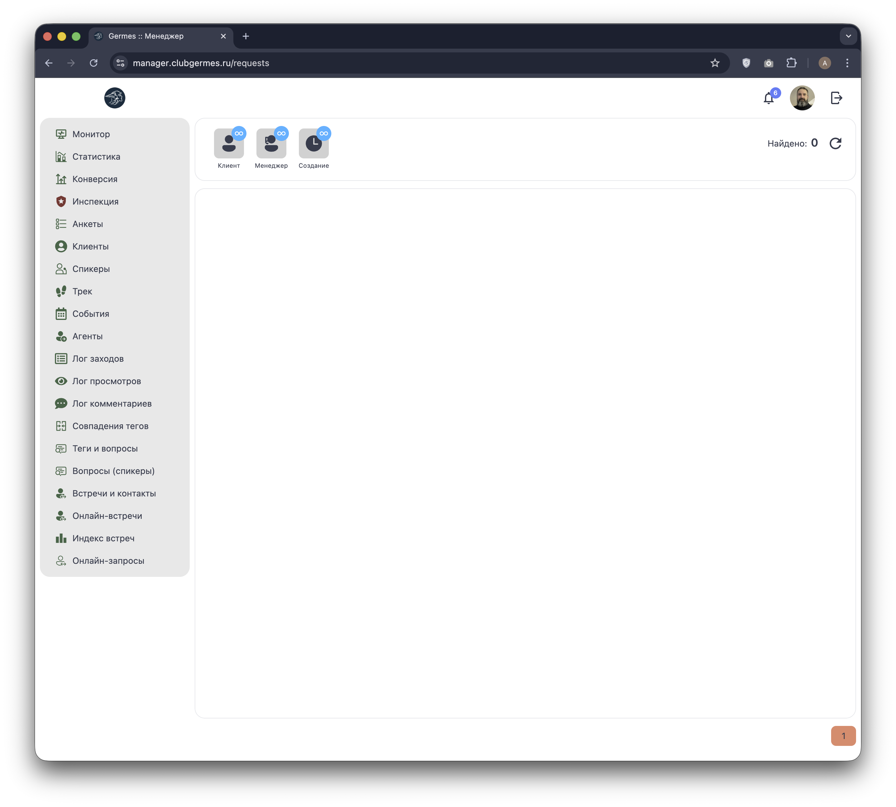
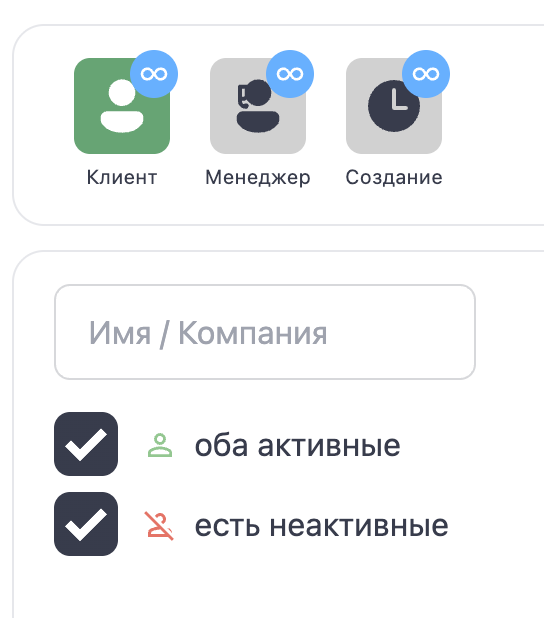
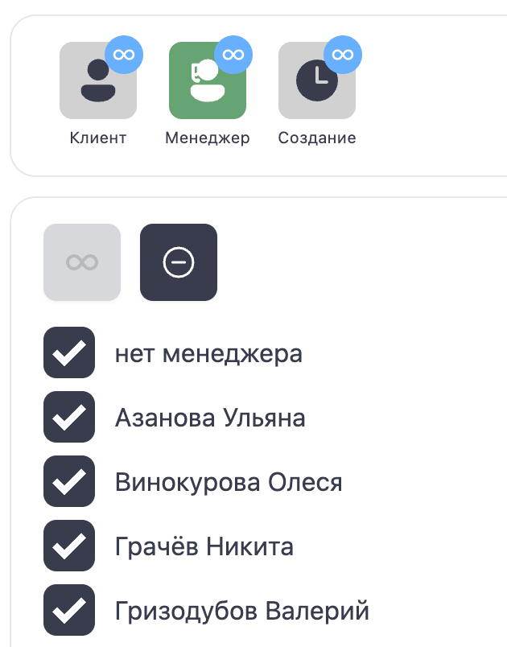
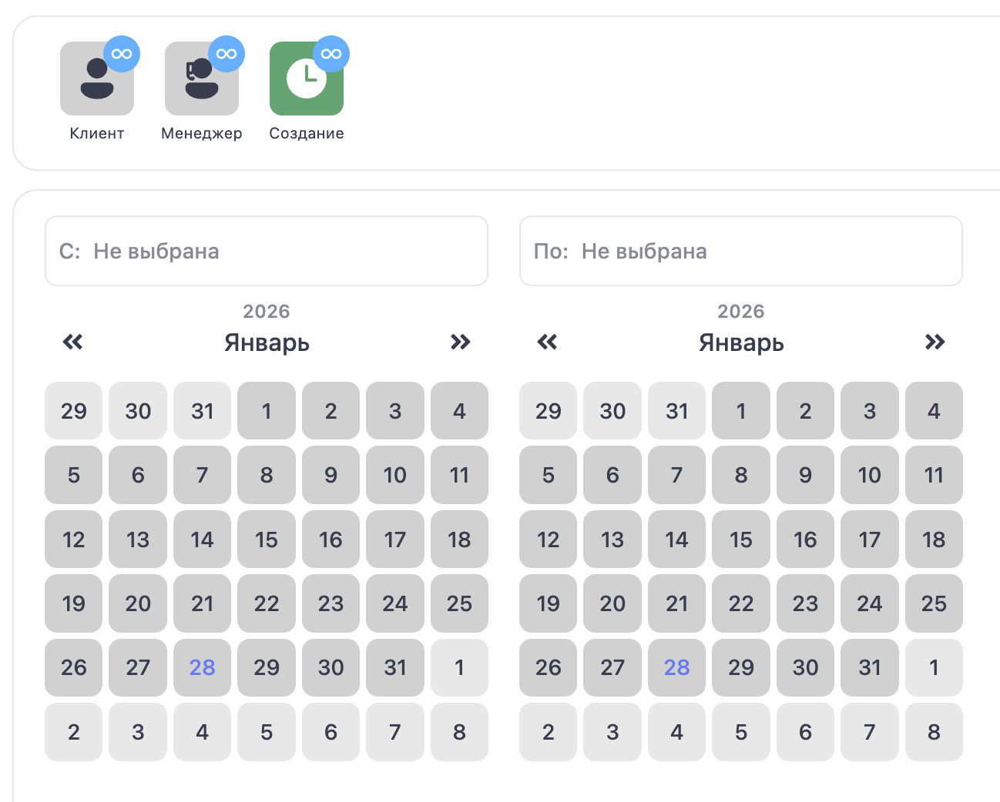

# 🙋‍♂️ Менеджер: Онлайн-запросы (Requests)

**Код:** `src/views/Requests.svelte`  
**Роут:** `/requests` (Layout: `Main`)

Модуль **Онлайн-запросы** — это буферная зона для модерации заявок на онлайн-встречи. Когда один резидент отправляет запрос на встречу другому, заявка попадает сюда. Задача менеджера — согласовать время с обеими сторонами, проверить свободные слоты и утвердить встречу.

После утверждения запрос исчезает из этого списка и появляется в модуле **[Онлайн-встречи](Manager-Meetings.md)**.

{style="block"}

## 1. Панель фильтров

Инструменты для поиска заявок.

| Фильтр | Описание | Код |
| :--- | :--- | :--- |
| **Менеджер** | Фильтр по ответственному КМ. | `filter.communityManager` |
| **Создание** | Фильтр по дате создания заявки (диапазон). | `filter.dateCreation1`, `filter.dateCreation2` |
| **Клиент** | Поиск по имени или компании. | `filter.name` |
| **Статус** | Фильтр по активности участников (Оба активные / Есть неактивные). | `filter.active` |
| **Счетчик** | "Найдено: N" — показывает количество необработанных запросов. | `amount` |
| **Обновить** | Кнопка (🔄) для принудительного обновления списка. | - |

## 2. Детальная настройка фильтров

### Клиент
Поиск по текстовому входу (Имя/Компания). Дополнительные опции:
- **Активность:** "оба активные" / "есть неактивные" (`filter.active`).

{style="block"}

### Менеджер
Выбор ответственного менеджера.

{style="block"}

### Создание (Дата)
Выбор диапазона дат создания заявки.

{style="block"}

## 3. Список запросов

Хотя на скриншоте список пуст, в коде заложена следующая структура карточки заявки:

1.  **Участники:** Две колонки — Инициатор (User 1) и Получатель (User 2).
2.  **Статус:** Текстовое поле в центре, описывающее состояние:
    *   *Ожидание ответа* (Участник 2 еще не ответил).
    *   *Требуется переназначение времени* (Участники согласны, нужно выбрать слот).
    *   *Отказ от встречи* (Заявка отклонена).
    *   *Требуется контроль* (Нужно вмешательство менеджера).
3.  **Действие:** Кнопка **"Обработать"** открывает панель модерации.

## 4. Обработка запроса (Drawer)

Боковая панель — основной рабочий инструмент менеджера в этом модуле.

### А. Анализ занятости (Лог слотов)
Менеджер может нажать кнопку **"Занятые слоты"**, чтобы увидеть расписание обоих участников (`meetingsLog`).
*   Система загружает занятые слоты и отображает их в виде карточек.
*   Это помогает избежать накладок при выборе времени.

### Б. Назначение времени (Утверждение)
Если встреча согласована, менеджер выбирает время вручную:

1.  **Дата:** Календарь.
2.  **Время:**
    *   Ручной ввод часов/минут.
    *   Быстрые слоты (кнопки 11:00, 11:30 ... 17:00).
3.  **Валидация:** Система автоматически проверяет (`isAvailable`), свободен ли выбранный слот у обоих участников. Если занят — кнопка блокируется и выводится ошибка "Слот занят".
4.  **Утверждение:** Кнопка **"Утвердить встречу"** (`userMeetingRequestConfirmation`).

## 5. Техническая реализация

### API Запросы
*   **Список:** `requestsList` (Endpoint: `/ma/meetings/requests/control`).
    *   Загружает необработанные заявки.
*   **Проверка слотов:** `meetingsLog` (Endpoint: `/ma/meetings/slots/log`).
    *   Загружает расписание конкретных пользователей для проверки пересечений.
*   **Действия:**
    *   `userMeetingRequestConfirmation`: Подтверждение времени и перевод в статус "Встреча".
    *   `meetingsRequestControl`: Взятие заявки на контроль менеджером.
    *   `userMeetingDel`: Удаление/отмена заявки.

### Логика
*   **Права на контроль:** Менеджер видит кнопки управления только если он является ответственным за одного из участников, либо имеет роль `Chief/Admin`.
*   **Валидация на клиенте:** Проверка пересечения времени происходит мгновенно в браузере на основе загруженного массива `slots`, без лишних запросов к серверу при каждом клике.
*   **Пагинация:** 25 записей на страницу.
*   **Пустой список:** Если запросов нет, отображается пустая область с сообщением (или без него, как на скриншоте).