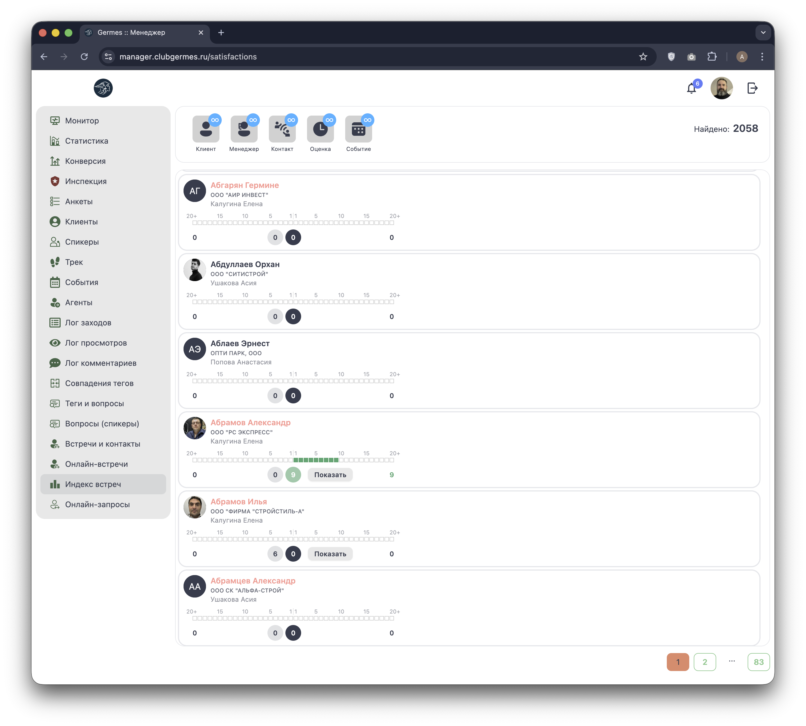
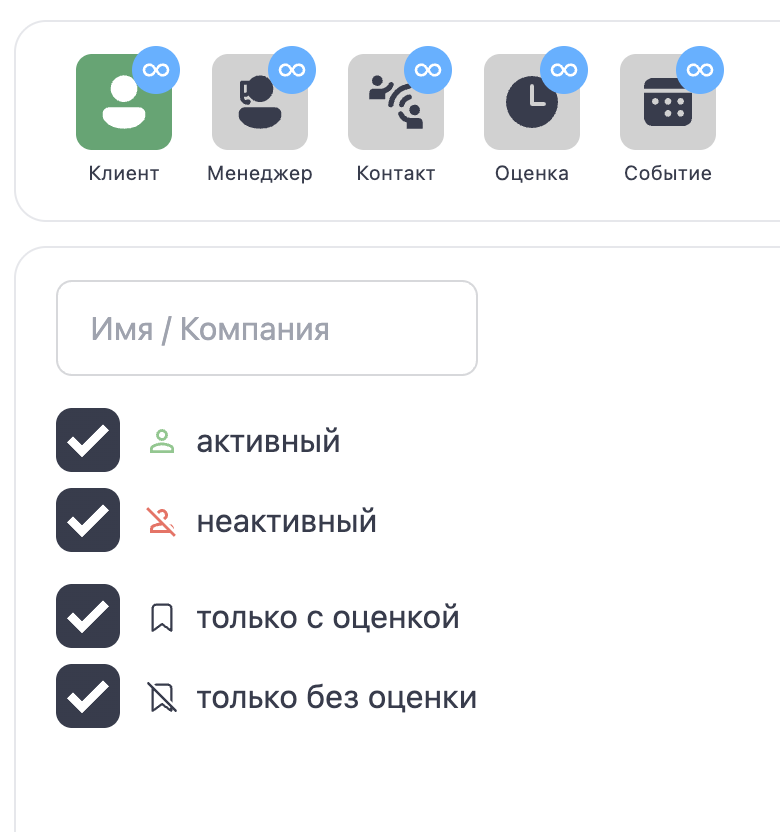
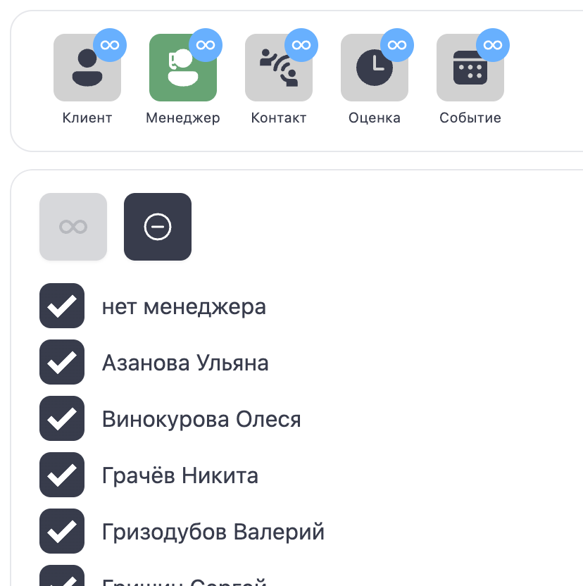
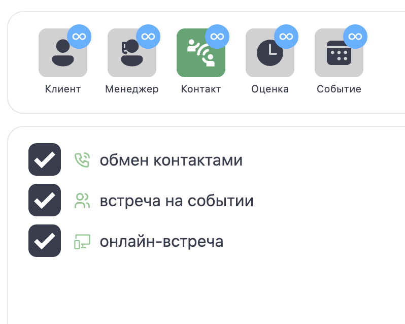
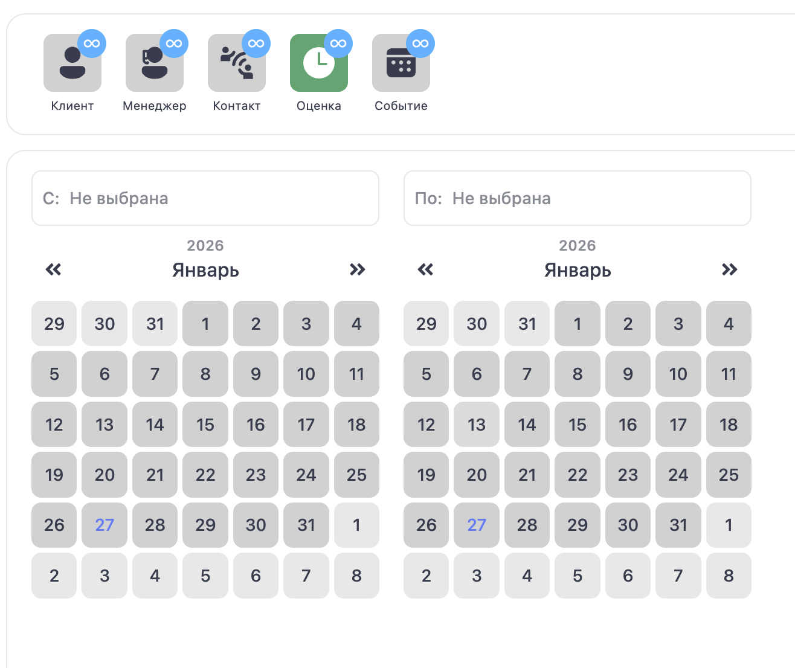
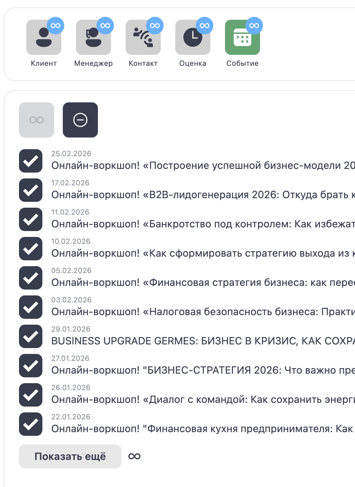

# 📊 Менеджер: Индекс встреч (Satisfactions)

**Код:** `src/views/Satisfactions.svelte` (frontend/club-manager/src/views/Satisfactions.svelte)  
**Роут:** `/satisfactions` (Layout: `Main`)

Модуль **Индекс встреч** визуализирует качество нетворкинга каждого резидента. Он строит графики распределения оценок, полученных участником за встречи, что позволяет быстро выявить самых популярных резидентов или тех, у кого возникают проблемы в коммуникации.

{style="block"}

## 1. Панель фильтров

Инструменты для выборки резидентов и анализа их рейтинга.

| Иконка | Название | Функция | Код |
| :--- | :--- | :--- | :--- |
| 👤 | **Клиент** | Поиск по имени или компании. | `filter.name` |
| 🎧 | **Менеджер** | Фильтр по ответственному менеджеру. | `filter.communityManager` |
| 📞 | **Контакт** | Фильтр по типу взаимодействия (Контакт/Встреча/Онлайн). | `filter.form` |
| 📅 | **Оценка** | Фильтр по дате (диапазон). | `filter.date` |
| 🏟️ | **Событие** | Фильтр по конкретному мероприятию. | `filter.event` |
| **Счетчик** | "Найдено: N" — показывает количество найденных анкет. | `amount` |

## 2. Детальная настройка фильтров

### Клиент
Поиск по текстовому входу. Дополнительные опции: "Только с оценкой" / "Только без оценки".

{style="block"}

### Менеджер
Выбор ответственного менеджера.

{style="block"}

### Контакт
Фильтрация по типу взаимодействия: Обмен контактами, Встреча на событии, Онлайн-встреча.

{style="block"}

### Оценка (Дата)
Выбор временного диапазона для анализа оценок (календари "С" и "По").

{style="block"}

### Событие
Выбор конкретного мероприятия.

{style="block"}

## 3. Список резидентов и Графики

Каждая строка списка представляет собой профиль резидента с визуализацией его "капитала встреч".

### График индекса
*   **Шкала:** Горизонтальные бары, показывающие количество оценок разного уровня.
*   **Зеленые полоски:** Положительные оценки (успешные встречи).
*   **Красные/Желтые:** Нейтральные или негативные отзывы.
*   **Диапазон:** Шкала нормируется от -20+ до 20+.

### Детализация
Кнопка **"Показать"** раскрывает подробную историю встреч выбранного резидента:
*   Список всех контактов с датами.
*   Комментарии к встречам.
*   Оценки по каждой конкретной встрече.

## 4. Техническая реализация

### API Запросы
*   **Список:** `satisfactionsList` (Endpoint: `/ma/satisfactions/control`).
    *   Возвращает список пользователей с агрегированными данными по оценкам.

### Особенности
*   **Визуализация:** Графики строятся на основе CSS-классов (ширина полоски пропорциональна количеству оценок).
*   **Фильтрация:** Параметр `filter.strictRating` позволяет отсечь "пустые" профили, у которых еще нет ни одной оценки.
