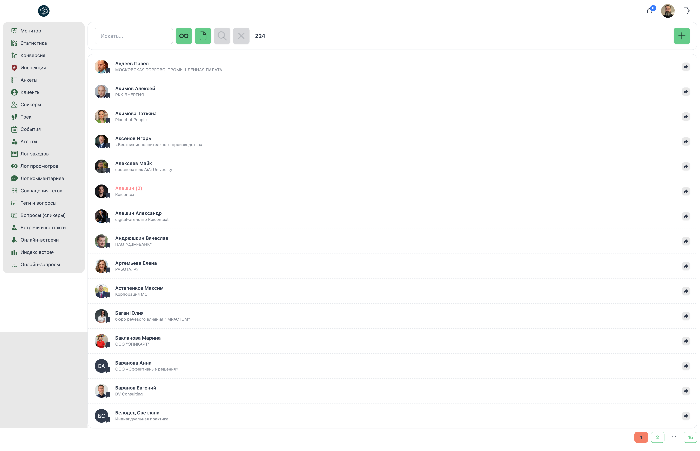
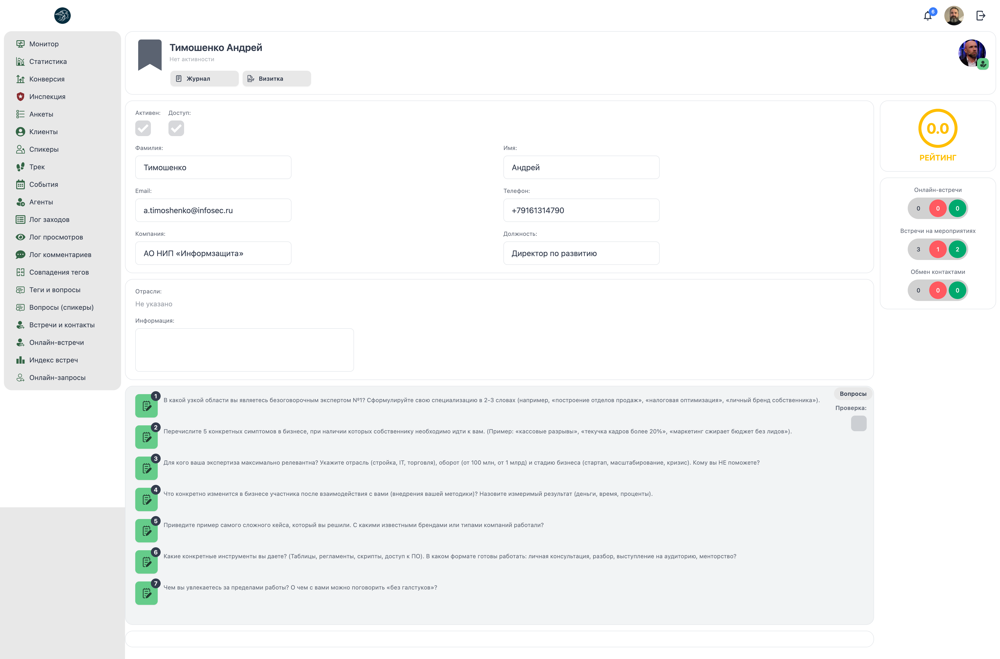

# 🎤 Менеджер: Спикеры

**Код:** `frontend/club-manager/src/views/Speakers.svelte`  
**Роут:** `/speakers` (Layout: `Main`)

Модуль управления базой спикеров клуба — экспертов, которые проводят онлайн-воркшопы, форумы и другие мероприятия. Позволяет искать, фильтровать, создавать и редактировать профили спикеров.

> **Визуализация UI**

### Список спикеров

{style="block"}

### Детальная карточка спикера

{style="block"}

---

## Функционал

### Поиск и фильтрация

**Поле поиска:**
*   Плейсхолдер: "Искать..."
*   Поиск по имени и компании спикера
*   Автоподсказки (автосаджест) при вводе текста (более 1 символа)
*   Показывает до 7 результатов в выпадающем списке
*   Кнопка "Показать всех" если результатов больше 7

**Фильтры:**
*   **Фильтр по контролю вопросов** (чекбокс с тремя состояниями):
    - ✓ Включен контроль вопросов
    - ☐ Выключен контроль вопросов  
    - ⊗ Без фильтра
*   **Фильтр по резюме** (чекбокс с тремя состояниями):
    - ✓ С резюме
    - ☐ Без резюме
    - ⊗ Без фильтра

**Кнопки управления:**
*   **Поиск** (🔍): Применить фильтры и выполнить поиск
*   **Очистить** (✕): Сбросить все фильтры
*   **Добавить** (+): Создать нового спикера
*   **Счетчик:** Общее количество найденных спикеров

#### Карточка спикера в списке

**Структура:**
*   **Аватар:** Круглое фото спикера (или инициалы).
*   **Имя:** Полное имя спикера.
    *   Неактивные спикеры отображаются красным цветом с пометкой "[2]".
*   **Специализация:** Краткое описание экспертизы под именем.
    *   Примеры: "ЮРИДИЧЕСКАЯ БЕЗОПАСНОСТЬ ПОД КЛЮЧ", "РИЭЛТОРСКИЕ УСЛУГИ", "БИЗНЕС-КОНСАЛТИНГ".
*   **Иконка перехода:** Стрелка справа для открытия детальной карточки.

**Сортировка:** По алфавиту.

**Примеры спикеров:**
*   Акимов Павел — ЮРИДИЧЕСКАЯ БЕЗОПАСНОСТЬ ПОД КЛЮЧ
*   Акимова Алексей — РИЭЛТОРСКИЕ УСЛУГИ
*   Аммосов Татьяна — РИЭЛТОРСКИЕ УСЛУГИ
*   Асеянов Игорь — БИЗНЕС-КОНСАЛТИНГ, БИЗНЕС-ТРЕНИНГИ
*   Анищенко Майя — КОНСАЛТИНГ, БИЗНЕС-ТРЕНИНГИ
*   Анищенко [2] — ПУСТО (неактивный)
*   Антипина Александр — БИЗНЕС-КОНСАЛТИНГ
*   Андрианова Всеслав — ГОСУДАРСТВЕННЫЕ ЗАКУПКИ

---

## Детальная карточка спикера

### Заголовок

**Элементы:**
*   **Аватар:** Крупное фото спикера (или инициалы).
*   **Имя:** Полное имя спикера (например: "Тимошенко Андрей").
*   **Специализация:** Под именем (например: "БИЗНЕС-КОНСАЛТИНГ").

**Кнопки действий:**
*   **Журнал** (📋): Просмотр истории активности спикера.
*   **Визитка** (👤): Просмотр/редактирование визитной карточки.

### Основная информация

#### Секция: Личные данные

**Поля (левая колонка):**
*   **Имя:** Текстовое поле.
*   **Email:** Текстовое поле.
*   **Класс ИП:** Текстовое поле.

**Поля (правая колонка):**
*   **Фамилия:** Текстовое поле.
*   **Телефон:** Текстовое поле.
*   **Должность:** Текстовое поле.

**Чекбоксы:**
*   **Актив:** Спикер активен.
*   **Бизнес:** Спикер ведет бизнес-тематику.

#### Секция: Подразделения

**Поля:**
*   **Название:** Текстовое поле (например: "Не указано").
*   **Биография:** Многострочное текстовое поле.

#### Секция: Отзывы

**Структура:**
Список отзывов о выступлениях спикера с зелеными галочками (✓) слева от каждого отзыва.

**Каждый отзыв содержит:**
*   **Номер:** Порядковый номер отзыва (1, 2, 3...).
*   **Текст отзыва:** Полный текст отзыва от участника.
*   **Зеленая галочка:** Отзыв подтвержден/одобрен.

**Примеры отзывов:**
```text
✓ 1. Самый полезный обзор, как мне кажется, что есть приходилось слушать на МГТТ. Хороший контент, много нюансов и тонкостей, полезная информация. Спасибо большое, с удовольствием послушаю еще!

✓ 2. Здравствуйте и спасибо за интересную и полезную информацию. Все было очень интересно, но хотелось бы побольше об НДС. Например, способы возврата, проводки и т.д. Важное дополнение, что надо...

✓ 3. Всё было очень интересно и максимально полезно, спасибо большое! Надеюсь, что в будущем будет еще что-то подобное по этой теме, так как тема очень актуальная...

✓ 4. Я не являюсь, к сожалению, в бизнесе практиком, поэтому мне было очень интересно и полезно послушать мнение практика. Очень хотелось бы услышать еще что-то...

✓ 5. Спасибо, очень полезно и понятно было. Хотелось бы еще услышать о том, какие еще есть варианты налоговых льгот для бизнеса, какие есть варианты...

✓ 6. Было полезно, как и слушать, и задавать вопросы. Надеюсь, что такие мероприятия будут еще, так как очень важно получать информацию из первых рук, особенно по таким важным темам...

✓ 7. Спасибо большое, все понятно и доступно. Хотелось бы еще раз услышать о налоговых льготах, какие есть варианты для бизнеса, какие есть варианты...
```

**Кнопки:**
*   **Вопросы:** Просмотр вопросов к спикеру.
*   **Программа:** Просмотр программы выступлений.

### Боковая панель (Sidebar)

**Элементы:**
*   **Аватар менеджера:** Круглое фото куратора спикера.
*   **Зеленая галочка:** Индикатор активности.

**Счетчики:**
*   **Онлайн-тренинги:** Количество проведенных онлайн-тренингов.
*   **Всего выступлений:** Общее количество мероприятий.
*   **Оценка удовлетворенности:** Средняя оценка от участников.

**Индикаторы (цветные кружки):**
*   **Серый (0):** Нейтральные оценки.
*   **Красный (0):** Негативные оценки.
*   **Зеленый (0):** Позитивные оценки.

---

## Техническая реализация

### Компоненты
*   **View**: `views/Speakers.svelte` (430 строк)
*   **SpeakerProfile**: Компонент формы создания/редактирования спикера
*   **Avatar**: Компонент отображения аватара

### API Запросы
Взаимодействие через `queries/user.ts`:

| Функция | Endpoint | Параметры | Описание |
|---|---|---|---|
| `speakerSearch` | `/ma/speaker/search` | `{ ids, text, page, filter, questionsControl, resume, ... }` | Поиск спикеров с фильтрацией. |

**Параметры speakerSearch:**
*   `text` (string): Текст поиска
*   `ids` (number[]): Массив ID для поиска конкретных спикеров
*   `page` (number): Номер страницы (пагинация по 15 записей)
*   `filter` (string[]): Поля для возврата (`['id', 'active', 'name', 'community_manager_id', 'avatar_hash', 'company', 'control_questions']`)
*   `questionsControl` (boolean | null): Фильтр по контролю вопросов
*   `resume` (boolean | null): Фильтр по наличию резюме
*   `ignoreCommunityManager` (boolean): Игнорировать менеджера
*   `showEventsConfirmationsPendings` (boolean): Показать подтверждения событий
*   `showNotesTimes` (boolean): Показать время заметок
*   `getPrevious` (boolean): Получить предыдущие данные
*   `getSatisfactions` (boolean): Получить оценки удовлетворенности
*   `getQuestions` (boolean): Получить вопросы
*   `showMeetingsRequests` (boolean): Показать запросы на встречи
*   `showMeetingsAmount` (boolean): Показать количество встреч
*   `getTariff` (boolean): Получить тариф
*   `getRating` (boolean): Получить рейтинг

**Возвращаемые данные:**
```json
{
    "users": [
        {
            "id": "number",
            "active": "boolean",
            "name": "string",
            "community_manager_id": "number | null",
            "avatar_hash": "string",
            "company": "string",
            "control_questions": "boolean"
        }
    ],
    "amount": "number",
    "community_managers": [
        {
            "id": "number",
            "name": "string",
            "department": "number | null"
        }
    ]
}
```

### Логика работы

**Автоподсказки (Autosuggest):**
*   Активируются при фокусе на поле поиска
*   Запрос отправляется с задержкой 500мс после ввода
*   Показывают до 7 результатов
*   Кнопка "Показать всех" для полного поиска

**Пагинация:**
*   По 15 спикеров на страницу
*   Умная пагинация: показывает текущую страницу, первую, последнюю и соседние
*   Многоточие (...) для пропущенных страниц

**Фильтрация:**
*   Три состояния для каждого фильтра: true / false / null
*   Фильтры применяются только после нажатия кнопки поиска
*   Кнопка поиска активна только при изменении параметров

### Drawer (боковая панель)

**Режим создания:**
*   Открывается при нажатии кнопки "+"
*   Компонент `SpeakerProfile` с `empty=true`
*   После создания обновляет список и закрывает панель

**Переход к профилю:**
*   Клик по спикеру → переход на `/speakers/:id`
*   Кнопка стрелки → переход на `/speakers/:id`

### Особенности

*   **Индикатор спикера**: Иконка закладки (📋) в списке
*   **Цветовое кодирование**: Неактивные спикеры отображаются с opacity 70% и красным текстом
*   **Реактивный поиск**: Автоматическое обновление автоподсказок при вводе
*   **Кэширование менеджеров**: `communityManagersCache` для быстрого доступа к департаментам

## См. также

**Связанные модули:**
*   [Tags-Speakers](Manager-Tags-Speakers.md) — управление тегами спикеров
*   [Events](Manager-Events.md) — управление событиями со спикерами
*   [Clients](Manager-Clients.md) — управление клиентами

**Другие интерфейсы:**
*   [Manager Overview](Manager-Overview.md) — обзор всех модулей менеджера
