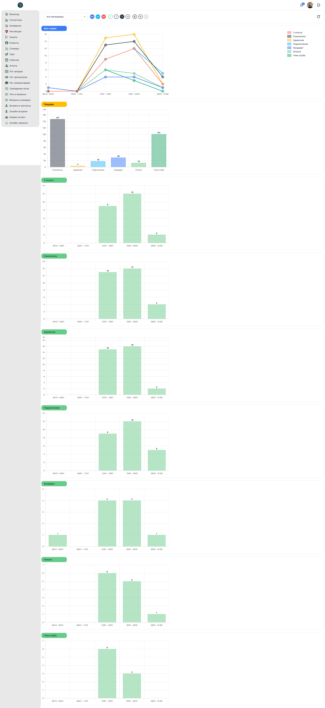

# 📈 Менеджер: Статистика (Воронка продаж)

**Код:** `Charts.svelte` (frontend/club-manager/src/views/Charts.svelte)  
**Роут:** `/charts` (Layout: `Main`)

## Назначение
Экран предназначен для аналитики движения клиентов по воронке продаж (стадиям членства) и анализа эффективности работы менеджеров. Он позволяет визуализировать динамику изменений и выявлять "узкие места" в процессе продаж.

> **Визуализация UI**

{style="block"}

---

## Элементы интерфейса

### 1. Панель фильтров
Управляет выборкой данных для построения графиков.

*   **Выбор менеджера:** Выпадающий список. Позволяет фильтровать статистику по конкретному сотруднику (Community Manager).
*   **Тип менеджера (Тогглы):**
    *   **КМ**: Community Manager.
    *   **ОП**: Отдел Продаж (Department 1).
    *   **НЕТ**: Пользователи без назначенного менеджера.
*   **Период (Интервалы):**
    *   **?**: Кастомный диапазон (выбор дат через `DateInput`).
    *   **1**: День.
    *   **7**: Неделя (активен по умолчанию).
    *   **30**: Месяц.
*   **Навигация:** Стрелки влево/вправо смещают выбранный интервал (`filterOffset`).
*   **Обновить:** Принудительная перезагрузка данных с сервера.

### 2. Графики (Charts)

Используется компонент `Chart.svelte` (обертка над `Chart.js`).

#### График "Все стадии" (Line Chart)
Отображает динамику количества пользователей на разных стадиях во времени.
*   **Ось X:** Временные интервалы (дни/недели).
*   **Ось Y:** Количество пользователей.
*   **Легенда:** Цветовое кодирование стадий (см. ниже).

#### График "Текущие" (Bar Chart)
Показывает *текущее* распределение пользователей по стадиям в выбранном срезе. Позволяет быстро оценить состояние воронки на данный момент.

#### Детальные графики по стадиям (Bar Charts)
Отдельные гистограммы для каждого этапа воронки. Показывают количество пользователей, находившихся на этой стадии в конкретный временной интервал.

---

## Бизнес-логика и Стадии

Стадии воронки жестко закодированы в системе (ID 0-6). Каждая стадия имеет свой фиксированный цвет для графиков (`CHART_COLORS`):

| ID | Название | Цвет | Описание |
| :--- | :--- | :--- | :--- |
| **0** | У агента | 🔴 Красный | Лид передан агенту |
| **1** | Соискатель | ⚫️ Темно-серый | Заполнил первичную анкету |
| **2** | Адмиссия | 🟡 Желтый | Проходит проверку |
| **3** | Подключение | 🔵 Голубой | Оформление документов |
| **4** | Кандидат | 🔵 Синий | Утвержден, ожидает оплаты |
| **5** | Оплата | 🟢 Светло-зеленый | Процесс оплаты |
| **6** | Член клуба | 🟢 Зеленый | Действующий резидент |

---

## Техническая реализация

### Архитектура данных (Client-Side Aggregation)
Экран работает по принципу **толстого клиента**.
1.  **Запрос:** Entity `userMonitorSales` (`src/queries/user.ts`) загружает сырой массив логов (`log`) и пользователей (`users`).
2.  **Агрегация:** Функция `createMonitor` на клиенте обрабатывает эти данные, группирует их по выбранным временным интервалам и формирует датасеты для графиков.
    *   *Риск:* При большом объеме данных пересчет может занимать время (блокировать UI).
3.  **Реактивность:** Svelte автоматически пересчитывает `intervals` и перерисовывает графики при изменении фильтров без повторного запроса к API.

### Интерактивность (Drill-down)
Графики поддерживают взаимодействие. В конфигурации `chartOptions` реализован обработчик `onClick`:
*   При клике на столбец графика определяется выбранный интервал и стадия.
*   Ниже графиков (вне основного экрана) раскрывается список конкретных пользователей (`dataUsersSelected`), которые сформировали эту статистику.
*   Это позволяет менеджеру детально изучить всплески активности (например, кто именно оплатил на этой неделе).

### Библиотеки
*   **Chart.js**: Основная библиотека визуализации.
*   **chartjs-plugin-datalabels**: Плагин для отображения точных значений прямо на столбцах и точках графиков.
