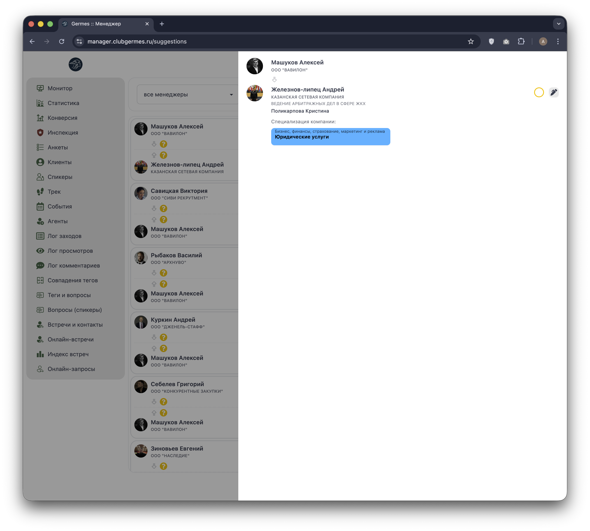

# 🔗 Менеджер: Совпадения тегов (Suggestions)

**Код:** `src/views/Suggestions.svelte`  
**Роут:** `/suggestions` (Layout: `Main`)

Модуль **Совпадения тегов** — это инструмент для "холодного" нетворкинга. Система автоматически находит пересечения интересов участников (например, один ищет "инвестиции", другой их предлагает) и формирует список рекомендаций. Задача менеджера — валидировать эти совпадения и инициировать знакомство.

{style="block"}

## 1. Панель фильтров

Инструменты для сегментации массива совпадений (на скриншоте > 6000 пар).

| Элемент | Описание | Привязка к коду |
| :--- | :--- | :--- |
| **Менеджер** | Фильтр по ответственному КМ. | `filter.communityManager` |
| **Поиск** | Поиск по имени или компании клиента. | `filter.name` |
| **Оценка** | Фильтр по дате последней обработки (3/7/30 дней). | `filter.dateEvaluation` |
| **Статусы** | Три кнопки (2/1/0) фильтруют по оценке перспективности. | `filter.evaluation` |
| **Счетчик** | "Всего: N" — показывает общее количество совпадений. | `amount` |

## 2. Список совпадений

Основная область отображает список рекомендаций. Каждая строка — это потенциальная пара для знакомства.

### Карточка совпадения

1.  **Участник (Карточка):** Основной профиль, которому предлагается рекомендация.
2.  **Теги (Контекст):**
    *   Под именем выводятся теги, вызвавшие совпадение (например: *company scope : company needs*).
    *   Функция `parseSuggestionTags` отвечает за читаемый вывод пар "Компетенция : Потребность".
3.  **Индикаторы "Уже знакомы" (Под аватаром):**
    *   **Желтый ключ 🔑 (Contact):** Появляется, если участники уже обменялись контактами. Это важный сигнал, что знакомить их, возможно, уже не нужно.
    *   *Код:* `item.user_1_contacts` / `item.user_2_contacts`.
4.  **Статус (Кружок оценки):**
    *   Кружок показывает текущий статус обработки совпадения менеджером.
    *   🔴 **Красный:** Отказ / Не интересно (`state === false`).
    *   🟡 **Желтый:** Не обработано / В проработке (`state === null`).
    *   🟢 **Зеленый:** Рекомендовано (`state === true`).

## 3. Детальная проработка (Drawer)

Клик по кнопке "Карандаш" открывает боковую панель.

{style="block"}

### Интерфейс модерации

1.  **Пара участников:** Сверху отображается инициатор, снизу — рекомендуемый партнер.
    *   Можно быстро перейти в профиль любого из них.
2.  **Оценка (Rating):**
    *   Радио-кнопки (Red/Yellow/Green) позволяют менеджеру вынести вердикт по качеству этого совпадения.
    *   Изменение статуса отправляет запрос `userSuggestionsState`.
3.  **История и Комментарии:**
    *   Лента комментариев позволяет менеджерам оставлять заметки (например, "Клиент просил не предлагать услуги маркетинга").
    *   Каждая запись содержит текст комментария, имя автора и дату.
    *   История сохраняется и подгружается при повторном открытии (`formSuggestion.comments`).

## 4. Техническая реализация

### API Запросы
*   **Список:** `suggestionsList` (Endpoint: `/ma/suggestions/control`).
    *   Возвращает:
        *   `suggestions`: Список пар.
        *   `comments`: История переписки менеджеров по этим парам.
*   **Действия:**
    *   `userSuggestionsState`: Изменение статуса (интересно/нет).
    *   `userSuggestionsComment`: Добавление комментария.

### Особенности
*   **Поиск:** Поле поиска поддерживает `debounce` (задержку ввода) через функцию `look` и таймер `autoTM`, чтобы не спамить запросами при наборе текста.
*   **Ролевая модель:** Обычный `community manager` видит совпадения только по своим клиентам (фильтр устанавливается при `onMount`). `Admin/Chief` видят всё.
