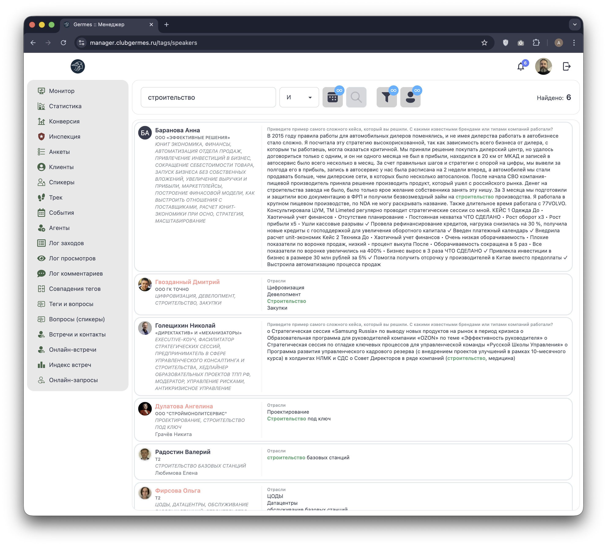
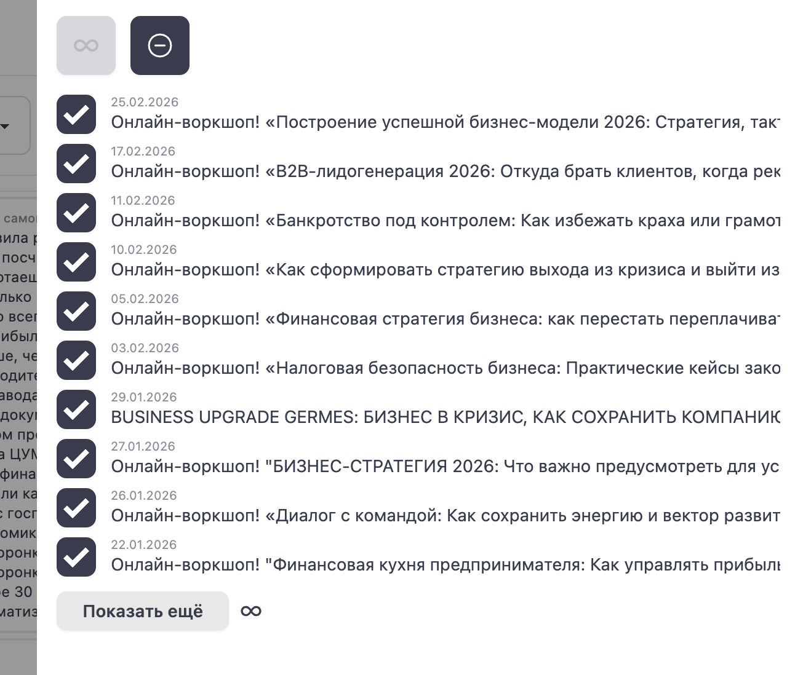
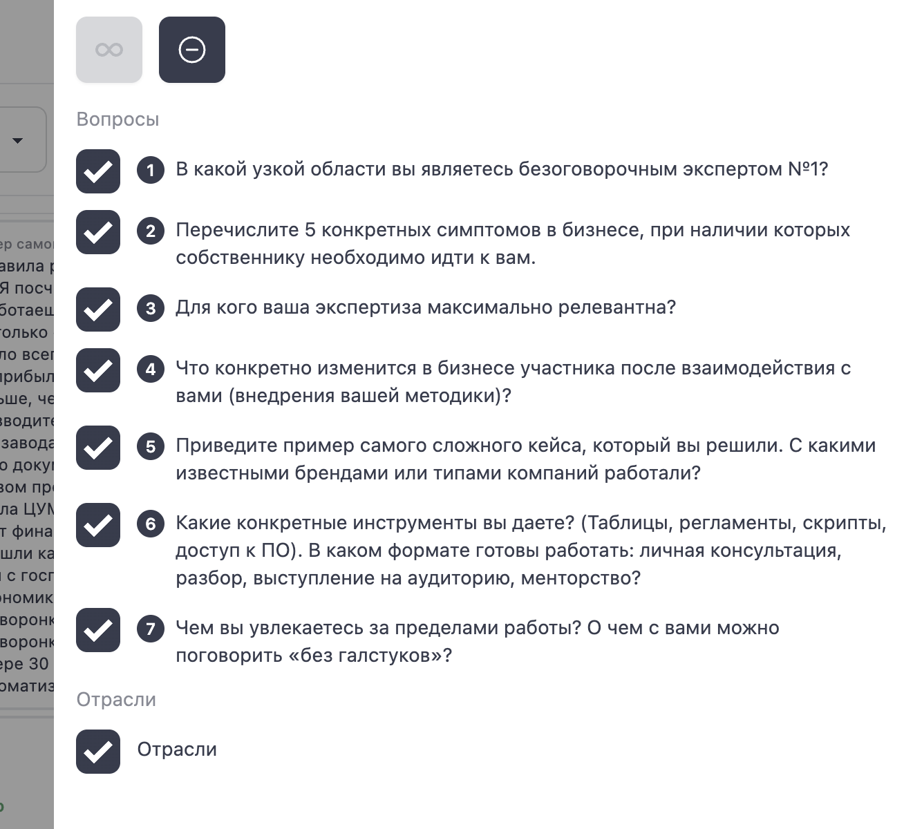

# 🎙️ Менеджер: Вопросы (спикеры)

**Код:** `frontend/club-manager/src/views/TagsSpeakers.svelte`  
**Роут:** `/tags/speakers` (Layout: `Main`)

Модуль **Вопросы (спикеры)** — это специализированная версия поиска по тегам, оптимизированная для подбора экспертов на мероприятия. Он позволяет находить резидентов, которые готовы делиться опытом, имеют релевантные кейсы или являются признанными экспертами в узких областях.

{style="block"}

## 1. Панель поиска

Инструменты поиска аналогичны основному модулю "Теги", но имеют специфические настройки.

| Элемент | Описание |
| :--- | :--- |
| **Поле ввода** | Поиск по ключевым словам (тема доклада, отрасль, название компании). |
| **Оператор** | **И / ИЛИ** — логика объединения слов. |
| **Фильтры** | Набор кнопок справа для уточнения критериев поиска (Даты, События, Статусы). |
| **Найдено** | Счетчик количества найденных кандидатов. |

## 2. Результаты поиска

Список отображает резидентов, чьи анкеты соответствуют запросу.

### Карточка эксперта

Карточка оптимизирована для быстрого анализа экспертности:

1.  **Профиль:** Аватар, ФИО, Компания.
2.  **Контекст (Справа):**
    *   **Вопросы анкеты:** Система подсвечивает ответы на специфические вопросы для спикеров (например, *"Приведите пример самого сложного кейса..."* или *"В какой узкой области вы являетесь экспертом №1?"*).
    *   **Отрасли:** Специализация компании.
    *   **Подсветка:** Ключевые слова запроса (например, "строительство", "транспорт") выделены **зеленым**.

## 3. Критерии поиска (Drawer)

Боковая панель "Настройка полей" (`formType = 'example'`) позволяет выбрать специфические вопросы анкеты спикера, по которым нужно искать.

{style="block"}

### Ключевые вопросы анкеты:
1.  **Экспертиза:** "В какой узкой области вы являетесь безоговорочным экспертом №1?"
2.  **Проблематика:** "Перечислите 5 конкретных симптомов в бизнесе..."
3.  **Аудитория:** "Для кого ваша экспертиза максимально релевантна?"
4.  **Результат:** "Что конкретно изменится в бизнесе участника..."
5.  **Бренды:** "С какими известными брендами работали?"
6.  **Инструменты:** "Какие конкретные инструменты вы даете?"
7.  **Неформально:** "О чем с вами можно поговорить «без галстуков»?"

Менеджер может включить/выключить поиск по каждому из этих вопросов, чтобы сузить выдачу (например, искать только по брендам или только по кейсам).

## 4. Дополнительные фильтры

Как и в основном модуле, доступны фильтры по:

*   **Событиям:** Поиск среди участников конкретных форумов/воркшопов.

    
    {style="block"}

*   **Статусам:** Фильтрация по активности и уровню членства.

    
    {style="block"}

## Техническая реализация

Этот модуль использует тот же код `src/views/Tags.svelte`, что и основной поиск. Различие заключается в предустановленном наборе фильтров `filterList`.

*   При переходе в режим спикеров или при ручном выборе фильтров, система активирует поиск именно по вопросам из анкеты спикера (индексы 1-7 в `filterList`).
*   **API:** Используется тот же эндпоинт `lookup` (`/ma/tag1/lookup`), но в параметрах поиска передаются специфические категории вопросов.