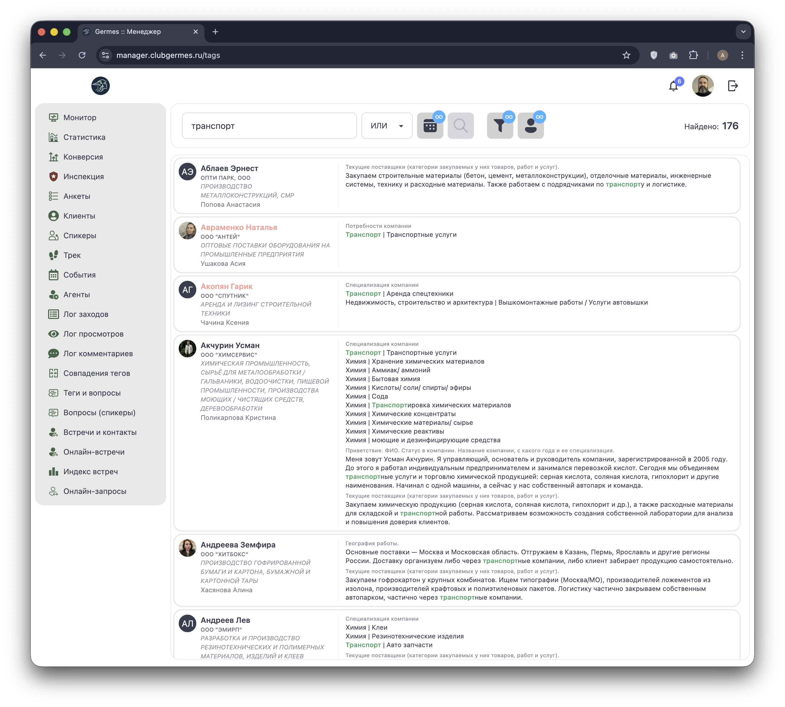
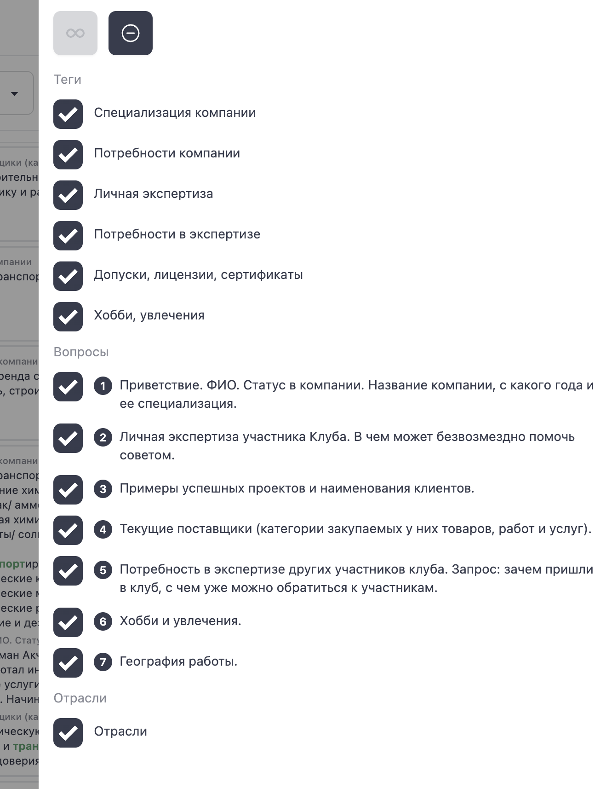
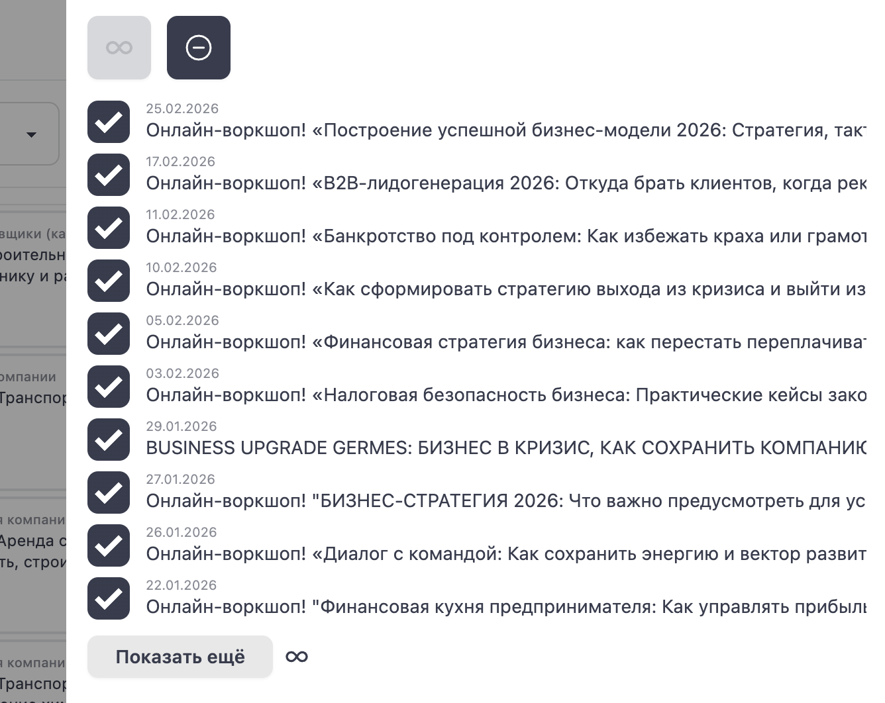
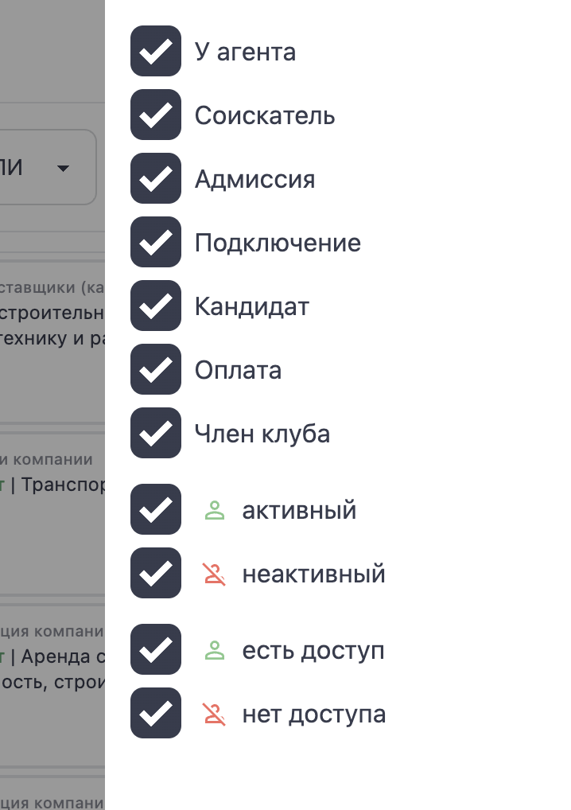

# 🏷️ Менеджер: Теги и вопросы (Tags)

**Код:** `src/views/Tags.svelte`  
**Роут:** `/tags` (Layout: `Main`)

Модуль **Теги и вопросы** предназначен для глубокого поиска по базе знаний Клуба. Он позволяет находить резидентов по специфическим ключевым словам, навыкам, потребностям или ответам в анкетах, используя гибкие логические операторы.

{style="block"}

## 1. Панель поиска

Инструмент поиска расположен в верхней части экрана.

| Элемент | Описание | Привязка к коду |
| :--- | :--- | :--- |
| **Поле ввода** | Основное поле для ввода ключевых слов (например, "транспорт"). | `example` |
| **Оператор** | Выпадающий список **И / ИЛИ** (`AND` / `OR`). Определяет логику поиска, если слов несколько. | `modificator` |
| **События** | Ограничить поиск участниками конкретных мероприятий. | `formType = 'events'` |
| **Кнопка поиска** | Запускает поиск. | `get()` |
| **Настройка полей** | Выбрать, *где именно* искать (в тегах, вопросах, отраслях). | `formType = 'example'` |
| **Настройка статусов** | Отфильтровать результаты по статусу клиента. | `formType = 'clients'` |
| **Счетчик** | "Найдено: N" — показывает количество найденных резидентов. | `usersFiltered.length` |

> **Индикаторы (Badges):** На кнопках настроек отображаются синие кружки с цифрами, которые показывают количество активных фильтров в данном разделе.

## 2. Результаты поиска

Список найденных резидентов отображается в основной области.

### Карточка результата

Каждая карточка содержит:
1.  **Профиль:** Аватар, ФИО, Компания, Менеджер.
2.  **Контекст (Found in):** Блок справа, показывающий, *почему* этот участник был найден.
    *   Данные группируются по категориям (Специализация, Потребности, Вопросы).
    *   Ключевые слова в тексте подсвечиваются **зеленым цветом** (функция `parseData`).

> **Пагинация:** Список подгружается автоматически при прокрутке ("бесконечный скролл") с помощью `Observer`, добавляя по 50 записей (`usersSlice`).

## 3. Настройки поиска (Drawer)

Боковая панель (Drawer) открывается кнопками настройки и имеет три режима:

### А. Где искать (Example/Fields)
Позволяет включить/выключить поиск по конкретным полям анкеты:
*   Теги (Специализация, Личная экспертиза, Хобби...).
*   Вопросы (Приветствие, Примеры проектов, Потребности...).
*   Отрасли.

{style="block"}

### Б. События (Events)
Позволяет сузить круг поиска до участников выбранных мероприятий.
*   Менеджер может выбрать одно или несколько событий из списка.
*   Полезно для поиска контактов "среди тех, кто был на форуме".

{style="block"}

### В. Статусы клиентов (Clients)
Фильтрация результатов по CRM-статусу резидента.
*   **Стадии:** Член клуба, Кандидат, Соискатель и т.д.
*   **Активность:** Активный / Неактивный.
*   **Доступ:** Есть доступ / Нет доступа.

{style="block"}

## 4. Техническая реализация

### API Запросы
*   **Поиск:** `lookup` (Endpoint: `/ma/tag1/lookup`).
    *   Принимает: `example` (текст), `modificator` (AND/OR), `eventsIds` (список ID событий).
    *   Возвращает список пользователей с полным контекстом совпадений (`tags`, `questions`, `catalog`).
*   **Список событий:** `lookupEvents` (Endpoint: `/ma/tag1/lookup/events`).

### Особенности
*   **Фильтрация на клиенте:** Фильтрация по статусам (`filterStages`) и типам полей (`filter`) применяется **после** получения результатов поиска от сервера (функция `filterUsers`). Это позволяет мгновенно переключать фильтры без повторных тяжелых запросов к API.
*   **Подсветка:** Реализована через RegExp замену в функции `parseData`.
