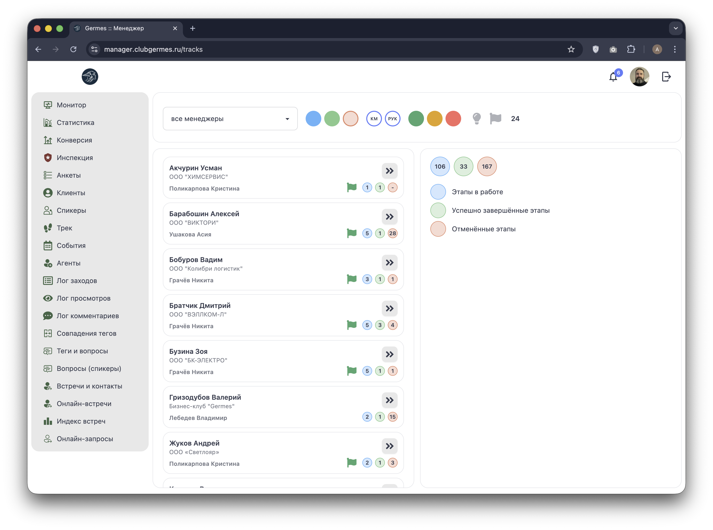
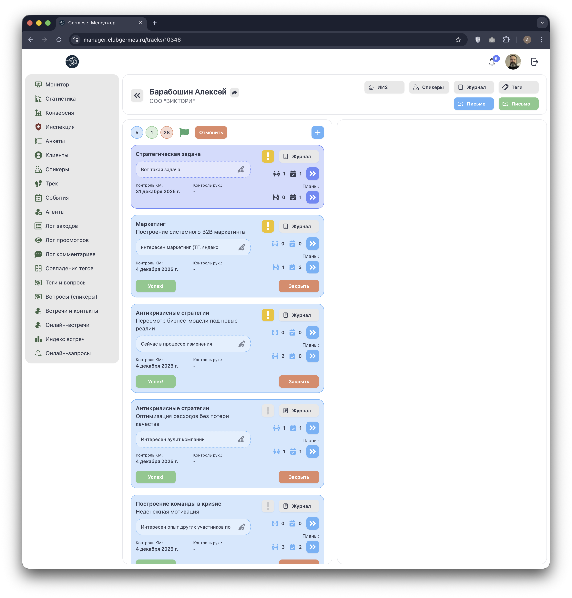
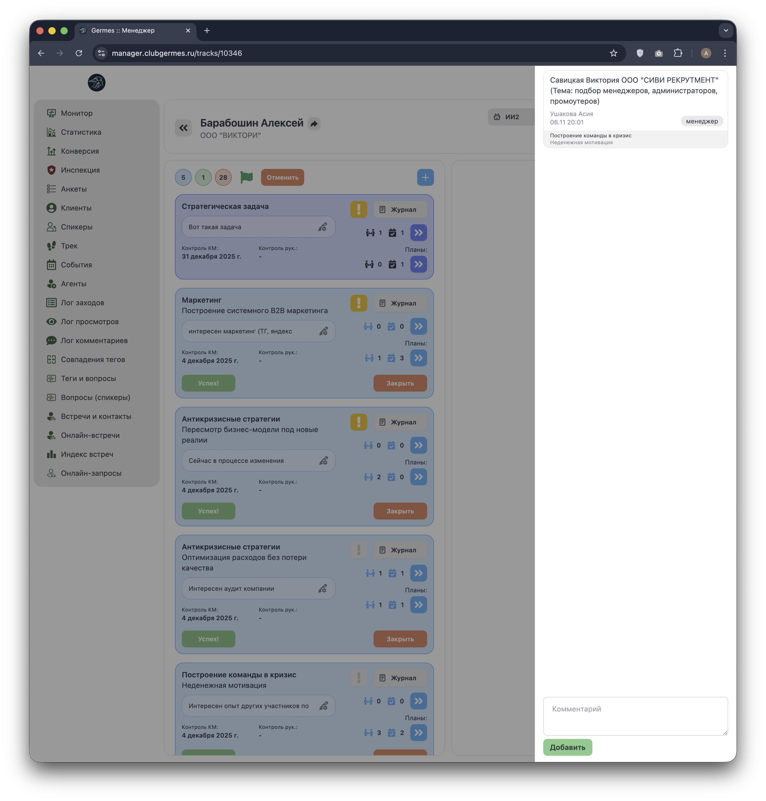
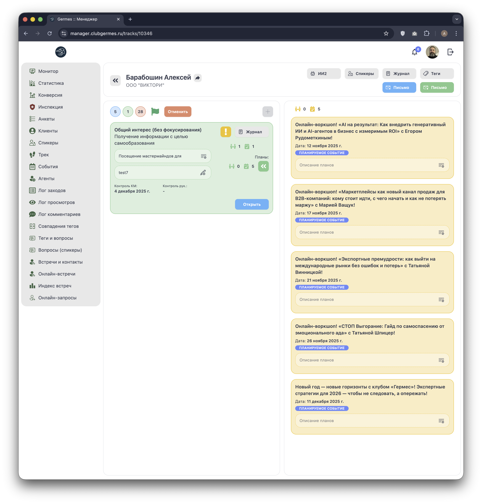
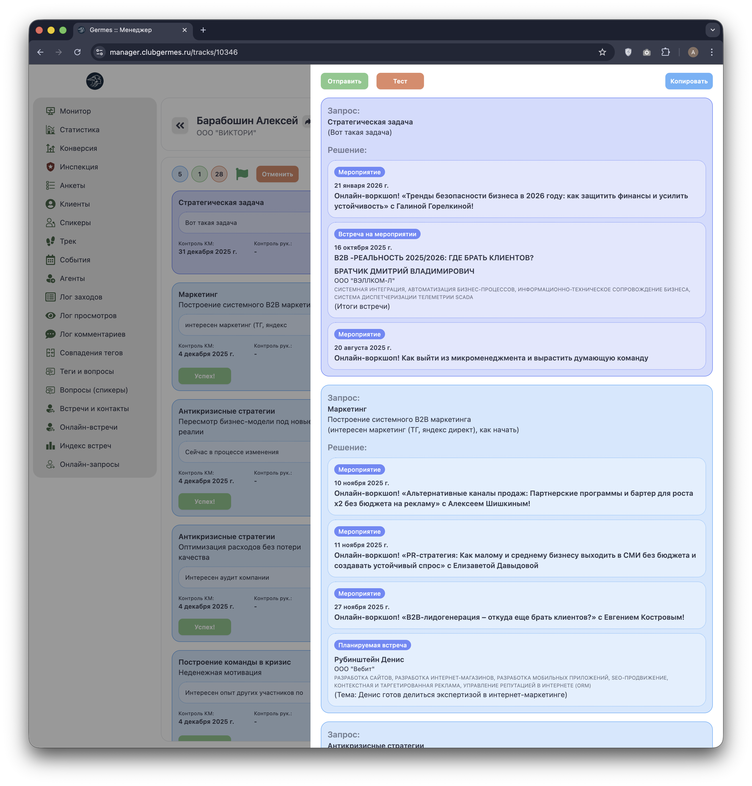

# 🛤️ Менеджер: Трек (Tracks)

**Код:** `User.svelte` (логика Drawer `prompts2`), `Bundle.svelte` (View `/bundle`) (frontend/club-manager/src/views/)  
**Роут:** `/bundle` (Layout: `Main`)

Модуль **Трек** разделен на две функциональные части:
1.  **Журнал отправок (`/bundle`)**: Обзор истории коммуникаций.
2.  **Генерация решений (Drawer)**: Инструмент ИИ-анализа и подготовки персонализированных писем.

---

## 1. Журнал отправок ИИ (`/bundle`)

Экран "Отправка ИИ" представляет собой лог всех предложений, сгенерированных системой и отправленных клиентам.


{style="block"}

### Функциональность
*   **Список пар:** Каждая запись показывает, кому (User 2) и от кого (User 1 - обычно менеджер или другой резидент) было отправлено предложение.
*   **Пагинация:** Данные выводятся страницами по 25 записей.
*   **API:** Данные загружаются через запрос `/ma/bundle2/sendings`.

### Фильтрация
Над списком доступна панель фильтров:
*   **Клиент:** Поиск по имени или компании.
*   **Менеджер:** Выбор одного или нескольких ответственных менеджеров.

---

## 2. Генерация решений (Drawer в User.svelte)

Основной рабочий инструмент менеджера, который открывается в боковой панели (Drawer) при работе с клиентом.


{style="block"}

### Список клиентов и Сортировка

В левой части панели (или в основном списке, если открыт режим списка) доступны инструменты выборки клиентов для обработки.

#### Панель управления (Dashboard)

Кнопки переключают режим сортировки списка `prompts2UsersSorted` по рейтингам ИИ:

| Цвет кнопки | Индексы сортировки | Направление (Рейтинг) |
| :--- | :--- | :--- |
| **Зеленый (Strategy)** | `0, 1` | Рейтинг стратегических задач. |
| **Синий (Marketing)** | `2, 3` | Рейтинг маркетинговых задач. |
| **Желтый (HR)** | `4, 5` | Рейтинг антикризисных задач. |
| **Синий (Score)** | `6, 7` | Общий сводный балл соответствия. |
| **Розовый** | `8, 9` | Рейтинг по `ratings[4]` (Прочее). |

> Каждая кнопка имеет два состояния (по возрастанию/убыванию).

#### Поиск и Фильтрация
*   **Поиск:** Текстовое поле фильтрует список по имени, компании или каталогу тегов.
*   **Только активные:** Кнопка-чекбокс (`prompts2Filters.active`) скрывает неактивных пользователей.
*   **Счетчик:** Отображает отношение отфильтрованных записей к общему количеству (например, `15 / 142`).

### Карточка клиента и Индикаторы

В списке отображается краткая сводка по клиенту.

**Индикаторы активности (Бейджи справа от имени):**
Система подсказывает, какие типы связей уже найдены для клиента (`prompts2Connections`):

*   🔵 **Телефон (Contact):** Количество найденных полезных контактов.
*   🟢 **Люди (Event):** Количество рекомендованных оффлайн-событий.
*   🟦 **Монитор (Online):** Количество онлайн-встреч.

**Рейтинги (Кружки):**
Пять цветных кружков показывают текущие баллы соответствия по разным направлениям трека.

---

## 3. Детальный просмотр Трека

При выборе клиента загружается полная структура трека (`prompt2`).

### 3.1 Структура блоков (Левая панель)

Левая часть интерфейса отображает аналитику по клиенту, разбитую на смысловые блоки (Стратегия, Маркетинг и т.д.).


{style="block"}

**Элементы блока:**
*   **Заголовок:** Название направления.
*   **Текущая ситуация:** Описание "Точки А" клиента.
*   **Целевое состояние:** Описание "Точки Б".
*   **Счетчики подключений:** Стрелки вверх/вниз, показывающие динамику или статус подключений.
*   **Предупреждения:** Иконки, сигнализирующие о критических моментах или недостатке данных.
*   **Иконка "Журнал":** Позволяет просмотреть историю изменений по блоку.

**Управление статусом задачи:**
*   **Кнопка "Успех!"**: Отмечает задачу как выполненную (переводит в зеленый статус).
*   **Кнопка "Закрыть"**: Закрывает или отменяет задачу.

### 3.2 Генератор решений (Правая панель)

Правая панель отвечает за формирование конкретных предложений (Events & Connections) на основе утвержденного трека.

#### Вариант 1: Список предложений
Изначально отображается список сгенерированных рекомендаций.


{style="block"}

*   **Желтые карточки:** Краткое описание предлагаемого контакта или события с указанием имени/названия.
*   **Контакты:** Предложения для Peer-to-Peer знакомств.

#### Вариант 2: Развернутые решения
При выборе предложения открывается детальная карточка с полным текстом письма.


{style="block"}

**Элементы интерфейса:**
*   **Текст письма:** Полностью сформированное ИИ сообщение, готовое к отправке.
*   **Бейджи:**
    *   **"Мероприятие"**: Рекомендация посетить прошедшее или регулярное событие.
    *   **"Планируемое событие"**: Рекомендация на будущее событие из календаря.
*   **Алгоритм работы:** Matching (Подбор) → Рендеринг шаблона → Генерация Email → Отправка.

**Кнопки управления:**
*   **Отправить**: Отправляет письмо клиенту (статус меняется на "Отправлено").
*   **Тест**: Отправляет тестовое письмо администратору для проверки верстки.
*   **Копировать**: Копирует текст предложения в буфер обмена.

---

## 4. Техническая реализация

### Структура данных (`prompts2UsersList`)

Ответ API `/ma/bundle2/users` содержит агрегированные данные для построения списков:

```javascript
const response = {
    // Список пользователей с рейтингами
    users: [
        {
            id: 1,
            name: "Иван Иванов",
            avatar_hash: "...",
            active: true,
            company: "OOO Ромашка",
            catalog: "IT, Marketing", // Теги для поиска
            ratings: [5, 4, 0, 0, 1] // 5 метрик
        }
    ],
    // Мета-данные о связях (для бейджей)
    connections: {
        "101": {
            contact: 2,  // Кол-во контактов
            event: 1,    // Кол-во событий
            online: 5    // Кол-во онлайн-встреч
        }
    }
};
```

### API Endpoints
*   `GET /ma/bundle2/sendings` — Журнал отправок (Log).
*   `POST /ma/bundle2/users` — Список клиентов для генерации.
*   `POST /ma/bundle2/prompt` — Детальные данные трека.
*   `POST /ma/bundle2/prompt/send` — Отправка письма.