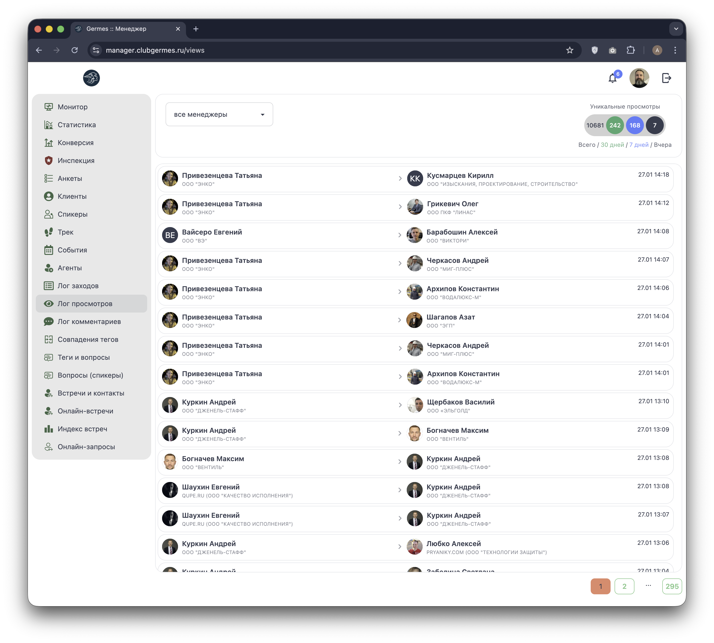

# 👁️ Менеджер: Лог просмотров (Views)

**Код:** `src/views/Views.svelte`  
**Роут:** `/views` (Layout: `Main`)

Модуль **Лог просмотров** фиксирует факты открытия профилей участников в мобильном приложении. Это позволяет отслеживать интерес пользователей друг к другу (нетворкинг-активность) и выявлять популярные профили.

{style="block"}

## 1. Статистика (Сводка)

В правом верхнем углу расположен блок статистики **уникальных просмотров** (Views Stats).

| Период | Цвет | Переменная в коде |
| :--- | :--- | :--- |
| **Всего** | Серый | `stats['views_all']` |
| **30 дней** | Зеленый | `stats['views_month']` |
| **7 дней** | Синий | `stats['views_week']` |
| **Вчера** | Черный | `stats['views_yersterday']` |

Данные загружаются запросом `viewsStats` (Endpoint: `/ma/stats/views/unique`) с привязкой к дате "вчера".

## 2. Список просмотров

Основная таблица отображает хронологию событий "Кто посмотрел -> Кого посмотрел".

### Структура строки

1.  **Кто посмотрел (Viewer) - Слева:**
    *   Пользователь, совершивший действие (открывший чужой профиль).
    *   Отображается Аватар, ФИО и Компания.
    *   *Индикация:* Если пользователь неактивен, имя подсвечивается красным (`text-error`).

2.  **Направление:**
    *   Иконка стрелки и лупы по центру, указывающая направление интереса.

3.  **Кого посмотрели (Target) - Справа:**
    *   Профиль пользователя, который был открыт.
    *   Отображается Аватар, ФИО и Компания.

4.  **Дата и время:**
    *   Точное время просмотра (формат `DD.MM hh:mm`).

**Взаимодействие:**
*   Клик по **аватару** или **кнопке со стрелкой** (справа от блока) открывает профиль соответствующего пользователя в новой вкладке.

## 3. Фильтрация и Управление

*   **Фильтр по менеджеру:** Выпадающий список вверху позволяет отфильтровать записи, где инициатор просмотра закреплен за определенным менеджером.
    *   *Доступ:* Виден только ролям `admin`, `manager`, `moderator`, `chief`.
    *   *Ограничение:* Обычный `community manager` видит только статистику своих клиентов.
*   **Пагинация:** Внизу страницы расположен стандартный пейджер (по 50 записей на страницу).

## 4. Техническая реализация

### API Запросы
*   **Список:** `logViews` (Endpoint: `/ma/log/views`).
    *   Параметры: `page`, `communityManagerId`.
*   **Статистика:** `viewsStats` (Endpoint: `/ma/stats/views/unique`).

### Особенности
*   Лог строится на основе массива `log`, получаемого от бэкенда.
*   При переключении страниц (`pagination`) происходит перезагрузка списка (`get()`).
