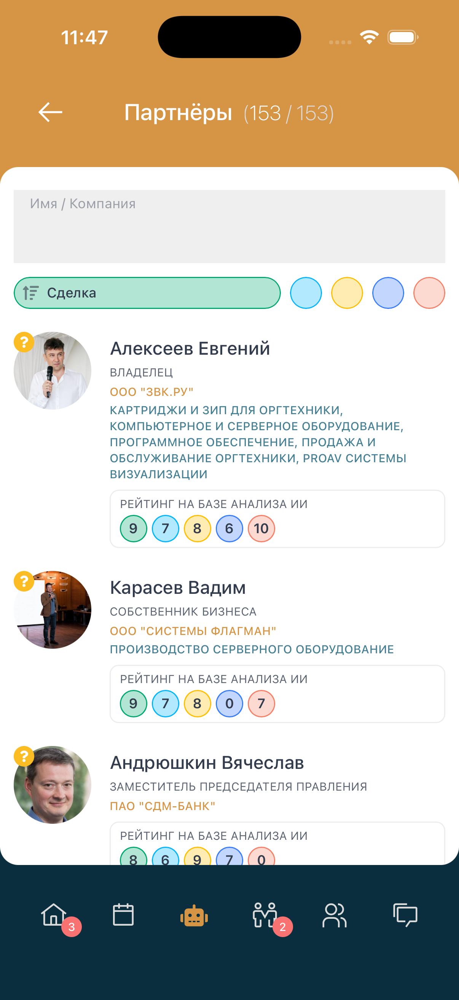
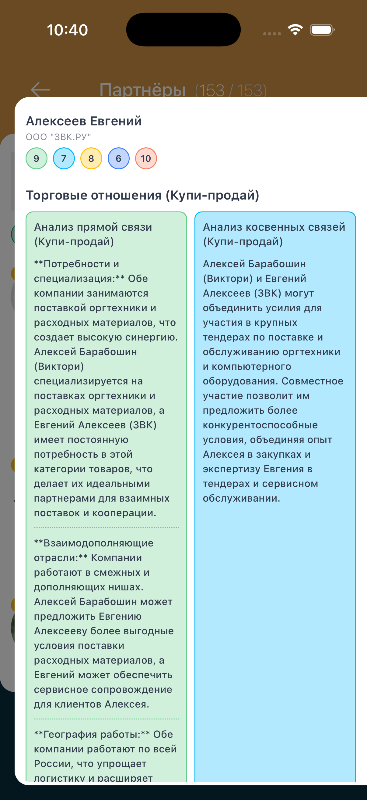
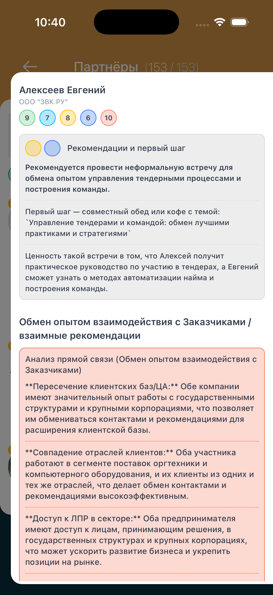

# 🤖 Раздел «Партнеры» (AI Partners)

**Код:** `frontend/club-client/src/views/Partners/Partners.svelte`  
**Роут:** `/partners`

## Концепция и Бизнес-ценность
Раздел **AI Partners** — это сердце нетворкинга в приложении. В отличие от простого каталога участников, этот модуль использует ML-алгоритмы для поиска **совместимости** между бизнесами.

Система не просто предлагает людей, а отвечает на вопрос: *"Почему мне стоит потратить время на встречу с этим человеком?"*, формируя персонализированные сценарии диалога (Prompts).

---

## Главный экран: Список рекомендаций

Здесь пользователь видит отранжированный список потенциальных партнеров.

> **Визуализация UI**
> 
> 

### 🧠 Элементы интерфейса

1.  **Фильтр по типу связи (Табы)**
    *   Пользователь переключает 5 цветных индикаторов. Каждый цвет соответствует типу потенциального партнерства:
        *   🟢 **Сделка** (Покупка/Продажа)
        *   🔵 **Синергия** (Совместные проекты)
        *   🟡 **Экспертиза** (Обмен опытом)
        *   🟣 **Инсайт**
        *   🔴 **Мост** (Нетворкинг через посредника)
    *   *Технически:* Реализовано через массив индексов и жестко заданные цветовые схемы (`colors1`, `colors2`).

2.  **Карточка партнера (`ResidentCard`)**
    *   **Рейтинг (0-10):** Цветные кружки показывают силу связи в каждой категории.
    *   **Кнопка Prompt:** Основной CTA (Call-to-Action). Вызывает модальное окно с детальным отчетом.

---

## Детальный отчет (AI Prompt)

Это самая сложная часть UI. Отчет генерируется на бэкенде и отображается через компонент `ModalSelector`. Данные приходят в структуре `userBundle`.

### Структура отчета

#### А. Заголовок и общий скоринг

*   Отображает ФИО и компанию партнера.
*   Блок **"РЕЙТИНГ НА БАЗЕ АНАЛИЗА ИИ"**: Визуализирует те же оценки, что и в списке, но крупнее, подтверждая валидность матчинга.

#### Б. Блок 1: Торговые отношения (Купи-продай)
Анализирует возможность прямой коммерческой выгоды.

| Тип связи | Цвет | Описание логики (из анализа скриншотов) |
| :--- | :--- | :--- |
| **Прямая связь** | 🟢 Зеленый | **"Потребности и специализация"**. ИИ находит совпадение: один продает то, что нужно другому (на примере: оргтехника и расходные материалы). |
| **Косвенная связь** | 🔵 Голубой | **"Объединение усилий"**. ИИ предлагает синергию: совместное участие в тендерах, где требуются компетенции обеих компаний для повышения конкурентоспособности. |

#### В. Блок 2: Обмен экспертизой
Анализирует возможность интеллектуального обогащения.

| Тип связи | Цвет | Описание логики (из анализа скриншотов) |
| :--- | :--- | :--- |
| **Прямая связь** | 🟡 Желтый | **"Обмен опытом"**. Пример: Автоматизация бизнес-процессов в тендерах. |
| **Косвенная связь** | 🔵 Голубой | **"Стратегии"**. Пример: Внедрение систем мотивации персонала. |

#### Г. Рекомендации (Actionable Advice)
В самом низу отчета ИИ генерирует конкретный сценарий:
> **Первый шаг:** 20-минутный звонок с темой "Взаимные поставки и сервисное обслуживание".
>
> **Ценность:** Расширение клиентской базы для одного, оптимизация расходов для другого.

---

## Состояния экрана

### Empty State (Пустой список)

Если алгоритм не нашел пар (`partnersFiltered.length === 0`), приложение не показывает пустой экран молча.
*   **Сообщение:** *"Для получения аналитического отчета... пройдите собеседование"*.
*   **Действие:** Это мотивирует пользователя заполнить профиль через комьюнити-менеджера, так как ИИ не хватает данных (тегов, описания) для генерации embeddings.

---

## Техническая реализация

### Data Flow (Поток данных)
1.  **User Action:** Клик по табу или загрузка страницы.
2.  **API Request:** `GET /new/user/bundle/partners`.
3.  **Client Processing:**
    *   Сортировка происходит **на клиенте** в функции `filterPartners`.
    *   Используется логика `filters.sort` (0-9), где четные/нечетные числа отвечают за направление сортировки (ASC/DESC) по конкретному критерию.
4.  **Drill-down:** Клик по карточке вызывает `POST /new/user/bundle/prompt` с ID обоих пользователей. Бэкенд возвращает готовые тексты с Markdown-разметкой (жирный шрифт).

### Ключевые файлы
*   `frontend/club-client/src/views/Partners/Partners.svelte`: Основной контроллер, фильтрация, модальные окна.
*   `frontend/club-client/src/views/Partners/components/ResidentCard/index.svelte`: Карточка в списке.
*   `frontend/club-client/src/views/Partners/components/ModalSelector/index.svelte`: Обертка для модального окна отчета.
*   `frontend/club-client/src/stores/partnersFilters.ts`: Хранение состояния фильтров.
