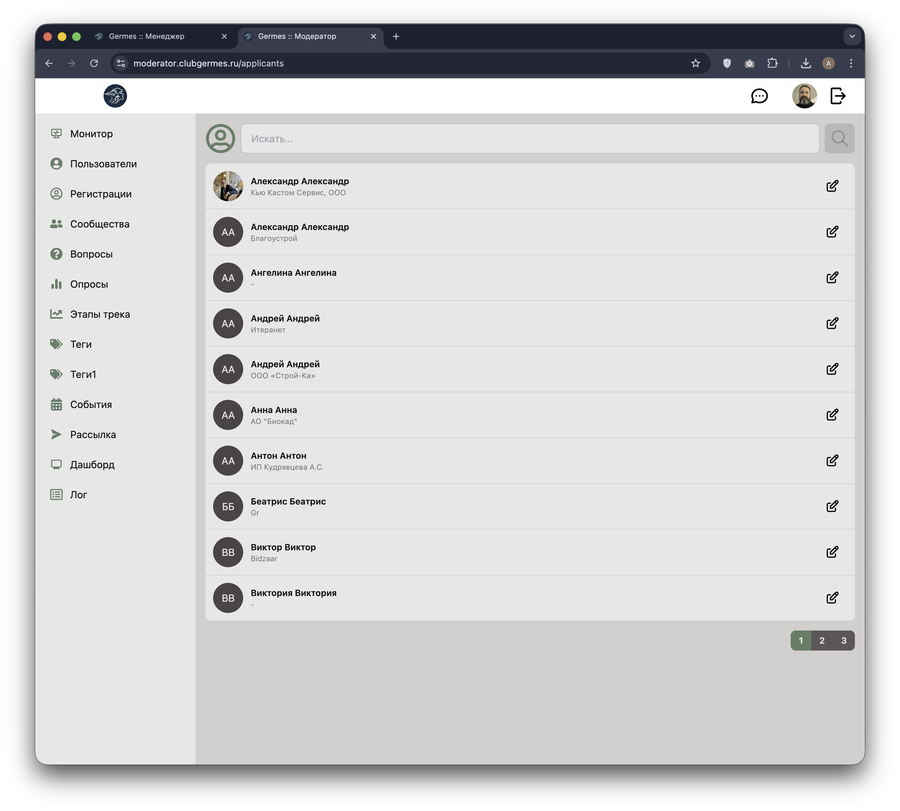
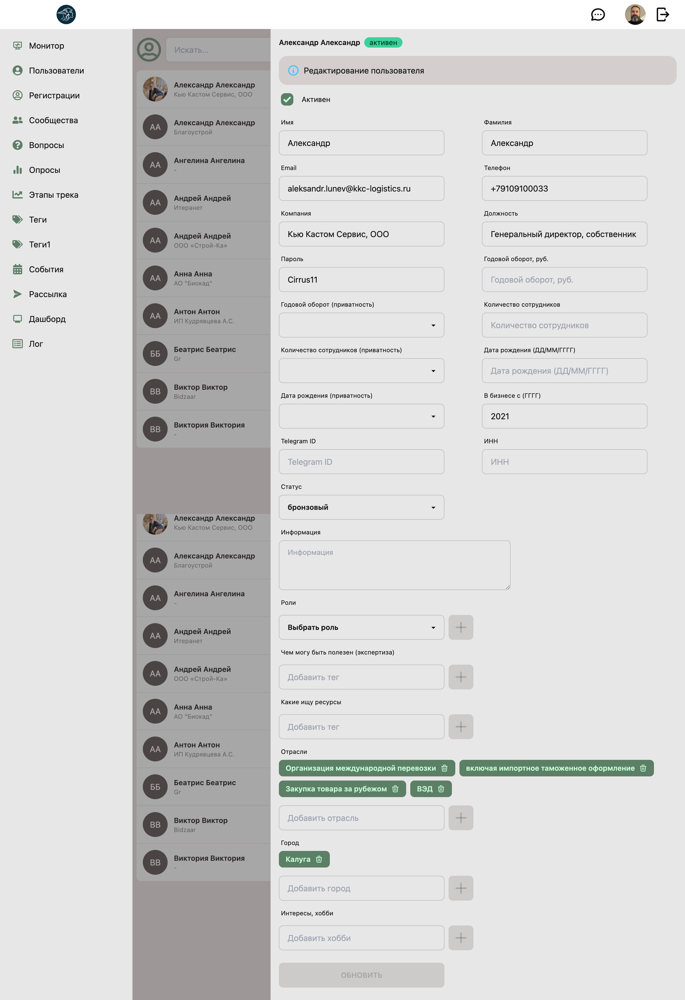

# 👮 Модератор: Регистрации (Applicants)

**Код:** `frontend/club-moderator/src/views/Applicants.svelte`
**Роут:** `/applicants` (Layout: `Main`)

Раздел предназначен для обработки новых заявок на вступление в клуб. Функционально он идентичен разделу "Пользователи", но отображает **только** пользователей со статусом "Новичок" (Applicant), требующих верификации или заполнения профиля перед полноценным доступом.

{style="block"}

## Функционал

Интерфейс разделен на список заявок и форму модерации (Drawer).

### Основной список
*   **Фильтрация**: В отличие от общего списка пользователей, здесь по умолчанию выводятся только те, кто попал в выборку `applicant: true` (обычно это свежие регистрации).
*   **Поиск**: Поле ввода для поиска по имени/телефону/email.
*   **Карточка**:
    *   **Аватар**: Фото (или заглушка с инициалами).
    *   **Данные**: ФИО, Название компании.
*   **Действия**: Кнопка ✏️ (Редактировать) открывает анкету пользователя.

### Форма модерации (Drawer)

{style="block"}

Позволяет модератору заполнить или исправить данные, введенные пользователем при регистрации, а также присвоить статус и роли.

1.  **Личные данные**: Имя, Фамилия, Email, Телефон, Дата рождения.
2.  **Бизнес-профиль**: Компания, Должность, ИНН, Оборот, Сотрудники.
3.  **Системные поля**:
    *   **Telegram ID**: Для привязки бота.
    *   **Статус**: Установка уровня участия (бронзовый, серебряный, золотой).
    *   **Роли**: Назначение прав доступа (обычно перевод из `guest`/`applicant` в `client` или `agent`).
4.  **Классификация (Теги)**:
    *   **Отрасли**: Сфера деятельности.
    *   **Компетенции**: "Чем могу быть полезен".
    *   **Интересы**: "Какие ищу ресурсы".
    *   **Город**, **Хобби**.

## Логика работы

### Выборка данных
При загрузке страницы (`onMount`) и при поиске вызывается метод `search()`.
*   Ключевое отличие от раздела "Пользователи": в запрос `userSearch` передается параметр **`applicant: true`**.
*   Бэкенд возвращает отфильтрованный список заявок.

### Редактирование и Валидация
*   При открытии анкеты (`edit()`) данные пользователя копируются в локальный объект `userEditable`.
*   Поля типа "Теги" (отрасли, интересы) приходят строкой, разбиваются на массивы для отображения в UI, а при сохранении собираются обратно в строку.
*   Изменения отслеживаются реактивно. Кнопка "ОБНОВИТЬ" активируется только если данные отличаются от исходных (`userCache`).

### Управление Тегами
Используется компонент `InputSuggestions` для полей:
*   *Отрасли*
*   *Чем могу быть полезен*
*   *Какие ищу ресурсы*
*   *Город*, *Хобби*

Система подсказывает существующие в базе теги по мере ввода, что позволяет избежать дублей и опечаток.

## Техническая реализация

### API Запросы
Взаимодействие через `queries/user.ts` и `queries/tag.ts`.

| Функция | Endpoint | Параметры | Описание |
|---|---|---|---|
| `userSearch` | `/m/user/search` | `{ text, applicant: true, page }` | Поиск заявителей. Флаг `applicant: true` обязателен. |
| `userUpdate` | `/new/m/user/update` | Объект пользователя | Сохранение изменений анкеты. |
| `tagList` | `/m/tag/list` | `{}` | Загрузка пула тегов для автоподсказок. |

### Особенности
*   **Инкапсуляция**: Код раздела `Applicants.svelte` практически полностью дублирует `Users.svelte`, но жестко зашивает логику фильтрации по новичкам. Это позволяет разделять потоки работы модераторов (тех, кто работает с базой, и тех, кто обрабатывает входящие заявки).
*   **Ролевая модель**: Список доступных для назначения ролей (`rolesAvailable`) фильтруется. Если текущий модератор не имеет прав админа, он может видеть ограниченный набор ролей для присвоения.
