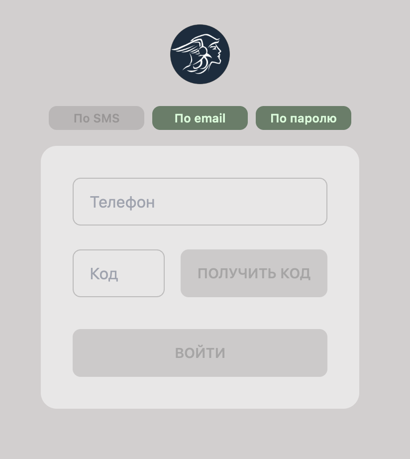
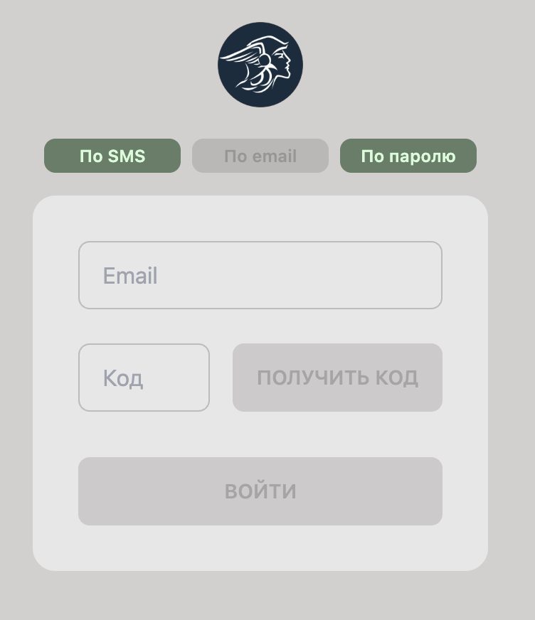
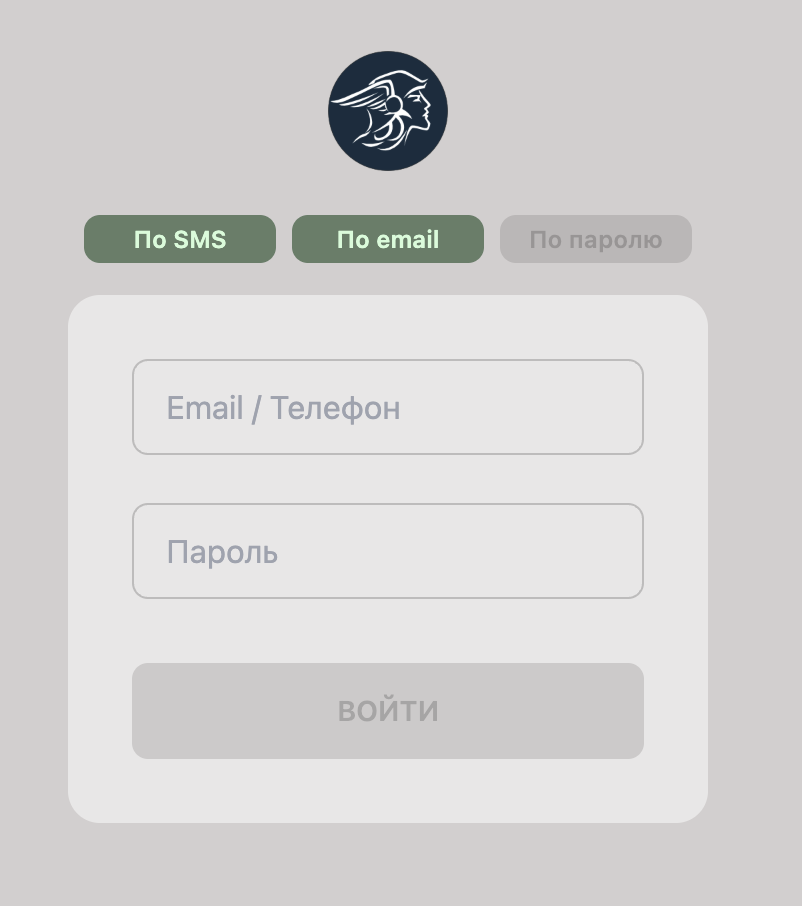

# 🔐 Модератор: Авторизация (Auth)

**Код:** `frontend/club-moderator/src/views/Login.svelte`  
**Роут:** `/auth` (Layout: `Auth`)

Модуль авторизации обеспечивает безопасный вход модераторов и администраторов в систему. Поддерживается три способа аутентификации: через SMS-код, через Email-код и по постоянному паролю.

## Способы входа

Интерфейс разделен на три вкладки, переключающие режим входа.

### 1. Вход по SMS
Основной способ входа для мобильных устройств.

{style="block"}

**Алгоритм:**
1.  Пользователь вводит номер телефона.
2.  Нажимает кнопку **"Получить код"** (вызывается API `userSetCode`).
3.  Система отправляет 4-значный код на указанный номер.
4.  Пользователь вводит код и нажимает **"Войти"** (вызывается API `userValidateCode`).

### 2. Вход по Email
Аналогичен входу по SMS, но код отправляется на электронную почту.

{style="block"}

### 3. Вход по паролю
Классический вход с использованием логина (Email или Телефон) и постоянного пароля.

{style="block"}

**Алгоритм:**
1.  Пользователь вводит идентификатор аккаунта.
2.  Вводит пароль.
3.  Нажимает **"Войти"** (вызывается API `userLogin`).

## Техническая реализация

### Валидация
В коде используются регулярные выражения для проверки корректности ввода перед активацией кнопок:
*   `testEmail`: проверка формата почты.
*   `testPhone`: проверка длины и состава номера телефона (10-20 цифр).
*   `valid1/2/3`: реактивные переменные, блокирующие кнопку "Войти", если данные не соответствуют требованиям (например, код должен быть ровно 4 символа).

### API Запросы
Взаимодействие через `queries/auth.ts`.

| Функция | Endpoint | Описание |
|---|---|---|
| `userSetCode` | `/m/user/set/code` | Запрос на отправку временного кода. |
| `userValidateCode` | `/m/user/validate/code` | Проверка кода и создание сессии. |
| `userLogin` | `/m/user/login` | Авторизация по постоянному паролю. |

### Особенности
*   **Таймаут (Wait Flag)**: После нажатия "Получить код" кнопка блокируется на 10 секунд (`waitFlag`), чтобы предотвратить спам-запросы.
*   **Transition**: Переключение между способами входа реализовано через абсолютное позиционирование блоков и `transition-all`, что создает эффект горизонтальной прокрутки (слайдера) внутри карточки.

## См. также

**Связанные модули:**
*   [Monitor](Moderator-Monitor.md) — мониторинг после успешной авторизации
*   [Log](Moderator-Log.md) — история входов в систему
*   [Users](Moderator-Users.md) — управление учетными записями

**Другие интерфейсы:**
*   [Manager-Auth](Manager-Auth.md) — авторизация в панели менеджера
*   [Mobile-Auth](Mobile-Auth.md) — авторизация в мобильном приложении
*   [Moderator Overview](Moderator-Overview.md) — обзор всех модулей модератора