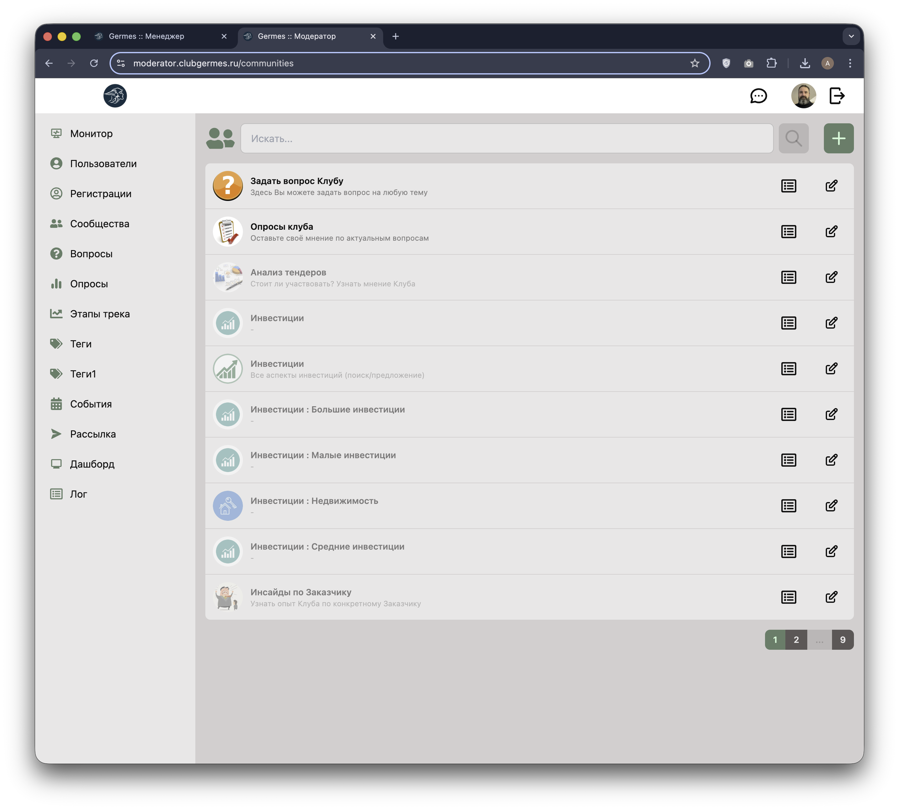
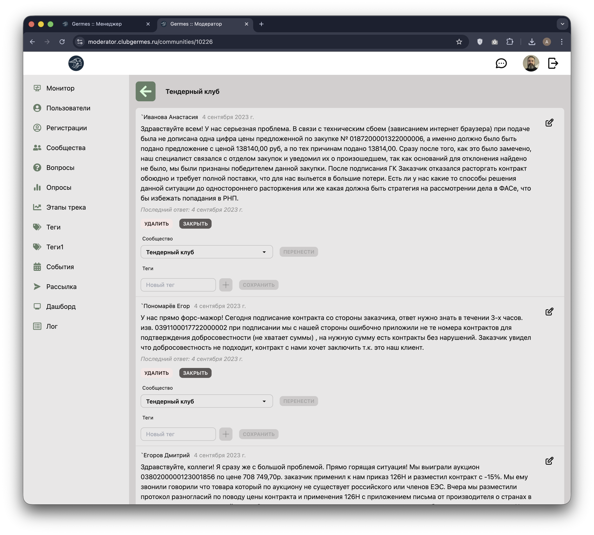
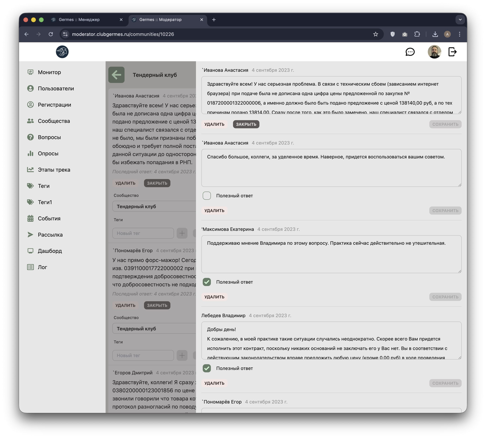

# 👮 Модератор: Сообщества (Communities)

**Код:** `frontend/club-moderator/src/views/Communities.svelte`  
**Роут:** `/communities` (Layout: `Main`)

Раздел для управления списком тематических сообществ клуба (например, "Тендерный клуб", "Инвестиции", "Вопросы клубу").

{style="block"}

## Функционал

### Основной список
Отображает карточки существующих сообществ.
*   **Иконка**: Логотип сообщества.
*   **Название и Описание**: Основная информация.
*   **Действия**:
    *   📁 **Вопросы**: Переход к списку постов/вопросов внутри сообщества.
    *   ✏️ **Редактировать**: Изменение названия, описания, иконки и настроек сообщества.

---

# 👮 Модератор: Вопросы сообщества (Community Questions)

**Код:** `frontend/club-moderator/src/views/Community.svelte`  
**Роут:** `/communities/:id` (Layout: `Main`)

Интерфейс для модерации контента внутри конкретного сообщества. Позволяет просматривать, редактировать и управлять вопросами (постами) пользователей.

{style="block"}

## Функционал

Экран представляет собой ленту вопросов, отсортированную по дате создания (новые сверху).

### Карточка вопроса
Каждый блок содержит:
*   **Заголовок**: Имя автора и дата создания.
*   **Текст**: Содержание вопроса.
*   **Панель управления** (кнопки):
    *   🔴 **УДАЛИТЬ**: Полное удаление вопроса.
    *   ⚫ **ЗАКРЫТЬ / ОТКРЫТЬ**: Переключение статуса обсуждения (можно ли оставлять комментарии).
    *   🔄 **ПЕРЕНЕСТИ**: Выпадающий список для выбора другого сообщества + кнопка переноса. Полезна, если вопрос задан не в ту тему.
    *   🏷️ **ТЕГИ**: Управление тегами поста (добавление/удаление).
    *   💾 **СОХРАНИТЬ**: Применяет изменения тегов.
    *   ✏️ **Редактировать** (справа): Открывает детальный режим просмотра и редактирования вопроса вместе с ответами.

### Режим детального редактирования (Drawer)

{style="block"}

Позволяет модератору вмешиваться не только в сам вопрос, но и в комментарии (ответы) к нему.
*   **Редактирование текста**: `textarea` для изменения содержания вопроса или ответа (например, для удаления нецензурной лексики или спама).
*   **Полезный ответ**: Чекбокс, позволяющий отметить ответ как "Полезный" (Helpful). Такие ответы обычно выделяются в интерфейсе пользователя.
*   **Удаление ответов**: Возможность удалить конкретный комментарий.

## Логика работы

### Перенос вопроса
1.  Модератор выбирает целевое сообщество в выпадающем списке "Сообщество".
2.  Нажимает кнопку "ПЕРЕНЕСТИ".
3.  Вызывается API `questionMove`, страница обновляется, и вопрос исчезает из текущего списка.

### Тегирование
*   Теги вводятся в поле "Новый тег".
*   Используется компонент `InputSuggestions` для подсказки существующих тегов.
*   Изменения тегов сохраняются отдельно кнопкой "СОХРАНИТЬ" рядом с блоком тегов.

## Техническая реализация

### API Запросы
*   `communityQuestions` (`/m/community/questions`): Получение списка постов для выбранного сообщества.
*   `postUpdate` (`/m/community/post/update`): Сохранение текста, статуса (closed), флага helpful и тегов.
*   `postDelete` (`/m/community/post/delete`): Удаление поста.
*   `questionMove` (`/m/community/question/move`): Перенос поста в другое сообщество.

### Особенности
*   **Вложенность**: Данные приходят в структуре `posts: [{ question: {}, answers: [] }]`.
*   **Кэширование**: При открытии формы редактирования создается полная копия вопроса и всех ответов в `questionCache`. Кнопки "Сохранить" активируются только при наличии изменений относительно кэша.
