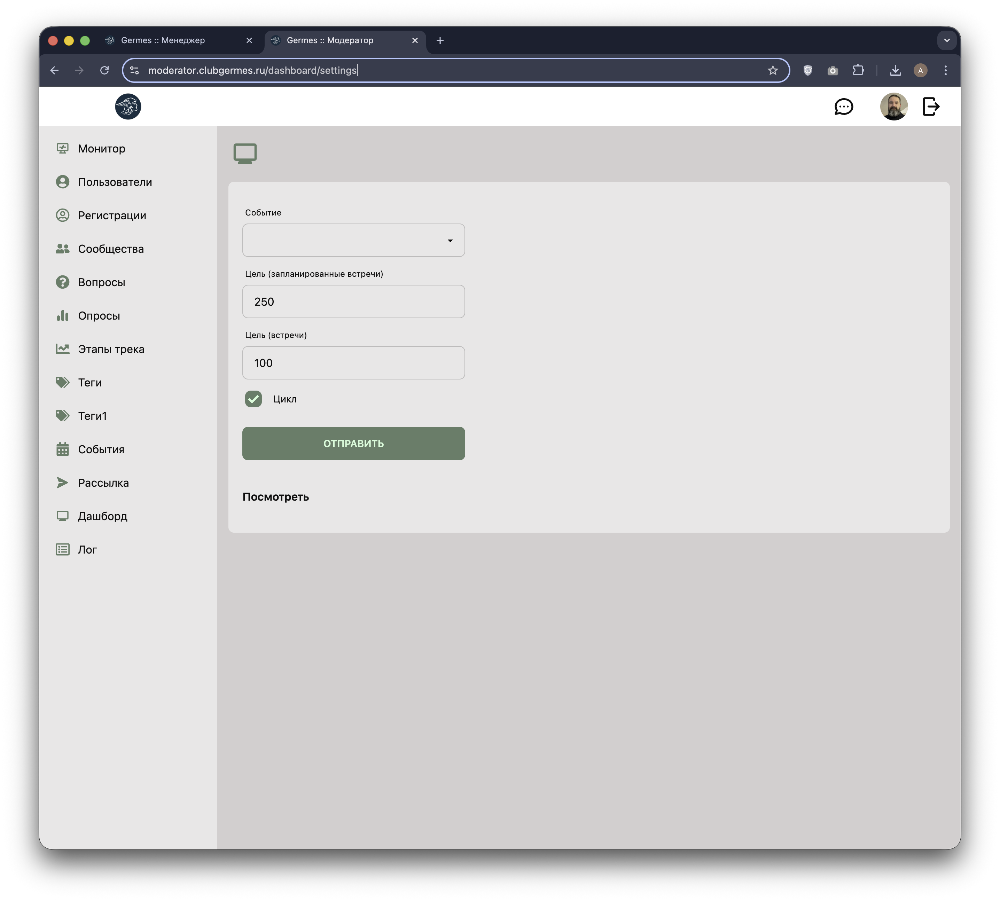

# 👮 Модератор: Витрина (Dashboard)

**Код:** `frontend/club-moderator/src/views/Dashboard.svelte`
**Роут:** `/dashboard` (Layout: `Main`)

Интерактивная панель (витрина) для вывода на большой экран во время мероприятия. Отображает ключевую статистику в реальном времени: количество гостей, назначенные встречи и новые знакомства.

{style="block"}

## Функционал

Экран разработан для Full HD разрешения (`1920x1080`) и предназначен для трансляции на проекторе.

### Блоки информации

1.  **Участников на событии**:
    *   Крупная цифра в центре (например, "867").
    *   Анимация появления новых участников (карточка с аватаром вылетает снизу).
    *   *Источник данных*: `visitorsUsers`.

2.  **Индекс встреч**:
    *   Круговая диаграмма (`DonutSimple`), показывающая общий уровень удовлетворенности нетворкингом.
    *   Цвет: Зеленый (`#27a745`).

3.  **Назначено встреч**:
    *   Двойной график (`Donut`): Текущее количество vs Целевое значение.
    *   Цвета: Желтый/Синий.

4.  **Состоялось встреч**:
    *   Двойной график (`Donut`): Факт vs План.
    *   Цвета: Желтый/Зеленый.

5.  **Новая назначенная встреча** (Синий блок):
    *   Анимация слайдера: показывает пары участников, которые только что договорились о встрече.
    *   Данные: `connectionsPlannedUsers`.

6.  **Сейчас состоялась встреча** (Зеленый блок):
    *   Анимация слайдера: показывает пары, которые отметили встречу как состоявшуюся.
    *   Данные: `connectionsUsers`.

## Настройка Витрины

Перед запуском трансляции модератор может настроить параметры отображения через специальную форму (обычно доступна по отдельному роуту настроек).

{style="block"}

*   **Событие**: Выбор мероприятия из списка.
*   **Заголовок**: Текст, который будет отображаться в шапке (по умолчанию название события).
*   **Целевые показатели**: Установка плановых значений для графиков (сколько встреч ожидается).

## Техническая реализация

### Анимации
Используется `svelte/transition` (`fly`) и `svelte/motion` (`tweened`) для плавного изменения цифр и появления карточек.
*   Цифры счетчиков "накручиваются" при обновлении данных.
*   Карточки участников циклически сменяют друг друга с интервалом 10 секунд.

### Обновление данных
*   **Polling**: Интервалы `setInterval` переключают отображаемых пользователей в слайдерах.
*   **WebSocket**: Подписка `subscribe('events', get)` вызывает обновление данных (`dashboardData`) при любых изменениях на бэкенде.

### Кэширование изображений
В блоке `<svelte:head>` реализован механизм `preload` для аватарок (`cacheAvatars`). Это предотвращает мерцание при смене слайдов, так как браузер загружает картинки заранее.
