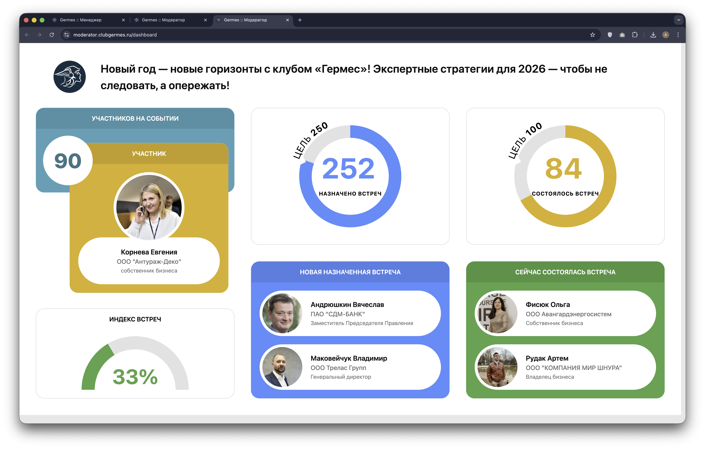

# 👮 Модератор: Дашборд (Dashboard)

Модуль предназначен для вывода статистики мероприятия в реальном времени на большие экраны (проекторы, ТВ-панели) во время проведения ивента. Состоит из интерфейса настроек и самой витрины.

## 1. Настройки Дашборда

**Код:** `frontend/club-moderator/src/views/DashboardSettings.svelte`
**Роут:** `/dashboard/settings` (Layout: `Main`)

Интерфейс для выбора события и установки целевых показателей (KPI), которые будут отображаться на графиках.

{style="block"}

### Функционал
*   **Событие**: Выпадающий список для выбора текущего активного мероприятия.
*   **Цель (запланированные встречи)**: Числовое значение. Определяет 100% заполнения круговой диаграммы для назначенных встреч.
*   **Цель (встречи)**: Числовое значение. Цель по фактически состоявшимся встречам.
*   **Цикл (Чекбокс)**:
    *   Если **выключено**: В блоке "Участники" показываются только *новые* зарегистрировавшиеся (пришедшие) гости.
    *   Если **включено**: Список участников прокручивается по кругу (слайдшоу из всех присутствующих).
*   **Кнопка "Отправить"**: Сохраняет настройки на сервере.
*   **Ссылка "Посмотреть"**: Открывает витрину дашборда (`/dashboard`) в новой вкладке.

---

## 2. Витрина (Display)

**Код:** `frontend/club-moderator/src/views/Dashboard.svelte`
**Роут:** `/dashboard` (Layout: `Dashboard`)

Публичный интерфейс, оптимизированный под разрешение **1920x1080**. Не содержит навигации и сайдбара.

{style="block"}

### Элементы интерфейса (Виджеты)

1.  **Заголовок**: Логотип клуба и название выбранного события.
2.  **Участников на событии (Слева, желтый блок)**:
    *   Счетчик: Общее количество гостей (анимация обратного отсчета через `tweened`).
    *   Карточка персоны: Слайдшоу с фото, именем и должностью участника. Анимация появления снизу вверх (`fly`).
3.  **Индекс встреч (Слева внизу)**:
    *   Полукруглый график (`DonutSimple`), показывающий эффективность нетворкинга (ratio).
4.  **Назначено встреч (Центр, верх)**:
    *   Круговая диаграмма (`Donut`) с прогрессом относительно цели, заданной в настройках.
    *   Цвет: Синий.
5.  **Состоялось встреч (Справа, верх)**:
    *   Круговая диаграмма (`Donut`) с прогрессом относительно цели.
    *   Цвет: Желтый/Зеленый.
6.  **Лента активности (Низ)**:
    *   **Новая назначенная встреча** (Синий блок): Показывает пары участников, договорившихся о встрече.
    *   **Сейчас состоялась встреча** (Зеленый блок): Показывает пары, которые отметили встречу как состоявшуюся.

## Логика работы

### Обновление данных
*   **Polling**: При загрузке данные запрашиваются через `dashboardDataHandler`.
*   **Real-time**: Компонент подписан на WebSocket канал `events` (`subscribe('events', get)`). При любом изменении данных на бэкенде, дашборд обновляется мгновенно без перезагрузки страницы.

### Анимация и Ротация
В коде используются интервалы (`setInterval`) для циклического переключения отображаемых пользователей:
*   `showVisitorUser` (каждые 10 сек): Переключает карточку участника слева.
*   `showConnectionPlannedUsers` (каждые 10 сек): Показывает новые пары в синем блоке.
*   `showConnectionUsers` (каждые 10 сек): Показывает пары в зеленом блоке.

Если включен режим "Цикл" в настройках, список участников прокручивается бесконечно. Если выключен — показываются только последние вошедшие.

## Техническая реализация

### API Запросы
Взаимодействие через `queries/dashboard.ts`.

| Функция | Endpoint | Описание |
|---|---|---|
| `dashboardGet` | `/m/dashboard/get` | Получение текущих настроек (для страницы Settings). |
| `dashboardUpdate` | `/m/dashboard/update` | Сохранение настроек (цели, event_id). |
| `dashboardData` | `/dashboard/data` | Получение агрегированной статистики и списков пользователей для Витрины. |

### Особенности
*   **Кэширование изображений**: В `<svelte:head>` реализован прелоадинг аватарок (`link rel="preload"`), чтобы при смене слайдов на дашборде изображения появлялись мгновенно, без моргания.
*   **Fixed Layout**: CSS жестко задает размеры `w-[1920px] h-[1080px]`, предполагая отображение на Full HD экранах в полноэкранном режиме браузера (F11).
*   **Компоненты**:
    *   `Donut`: SVG-компонент для диаграмм с анимацией заполнения.
    *   `AvatarDashboard`: Увеличенная версия аватара для больших экранов.