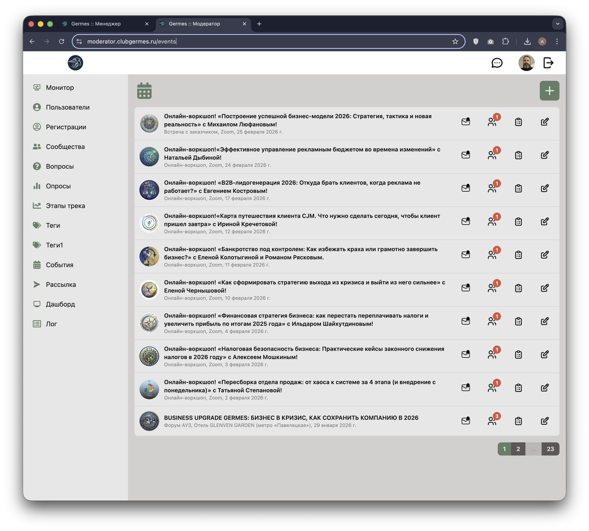
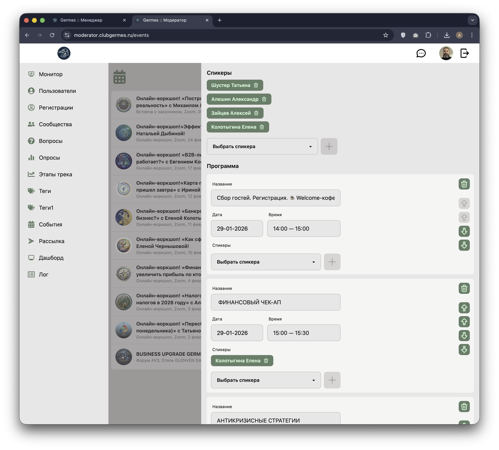

# 👮 Модератор: События (Events)

**Код:** `frontend/club-moderator/src/views/Events.svelte`  
**Роут:** `/events` (Layout: `Main`)

Раздел предназначен для полного цикла управления мероприятиями клуба: от создания карточки и настройки программы до регистрации участников и рассылки уведомлений.

{style="block"}

## Функционал

Интерфейс разделен на основную рабочую область (список) и выдвижную панель редактирования (Drawer).

### Основной список
Отображает перечень всех мероприятий с пагинацией.
*   **Визуализация статуса**: Неактивные события (черновики) отображаются полупрозрачными.
*   **Карточка события**:
    *   **Аватар**: Иконка/логотип мероприятия.
    *   **Заголовок**: Название события.
    *   **Мета-данные**: Формат (например, "Форум АУЗ"), Место проведения, Дата.
*   **Панель действий** (кнопки справа):
    1.  🔔 **Уведомления**: Переход к конструктору Email/Push рассылки по событию.
    2.  👥 **Участники**: Управление списком регистрации. Красный бейдж показывает количество неподтвержденных заявок.
    3.  📅 **Программа**: Редактор таймлайна и спикеров.
    4.  ✏️ **Редактировать**: Основные настройки карточки события.

### Режимы редактирования (Drawer)
Боковая панель меняет свое содержимое в зависимости от выбранного действия.

#### 1. Основные настройки

{style="block"}
Форма для ввода базовой информации:
*   **Статус**: Чекбокс "Событие активно".
*   **Данные**: Заголовок, Формат (выпадающий список), Место проведения.
*   **Дата**: Выбор даты через календарь (`DateInput`).
*   **Информация**: Rich Text Editor (CKEditor) для детального описания.
*   **Медиа**:
    *   **Иконка события**: Круглое изображение (с кропом).
    *   **Изображение в ленте**: Баннер события.
    *   **Файлы события**: Загрузка вложений (например, архивы .zip).

#### 2. Программа и Спикеры

{style="block"}
Компонент `<EventProgram />`. Позволяет:
*   Управлять списком спикеров (добавление из базы, удаление из события).
*   Формировать таймлайн (блоки программы): Название, Дата, Время, привязка Спикеров к блоку.

#### 3. Участники

{style="block"}
Компонент `<EventParticipants />`.
*   Отображает список зарегистрированных пользователей.
*   Позволяет вручную подтвердить участие (если требуется).
*   Позволяет удалить участника или добавить нового вручную из выпадающего списка.

## Бизнес-логика

### Инициализация и Фильтрация
*   При загрузке страницы выполняется запрос `eventList`. Список всегда сортируется в обратном хронологическом порядке (параметр `reverse: true`).
*   Пагинация рассчитывается на клиенте на основе общего числа записей (`amount`) и текущей страницы (`page`). Размер страницы — 10 элементов.

### Управление состоянием (State Management)
Редактирование реализовано через локальную копию данных:
1.  При открытии формы (`edit()`) создается копия объекта события в переменные `eventEditable` и `eventCache`.
2.  Реактивное выражение `$: eventEditable, checkEvent()` сравнивает текущие введенные данные с кэшем.
3.  Кнопка "Сохранить" («Обновить») становится активной (`disabled={...}`), только если есть реальные изменения и не идет процесс загрузки.

### Загрузка медиа
Загрузка файлов (иконки, изображения, архивы) происходит **немедленно** при выборе файла, минуя основную кнопку "Сохранить":
*   Используется прямой `fetch` запрос к медиа-серверу (`https://media.clubgermes.ru:5017`).
*   После успешной загрузки список событий обновляется, а к URL изображения добавляется timestamp (`?Date.now()`), чтобы сбросить кэш браузера и сразу показать новую картинку.

### Форматы мероприятий
В коде используется маппинг названий форматов для UI и API:
*   UI: "Форум АУЗ", "Прямой эфир", "Тендерный разбор".
*   API: `forum`, `webinar`, `tender`.
Маппинг осуществляется через объекты `formatValues` и `formatNames`.

## Техническая реализация

### Компоненты
*   **View**: `views/Events.svelte` — основной контроллер.
*   **Sub-components**:
    *   `components/EventProgram`: Логика программы и спикеров.
    *   `components/EventParticipants`: Логика списка участников.
    *   `components/UploadEventIcon`: Специализированный компонент для аватара с возможностью кропа (через `svelte-easy-crop`).
*   **Libraries**:
    *   `ckeditor5-svelte`: Редактор текста.
    *   `date-picker-svelte`: Выбор даты.

### API Запросы
Взаимодействие с бэкендом через слой `queries/event.ts`.

| Функция | Метод | Endpoint | Назначение |
|---|---|---|---|
| `eventList` | POST | `/m/event/list` | Получение списка событий. |
| `eventCreate` | POST | `/m/event/create` | Создание нового события. |
| `eventUpdate` | POST | `/m/event/update` | Обновление текстовых полей и настроек. |
| `usersForSelect` | POST | `/m/user/for/select` | Получение списка пользователей для ручного добавления участника. |
| `eventNotification` | POST | `/m/event/notification` | Получение данных для конструктора рассылки (теги, шаблоны). |

### Upload Endpoints
Загрузка файлов идет в обход основного API слоя (прямой `fetch` в `views/Events.svelte` и компонентах):
*   `POST https://media.clubgermes.ru:5017/upload/event/icon`
*   `POST https://media.clubgermes.ru:5017/upload/event/image`
*   `POST https://media.clubgermes.ru:5017/upload/event/files`

### Нюансы
*   **UI Drawer**: Боковая панель реализована через CSS-класс `drawer` (DaisyUI) и управляется чекбоксом с id `layout-events`.
*   **Нормализация даты**: При выборе даты время принудительно устанавливается в 14:00 UTC (или обнуляются секунды/миллисекунды), чтобы избежать проблем с часовыми поясами при фильтрации.
