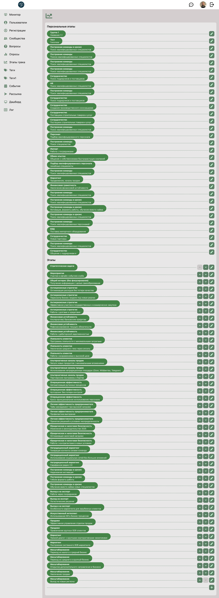
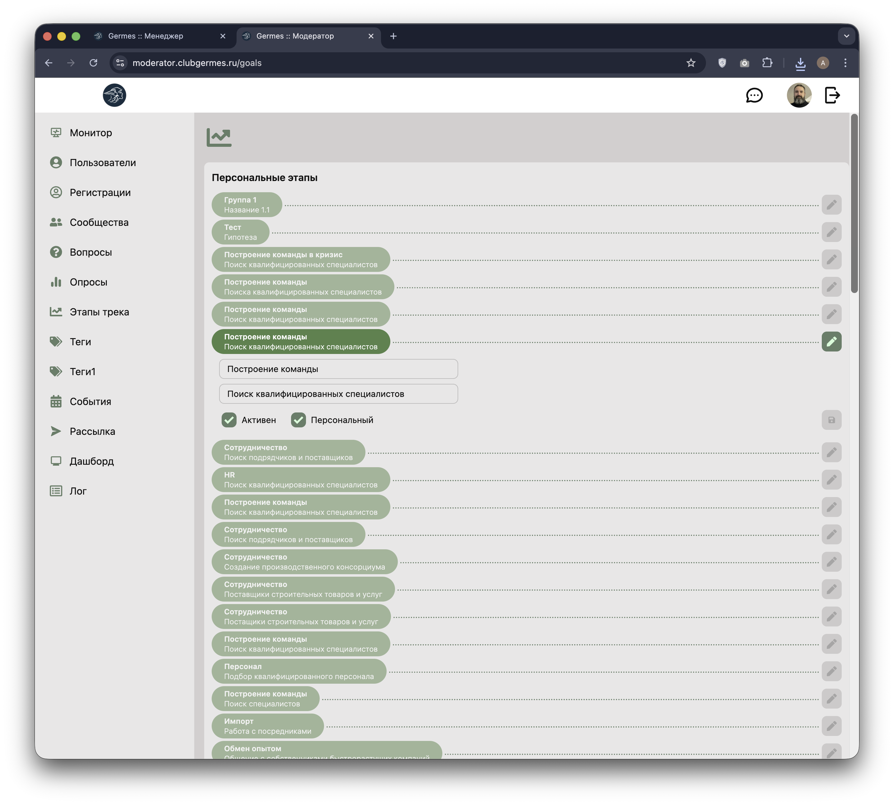
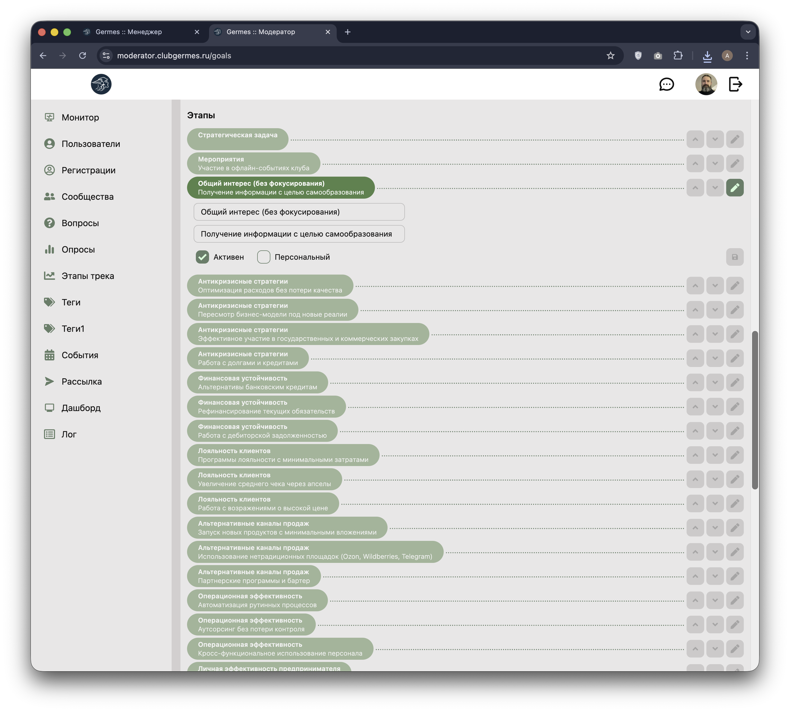

# 👮 Модератор: Этапы трека (Goals)

**Код:** `frontend/club-moderator/src/views/Goals.svelte`  
**Роут:** `/goals` (Layout: `Main`)

Раздел для управления справочником целей и этапов развития (topics), которые используются в треках участников Клуба. Позволяет создавать, редактировать и сортировать этапы трека.


{style="block"}

## Функционал

Экран разделен на два смысловых блока списков:

### 1. Персональные этапы
Список кастомных или вариативных целей.
*   Отображаются в верхней части страницы.
*   Не имеют строгой последовательности (отсутствуют кнопки сортировки).
*   Предназначены для специфических задач, которые могут назначаться индивидуально.

### 2. Этапы (Общие)
Список шагов основного трека развития.
*   Отображаются в нижней части.
*   **Сортировка**: Имеют кнопки 🔼 (Вверх) и 🔽 (Вниз) для изменения порядка следования этапов в треке.
*   **Иерархия**: Некоторые этапы могут быть выделены визуально (зеленым цветом), обозначая ключевые вехи (например, "Стратегическая задача").

### Управление
*   **Редактирование**: Кнопка ✏️ (Карандаш) справа открывает режим редактирования элемента "на месте" (inline-режим).
*   **Создание**: Кнопка ➕ внизу списка добавляет новый этап.

## Режим редактирования

**Редактирование персонального этапа:**

{style="block"}

**Редактирование общего этапа:**

{style="block"}

При нажатии на карандаш карточка этапа разворачивается в форму. Основные различия между типами:

*   **Персональные этапы**: Без кнопок сортировки, чекбокс "Персональный" включен.
*   **Общие этапы**: С кнопками сортировки (🔼🔽), чекбокс "Персональный" выключен.

Поля формы:

*   **Название**: Краткий заголовок этапа.
*   **Описание**: Детальная информация или подсказка (например, "Поиск квалифицированных специалистов").
*   **Чекбокс "Активен"**: Включить/выключить видимость этапа в системе.
*   **Чекбокс "Персональный"**:
    *   Если **включен**: Этап попадает в список "Персональные этапы".
    *   Если **выключен**: Этап попадает в общий список "Этапы" и участвует в сортировке.
*   **Сохранение**: Кнопка с иконкой дискеты (сохранить изменения).

## Логика работы

### Разделение списков
Система фильтрует единый список целей на клиенте или сервере на основе флага `personal` (Персональный).
*   Переключение чекбокса "Персональный" при редактировании мгновенно перемещает элемент из одного списка в другой.

### Сортировка (Ordering)
Сортировка доступна только для общих этапов.
*   Нажатие стрелок вызывает API-метод (вероятно, `goalMove` или аналогичный), меняющий `sort_order` элемента.
*   После успешного ответа сервера список перерисовывается.

## Техническая реализация

### Компоненты
*   **View**: `views/Goals.svelte` (483 строки)
*   **Прямые API запросы**: Использует собственную функцию `ajaxRequest` вместо централизованного слоя queries

### API Запросы
Взаимодействие напрямую с API через `ajaxRequest`:

| Функция | Endpoint | Параметры | Описание |
|---|---|---|---|
| `getTopics` | `/goals/topics` | `{ active: true }` | Получение списка всех topics (этапов). |
| `addTopic` | `/goals/topics/add` | `{ title, subtitle, private: false }` | Создание нового этапа. |
| `editTopic` | `/goals/topics/edit` | `{ topicId, title, subtitle, private, active }` | Обновление этапа. |
| `sortTopic` | `/goals/topics/edit` | `{ topicId, sort }` (два запроса) | Изменение порядка сортировки (swap двух элементов). |

**Базовый URL API:** `https://iota.clubgermes.ru:5111`

### Структура данных

**Topic (этап):**
```json
{
    "topicId": "number",
    "title": "string",
    "subtitle": "string",
    "active": "boolean",
    "private": "boolean",
    "sort": "number"
}
```

**Описание полей:**
- `topicId` — ID этапа
- `title` — Группа/категория
- `subtitle` — Название этапа
- `active` — Активен ли этап
- `private` — Персональный или общий
- `sort` — Порядок сортировки

### Особенности реализации

*   **Разделение на типы**: Topics делятся на два списка:
    - `topicsPrivate` — персональные этапы (фильтр `topic.private === true`)
    - `topicsPublic` — общие этапы (фильтр `topic.private === false`)

*   **Inline Editing**: Редактирование происходит прямо в списке без Drawer:
    - Переменная `open` хранит ID редактируемого topic
    - При открытии создаются `edit` и `editCache` для отслеживания изменений
    - Кнопка сохранения активна только при наличии изменений (`noChange === false`)

*   **Сортировка**: 
    - Только для публичных этапов (`topicsPublic`)
    - Кнопки 🔼 (вверх) и 🔽 (вниз) меняют местами `sort` двух соседних элементов
    - Отправляются два параллельных запроса через `Promise.all`

*   **Визуализация**:
    - Зеленый фон (`bg-[#458548]`) для всех этапов
    - Opacity 50% для неактивных элементов при редактировании
    - Dotted border для визуальной связи элементов

*   **Валидация**:
    - Обязательные поля: `title` и `subtitle`
    - Кнопки блокируются при открытом редактировании другого элемента

## См. также

**Связанные модули:**
*   [Dashboard](Moderator-Dashboard.md) — отображение целей на витрине
*   [Users](Moderator-Users.md) — управление пользователями и их прогрессом по целям

**Другие интерфейсы:**
*   [Moderator Overview](Moderator-Overview.md) — обзор всех модулей модератора
