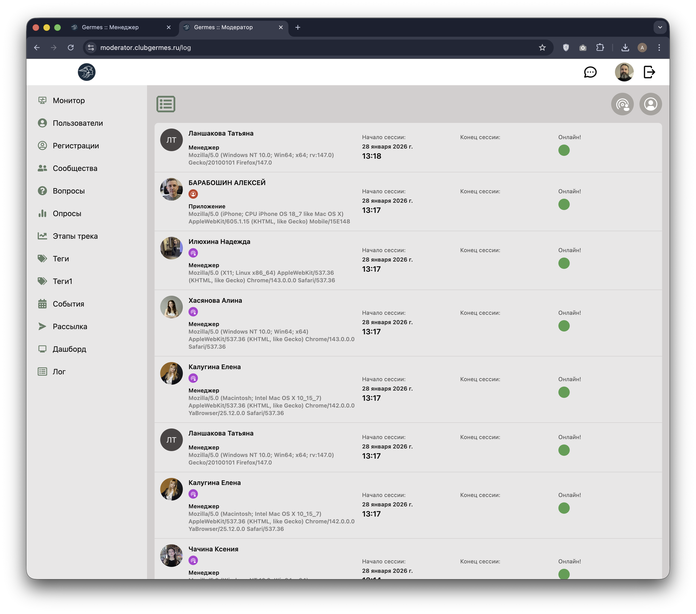

# 👮 Модератор: Лог заходов (Log)

**Код:** `frontend/club-moderator/src/views/Log.svelte`  
**Роут:** `/log` (Layout: `Main`)

Раздел предназначен для мониторинга активности пользователей в системе (лог авторизаций и сессий). Позволяет модератору видеть, кто и когда заходил в приложение или веб-панель.

{style="block"}

## Функционал

### Основной список
Таблица отображает историю сессий в хронологическом порядке (новые сверху).

1.  **Пользователь (Слева)**:
    *   **Аватар**: Фото пользователя.
    *   **Имя**: ФИО.
    *   **Роли**: Иконки ролей (например, фиолетовая для Менеджера, красная для Клиента).
    *   **Тип клиента**: Подпись "Модератор", "Менеджер" или "Приложение" (мобильное).
    *   **User Agent**: Техническая информация об устройстве (например, "Mozilla/5.0...").

2.  **Время сессии (Справа)**:
    *   **Начало сессии**: Дата и время входа.
    *   **Конец сессии**: Дата и время выхода (или последней активности).
    *   **Длительность**:
        *   Если сессия завершена: время в часах/минутах.
        *   Если сессия активна: индикатор **"Онлайн!"** и зеленый кружок.

### Фильтрация
В верхней части находятся кнопки-фильтры (переключатели):
*   **Менеджеры** (Фиолетовая иконка): Показать только сессии Коммьюнити-менеджеров.
*   **Клиенты** (Красная иконка): Показать только сессии Клиентов (резидентов).

### Пагинация
Внизу страницы расположен стандартный пейджер (по 25 записей на страницу).

## Техническая реализация

### API Запросы
Взаимодействие через `queries/log.ts`.

| Функция | Endpoint | Описание |
|---|---|---|
| `logSignings` | `/m/log/signings` | Получение списка сессий. Принимает параметры `page` и `roles` (для фильтрации). |

### Особенности
*   **Определение клиента**: Тип клиента определяется по полю `item.settings.client`. Используется маппинг: `moderator`, `manager`, `application`.
*   **Онлайн-статус**: Если поле `time_to` (время окончания) отсутствует или равно null, система считает, что пользователь сейчас онлайн.
*   **Расчет длительности**: Функция `toTimeLength` вычисляет разницу между `time_to` и `time_from`.