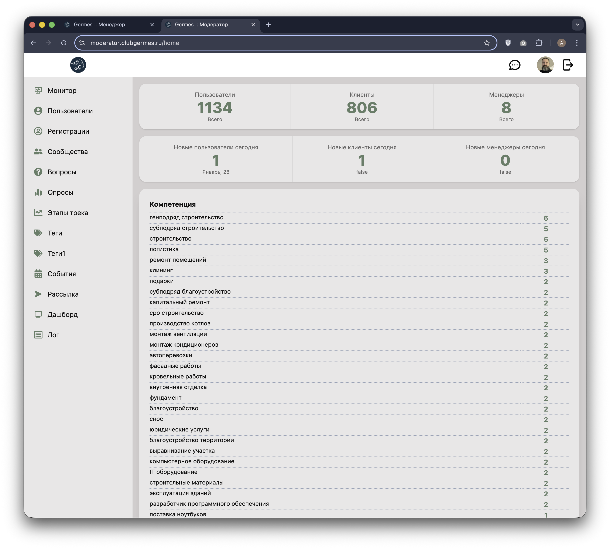

# 👮 Модератор: Монитор (Monitor)

**Код:** `frontend/club-moderator/src/views/Home.svelte`
**Роут:** `/home` (Layout: `Main`)

Стартовый экран модератора (Дашборд), предоставляющий сводную статистику по пользователям и активности в системе.


{style="block"}

## Функционал

Страница разделена на три информационных блока:

1.  **Общая статистика (Total Stats)**:
    *   Показывает общее количество сущностей в базе данных.
    *   Метрики: **Пользователи** (всего), **Клиенты** (пользователи с ролью client), **Менеджеры**.

2.  **Дневная статистика (Today Stats)**:
    *   Показывает прирост за текущие сутки.
    *   Метрики: Новые пользователи, Новые клиенты, Новые менеджеры.
    *   Под цифрой выводится текущая дата (например, "Январь, 28").
    *   *Примечание:* На скриншоте у блоков клиентов и менеджеров выводится `false` — это результат ошибки в шаблоне кода (отсутствие вызова функции форматирования даты), но логически там должна быть дата.

3.  **Статистика тегов**:
    *   Две таблицы (на скриншоте видна верхняя), отображающие популярность тегов.
    *   **Компетенция**: Какие навыки указывают пользователи.
    *   **Интерес** (ниже, не влез в скрин): Какие ресурсы ищут пользователи.
    *   Данные представлены в виде списка: `Название тега` — `Количество использований`.

## Логика работы

### Инициализация
При загрузке компонента (`onMount`) выполняются два параллельных запроса к API через `collector`:
1.  Получение статистики по пользователям (`statsUsers`).
2.  Получение статистики по тегам (`statsTags`).

### Сортировка и отображение
*   **Теги**: Данные приходят с сервера в виде объекта `{"tag_name": count}`.
*   Сортировка происходит **на клиенте**: Ключи объекта сортируются по убыванию значения (`tags[b] - tags[a]`), чтобы самые популярные теги оказались сверху.
*   **Дата**: Для отображения текущей даты используется хелпер `formatDatetime(Date.now(), 'MS, DD', true, false)`, который преобразует timestamp в формат "Месяц, День".

## Техническая реализация

### API Запросы
Взаимодействие осуществляется через слой `queries/stats.ts`.

| Переменная Handler | Endpoint | Описание |
|---|---|---|
| `statsUsersHandler` | `/m/stats/users` | Возвращает объект с полями `users`, `clients`, `managers` (общие) и `*_new` (за сегодня). |
| `statsTagsHandler` | `/m/stats/tags` | Возвращает объект `{ tags: {...}, interests: {...} }`. |

### Особенности кода
*   **Layout**: Используются CSS-классы `stats` из библиотеки DaisyUI для верхних блоков и `grid` для таблиц тегов.
*   **Reactive Statements**: Сортировка ключей тегов реактивна:
    ```typescript
    $: tagsKeys = Object.keys(tags).sort((a, b) => tags[b] - tags[a]);
    ```
    Это гарантирует перерисовку списка при обновлении данных.
