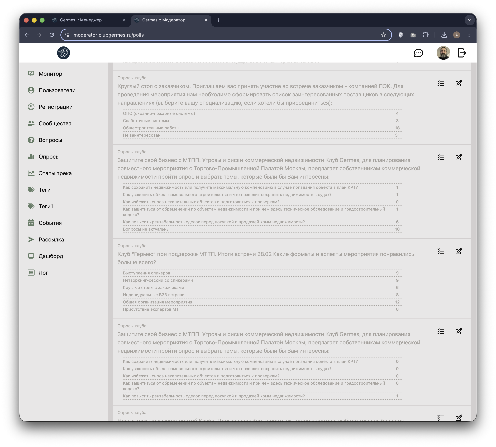
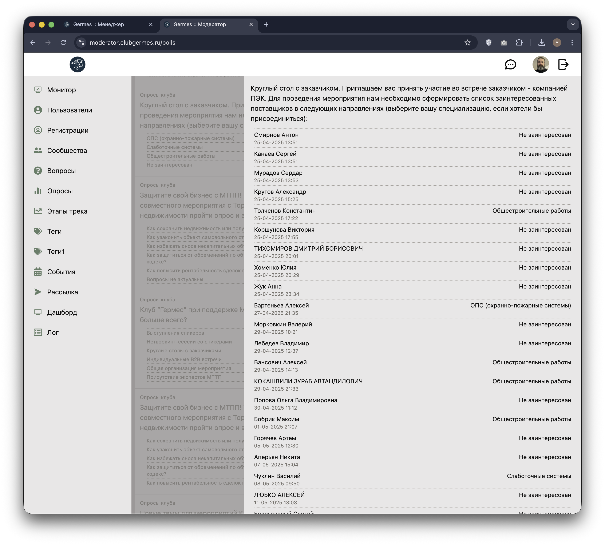
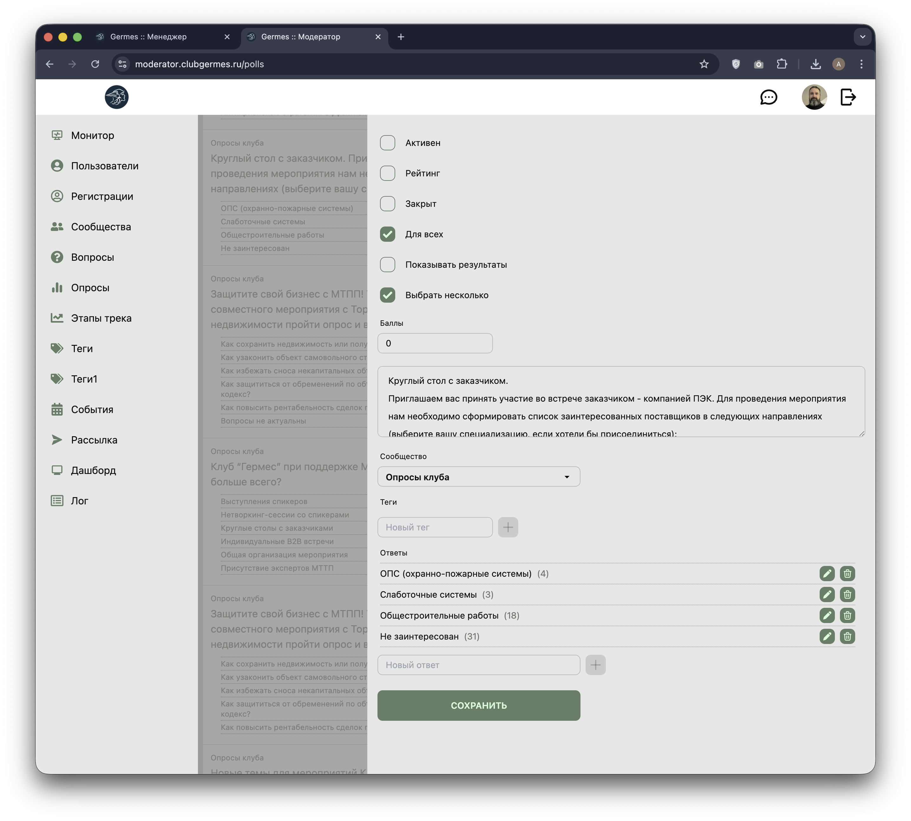

# 👮 Модератор: Опросы (Polls)

**Код:** `frontend/club-moderator/src/views/Polls.svelte`
**Роут:** `/polls` (Layout: `Main`)

Раздел для создания и управления голосованиями внутри Клуба. Опросы могут быть привязаны к конкретному сообществу или быть общедоступными.

{style="block"}

## Функционал

### Основной список
Отображает ленту всех опросов, отсортированную по активности и дате создания.
*   **Карточка опроса**:
    *   **Заголовок**: Название сообщества, к которому привязан опрос (или "Для всех").
    *   **Вопрос**: Текст вопроса.
    *   **Варианты ответов**: Список вариантов с текущим количеством голосов.
*   **Действия**:
    *   📋 **Лог**: Просмотр детального списка проголосовавших пользователей.
    *   ✏️ **Редактировать**: Изменение настроек и текста опроса.
    *   ➕ **Добавить**: Создание нового опроса (кнопка в шапке).

### Лог голосования (Log)

{style="block"}
Открывается в боковой панели. Показывает список всех пользователей, принявших участие в опросе, с указанием выбранного варианта ответа и времени голосования. Позволяет анализировать аудиторию.

### Редактирование / Создание (Drawer)

{style="block"}

Форма настройки опроса с широким набором параметров:

1.  **Настройки доступа и отображения**:
    *   **Активен**: Включить/выключить опрос.
    *   **Рейтинг**: Переключает режим опроса в "Рейтинг" (цветные варианты ответов: красный/желтый/зеленый).
    *   **Закрыт**: Опрос только для чтения (голосовать нельзя).
    *   **Для всех**: Показывать опрос всем пользователям, вне зависимости от их членства в сообществе.
    *   **Выбрать несколько**: Разрешить мультивыбор (`checkbox` вместо `radio`).
    *   **Баллы**: Начисление баллов за участие (геймификация).

2.  **Контент**:
    *   **Текст вопроса**: `textarea`.
    *   **Сообщество**: Привязка к конкретному разделу.
    *   **Теги**: Для категоризации.

3.  **Варианты ответов**:
    *   Динамический список: можно добавлять новые варианты, редактировать или удалять существующие.
    *   В режиме "Рейтинг" каждому ответу присваивается цвет (🔴/🟡/🟢) для визуальной индикации настроения.

## Логика работы

### Типы опросов
Код поддерживает два принципиально разных типа опросов, переключаемых чекбоксом `rating`:
1.  **Обычный опрос**: Пользователь выбирает текстовый вариант ответа. Можно разрешить мультивыбор (`many: true`). Требует привязки к Сообществу.
2.  **Рейтинг**: Варианты ответов кодируются цветами (r, y, g). Используется для оценки мероприятий или спикеров. Поле `community_id` сбрасывается.

### Управление вариантами ответов
*   При редактировании ответа создается запись в истории изменений (`editableAnswerHistory`), что позволяет корректно обрабатывать изменения уже после начала голосования (например, исправление опечаток без потери голосов).
*   Удаление варианта ответа (`d1`, `d2`...) также фиксируется, чтобы сохранить целостность данных на бэкенде.

## Техническая реализация

### API Запросы
Взаимодействие через `queries/poll.ts`.

| Функция | Endpoint | Описание |
|---|---|---|
| `pollList` | `/m/poll/list` | Получение полного списка опросов. |
| `pollLog` | `/m/poll/log` | Получение списка проголосовавших (`{ user_id, name, answer, time }`). |
| `pollUpdate` | `/m/poll/update` | Обновление опроса. Принимает массив `history` для обработки изменений вариантов ответов. |
| `pollCreate` | `/m/poll/create` | Создание нового опроса. |

### Особенности
*   **Цветовое кодирование**: В режиме рейтинга ответы хранятся в формате `{color}Text` (например, `{g}Отлично`, `{r}Плохо`). Функции-хелперы `answerGetColor` и `answerGetText` парсят эту строку для отображения в UI.
*   **Сортировка**: Список опросов сортируется на клиенте: сначала активные, затем по дате создания (новые выше).
