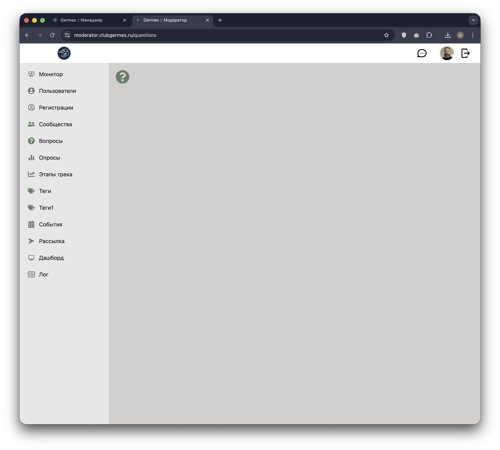

# 👮 Модератор: Вопросы (Questions / Unverified)

**Код:** `frontend/club-moderator/src/views/Questions.svelte`
**Роут:** `/questions` (Layout: `Main`)

> ⚠️ **Примечание**: В настоящее время этот раздел не используется в продакшене. 
> Функционал премодерации вопросов был перенесен в раздел "Сообщества". 
> Документация описывает изначальный замысел модуля.

Раздел служит **очередью премодерации (Inbox)**. Сюда попадают новые вопросы пользователей, которые еще не были проверены, не имеют привязки к конкретному сообществу или требуют распределения по категориям перед публикацией.

{style="block"}

## Функционал

Интерфейс представляет собой ленту карточек с вопросами, требующими обработки.

### Карточка вопроса (Draft)
Каждый блок содержит сырые данные от пользователя:
*   **Автор и Дата**: Кто и когда задал вопрос.
*   **Текст вопроса**: Основное содержание.
*   **Инструменты классификации**:
    *   **Сообщество**: Выпадающий список (`select`) для выбора целевого раздела (например, "Тендерный клуб"). По умолчанию может быть "Не выбрано".
    *   **Теги**: Поле ввода с автодополнением (`InputSuggestions`) для присвоения тематических тегов.

### Панель действий
1.  **Удалить**: Если вопрос является спамом или неактуален.
2.  **Опубликовать**: Главная кнопка действия. Переводит вопрос в статус `verified: true` и переносит его в выбранное Сообщество.
    *   *Важно:* Кнопка активна **только** если выбрано Сообщество И добавлен хотя бы один Тег.
3.  **Редактировать** (Карандаш): Открывает боковую панель для правки текста.

### Редактирование текста (Drawer)
Если вопрос содержит ошибки или некорректные формулировки, модератор может изменить текст перед публикацией через выдвижную панель. Изменения сохраняются локально для этого вопроса.

## Логика работы

### Процесс модерации (Workflow)
Алгоритм работы модератора в этом разделе:
1.  Прочитать новый вопрос.
2.  Если вопрос некорректен — **Удалить**.
3.  Если вопрос валиден:
    *   Исправить текст (при необходимости).
    *   Выбрать подходящее **Сообщество** из списка.
    *   Добавить релевантные **Теги**.
    *   Нажать **Опубликовать**.
4.  После публикации вопрос исчезает из этого списка и появляется в соответствующем разделе "Сообщества".

## Техническая реализация

### API Запросы
Взаимодействие через `queries/community.ts`.

| Функция | Endpoint | Описание |
|---|---|---|
| `questionsUnverified` | `/m/community/questions/unverified` | Получение списка вопросов, требующих распределения. |
| `postUpdate` | `/m/community/post/update` | Используется для публикации. Отправляет флаг `verified: true`, `community_id` и обновленные `tags`. |
| `postDelete` | `/m/community/post/delete` | Удаление вопроса. |

### Особенности
*   **Валидация UI**: Интерфейс принуждает модератора классифицировать контент. Нельзя опубликовать вопрос "в никуда" — система требует явного указания `community_id` и наличия массива `tags`.
*   **Автодополнение**: Используется общий пул тегов (`tagList`) для унификации классификации.
