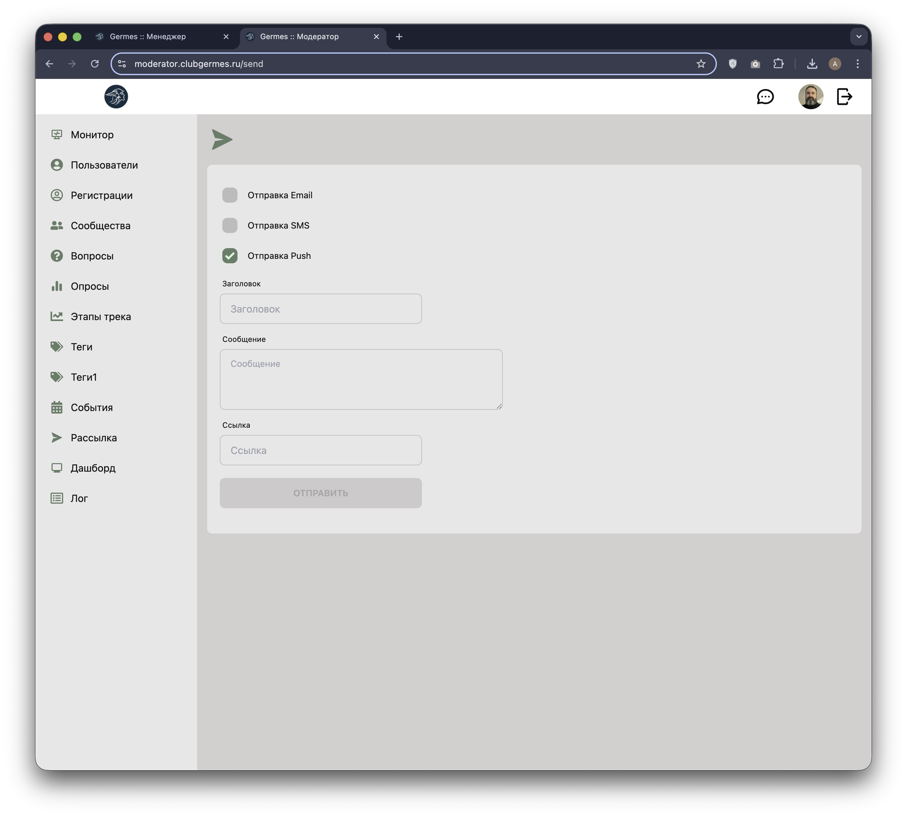

# 🔔 Модератор: Рассылка (Send)

**Код:** `frontend/club-moderator/src/views/Send.svelte`  
**Роут:** `/send` (Layout: `Main`)

Инструмент для ручной отправки массовых уведомлений всем пользователям системы. Используется для срочных анонсов, новостей или технических сообщений.

{style="block"}

## Функционал

Интерфейс представляет собой простую форму для создания сообщения.

### Каналы отправки
Модератор может выбрать каналы доставки сообщения:
*   **Email**: Отправка на электронную почту (чекбокс отключен/неактивен в текущей версии).
*   **SMS**: Отправка SMS (чекбокс отключен/неактивен в текущей версии).
*   **Push**: Отправка Push-уведомлений в мобильное приложение (активно по умолчанию).

### Содержание сообщения
*   **Заголовок**: Тема уведомления (минимум 2 символа).
*   **Сообщение**: Текст уведомления (минимум 10 символов).
*   **Ссылка**: URL, который откроется при клике на Push-уведомление (deeplink или внешняя ссылка).

### Отправка
Кнопка **"Отправить"** активируется только после заполнения обязательных полей (Заголовок и Сообщение).
После нажатия:
1.  Сообщение ставится в очередь на отправку.
2.  Поля формы очищаются.

## Техническая реализация

### API Запросы
Взаимодействие через `queries/send.ts`.

| Функция | Endpoint | Описание |
|---|---|---|
| `sendMessage` | `/m/message/send` | Отправка сообщения. |

### Параметры запроса
*   `flagEmail` (bool): Отправлять ли Email.
*   `flagSms` (bool): Отправлять ли SMS.
*   `flagPush` (bool): Отправлять ли Push.
*   `title` (string): Заголовок.
*   `message` (string): Текст.
*   `link` (string): Ссылка.

### Особенности
*   **Ограничения UI**: Чекбоксы Email и SMS имеют атрибут `disabled` в коде (`bind:checked="{flagEmail}" disabled`), что говорит о том, что в данный момент рассылка разрешена только через Push-канал.