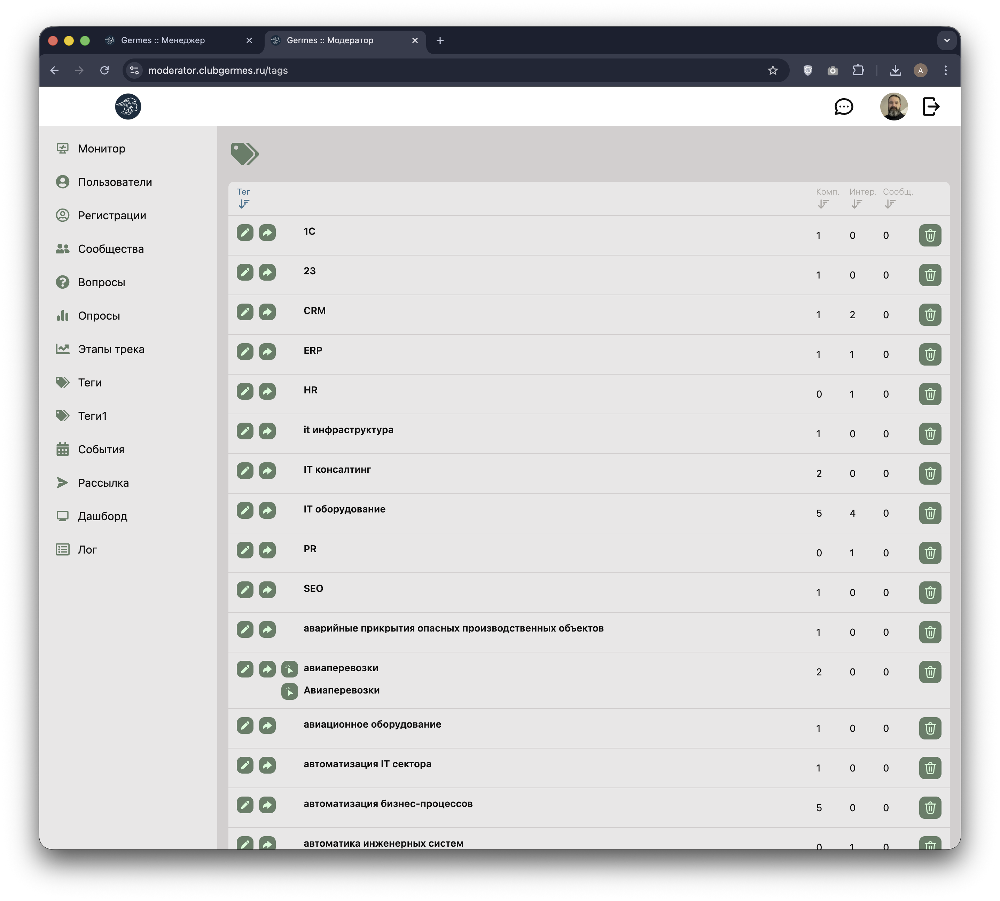
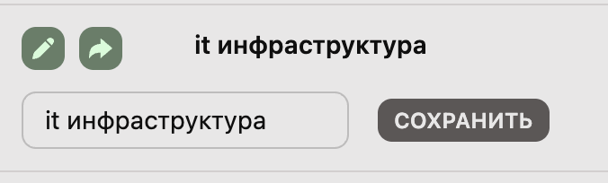

# 👮 Модератор: Теги (Tags)

**Код:** `frontend/club-moderator/src/views/Tags.svelte`  
**Роут:** `/tags` (Layout: `Main`)

Раздел предназначен для управления таксономией (словарем тегов) Клуба. Позволяет модераторам исправлять опечатки, объединять дубликаты и удалять неактуальные теги, которые пользователи указывают в своих профилях (Компетенции/Интересы) и в Сообществах.

{style="block"}

## Функционал

### Основной список
Таблица тегов с возможностью сортировки по колонкам:
1.  **Тег**: Алфавитная сортировка по названию.
2.  **Комп. (Competency)**: Количество пользователей, указавших этот тег как свою компетенцию ("Чем могу быть полезен").
3.  **Интер. (Interests)**: Количество пользователей, ищущих этот тег ("Какие ищу ресурсы").
4.  **Сообщ. (Communities)**: Количество сообществ, использующих этот тег.

### Инструменты управления (Слева от названия)
*   ✏️ **Редактировать**: Изменение названия тега (исправление ошибок).
*   ➡️ **Объединить (Merge)**: Вливание текущего тега в другой существующий тег (устранение смысловых дублей).
*   ✅ **Выбрать написание**: Если система обнаружила несколько вариантов написания одного тега (например, "IT" и "It"), появляется кнопка для выбора канонического варианта.

### Инструменты удаления (Справа)
*   🗑️ **Удалить**: Полное удаление тега из системы. Вызывает модальное окно подтверждения.

## Режимы работы

### 1. Редактирование (Rename)

{style="block"}

При нажатии на иконку карандаша открывается поле ввода.
*   **Действие**: Полная замена текста тега во всей базе данных.
*   **Применение**: Исправление опечаток (например, "it инфраструктура" -> "IT-инфраструктура").

### 2. Объединение (Merge)
При нажатии на иконку стрелки открывается выпадающий список всех существующих тегов.
*   **Действие**: Все связи текущего тега переносятся на выбранный тег-цель, а текущий тег удаляется.
*   **Применение**: Объединение синонимов (например, слияние "Бухгалтерия" в "Бухгалтерский учет").

## Логика работы

### Сортировка
Сортировка происходит **на клиенте** (`client-side`). При клике на заголовок столбца изменяется переменная `sortField`, и массив `tagsSorted` перестраивается.
*   По умолчанию сортировка по алфавиту.
*   При сортировке по метрикам (Комп./Интер./Сообщ.) вторичная сортировка идет по алфавиту.

### Группировка вариантов (Case Sensitivity)
Бэкенд может возвращать сгруппированные варианты одного тега (например, `['SEO', 'seo', 'Seo']`).
В интерфейсе это отображается как одна строка, но с возможностью раскрыть список вариантов или выбрать основной через модальное окно (`my_modal_{t.tag}_{option}`).

## Техническая реализация

### API Запросы
Взаимодействие через `queries/tag.ts`.

| Функция | Endpoint | Описание |
|---|---|---|
| `tagList` | `/m/tag/list` | Получение полного списка тегов со статистикой использования. |
| `tagReplace` | `/m/tag/replace` | Переименование или объединение. Принимает `tag` (старый) и `tag_new` (новый). |
| `tagDelete` | `/m/tag/delete` | Удаление тега. |

### Особенности
*   **Блокировка интерфейса**: В коде реализована логика, при которой открытие режима редактирования одной строки (`t.open = 1`) автоматически закрывает режимы редактирования других строк.
*   **Список для мерджа**: При инициализации компонента создается массив `tagsOptions` — плоский список названий тегов для использования в выпадающем списке при объединении.
