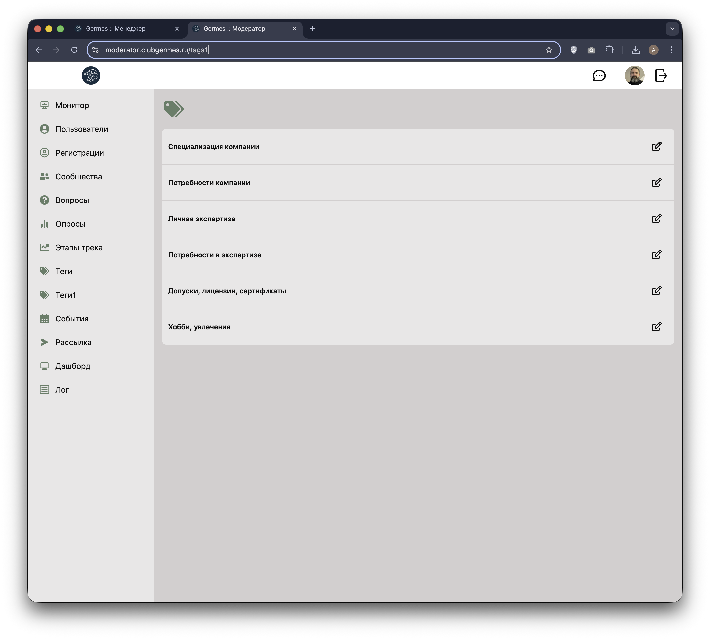
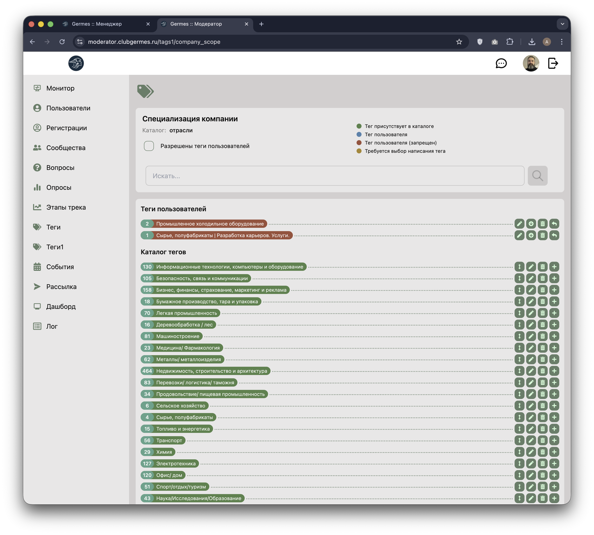
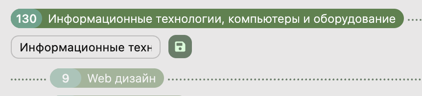
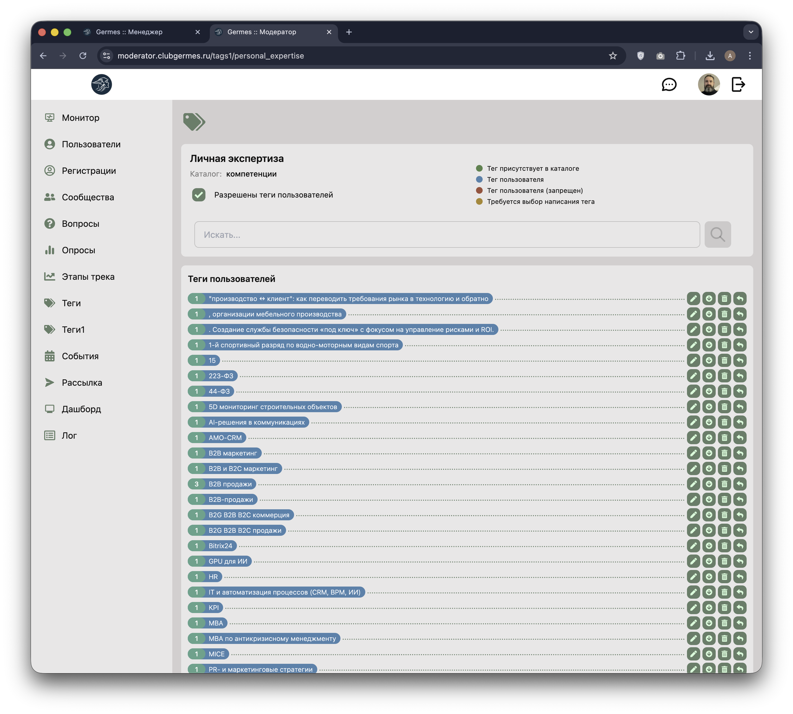

# 🏷️ Модератор: Спец. Теги (Tags1)

**Код:** `frontend/club-moderator/src/views/Tags1.svelte`, `frontend/club-moderator/src/views/Tags1Category.svelte`  
**Роут:** `/tags1`, `/tags1/:alias` (Layout: `Main`)

Раздел предназначен для управления иерархическими справочниками тегов (Специализация компании, Потребности компании, Личная экспертиза и др.). В отличие от общего раздела "Теги", здесь реализована структура каталогов и механизм модерации пользовательских тегов.

{style="block"}

## 1. Список категорий

При входе в раздел отображается перечень доступных справочников (категорий).
*   **Элементы**: Название категории (например, "Специализация компании").
*   **Действие**: Кнопка ✏️ переводит в режим управления конкретным справочником.

## 2. Управление справочником

Экран управления категорией разделен на две части: **Теги пользователей** и **Каталог тегов**.

{style="block"}

### Цветовая индикация статусов
Система использует цветовую кодировку для быстрого определения статуса тега:
*   🟢 **Зеленый**: Тег уже присутствует в официальном каталоге.
*   🔵 **Голубой**: Новый тег, созданный пользователем (разрешен настройками категории).
*   🔴 **Красный**: Пользовательский тег, который запрещен (если чекбокс "Разрешены теги пользователей" выключен).
*   🟠 **Оранжевый**: Обнаружено несколько вариантов написания одного тега (требуется выбор канонического варианта).

### Теги пользователей
Список тегов, которые резиденты вводили вручную в своих профилях.
*   **Статистика**: Число в зеленом кружке показывает, сколько раз этот тег использован.
*   **Действия**:
    *   ✏️ **Переименовать**: Изменение текста тега.
    *   📥 **В каталог**: Перенос тега в один из разделов официального каталога.
    *   🗑️ **Удалить**: Удаление тега у всех пользователей.
    *   🔄 **Заменить (Merge)**: Перенос всех пользователей с этого тега на другой (существующий в каталоге).

### Каталог тегов (Иерархия)
Древовидная структура официальных тегов Клуба.
*   **Уровни**: Поддержка вложенности (Раздел > Подраздел > Тег).
*   **Управление**: Кнопки для добавления новых элементов в текущий уровень, редактирования названий и удаления.

{style="block"}

## 3. Процессы модерации

### Выбор написания (Case Sensitivity)
Если в базе скопились варианты типа "SEO", "Seo" и "seo", система подсвечивает их оранжевым.

{style="block"}

Модератор должен выбрать один правильный вариант. После подтверждения все остальные варианты в базе будут автоматически заменены на выбранный.

### Массовая замена (Merge)
Используется для очистки справочника от мусора или синонимов.

{style="block"}

1.  Модератор нажимает иконку "Заменить" на пользовательском теге.
2.  Вверху появляется оранжевая панель "Выберите замену...".
3.  Модератор кликает на любой тег в каталоге.
4.  Система перепривязывает всех пользователей и удаляет старый тег.

## Техническая реализация

### API Запросы
Взаимодействие через `queries/tag.ts`.

| Функция | Endpoint | Описание |
|---|---|---|
| `tag1Categories` | `/m/tag1/categories` | Получение списка всех категорий спец. тегов. |
| `tag1Tags` | `/m/tag1/tags` | Загрузка тегов и структуры каталога для конкретной категории. |
| `tag1CategoryUpdate` | `/m/tag1/category/update` | Переключение флага `allow_user_tags`. |
| `tag1CatalogTag` | `/m/tag1/catalog/tag` | CRUD операции над элементами каталога. |
| `tag1UserTag` | `/m/tag1/user/tag` | Модерация пользовательских тегов (rename, delete, merge). |
| `tag1UserTagMove` | `/m/tag1/user/tag/move` | Перенос тега из "пользовательских" в "каталог". |

### Особенности
*   **Фильтрация**: Поиск по тегам (`searchText`) работает мгновенно на клиенте, фильтруя как список пользователей, так и дерево каталога.
*   **Навигация**: Используется алиас категории в URL (например, `/tags1/company_scope`).