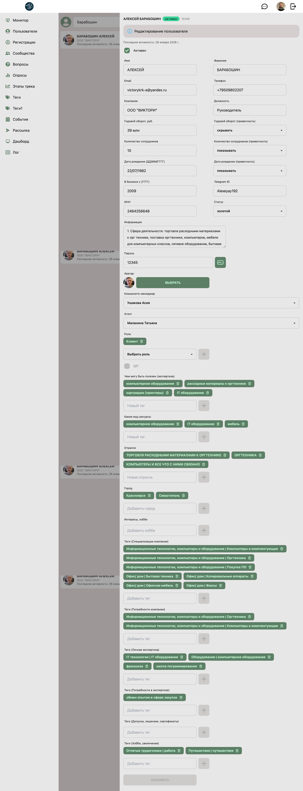
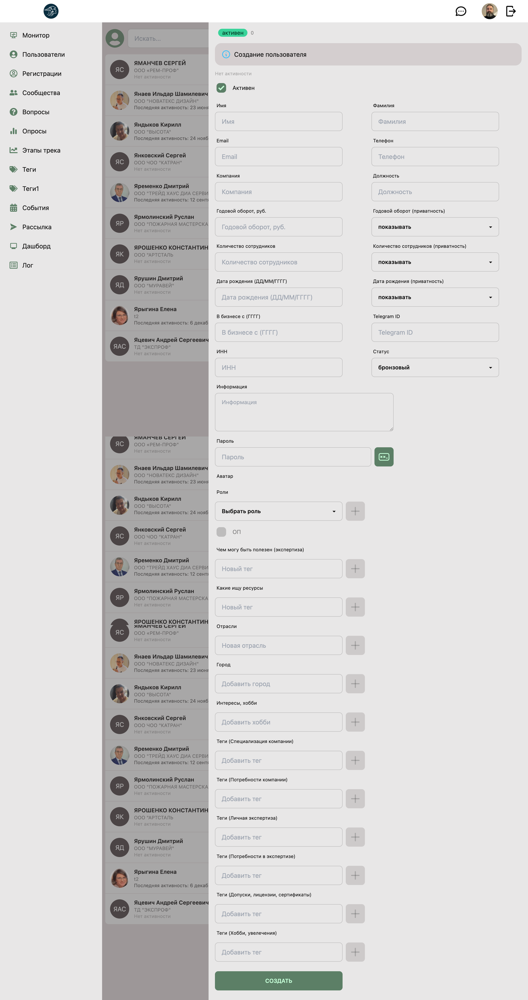

# 👮 Модератор: Пользователи (Users)

**Код:** `frontend/club-moderator/src/views/Users.svelte`
**Роут:** `/users` (Layout: `Main`)

Раздел для управления базой пользователей системы. Позволяет искать, создавать, редактировать профили пользователей, управлять их ролями, статусами и тегами.

{style="block"}

## Функционал

Интерфейс разделен на список пользователей и выдвижную форму редактирования (Drawer).

### Основной список
*   **Поиск**: Поле ввода в верхней части. Ищет по имени, email или телефону.
*   **Карточка пользователя**:
    *   **Аватар**: Фотография пользователя.
    *   **Данные**: Имя, Фамилия, Компания.
    *   **Активность**: Дата последнего действия в системе (или "Нет активности").
*   **Панель действий**:
    *   Кнопка ✏️ (Редактировать) на каждой строке.
    *   Кнопка ➕ (Добавить) в шапке для создания нового пользователя.
*   **Пагинация**: Внизу страницы (по 10 записей на страницу).

### Форма редактирования / Создания

Форма идентична по структуре для обоих режимов, но при редактировании поля предзаполняются данными пользователя.

**Режим создания:**

{style="block"}

**Режим редактирования:**

{style="block"}

Открывается в боковой панели. Содержит обширный набор полей, сгруппированных логически:

1.  **Основная информация**: Имя, Фамилия, Email, Телефон, Дата рождения (с настройкой приватности).
2.  **Бизнес-данные**: Компания, Должность, ИНН, Годовой оборот, Кол-во сотрудников (с настройками приватности), Отрасли, Город.
3.  **Системные настройки**:
    *   **Активность**: Чекбокс, блокирующий доступ.
    *   **Статус**: Бронзовый/Серебряный/Золотой.
    *   **Пароль**: Поле ввода + генератор случайного пароля.
    *   **Роли**: Выбор ролей (Клиент, Менеджер, Агент и т.д.).
    *   **Кураторы**: При выборе роли "Клиент" появляются поля для привязки Комьюнити-менеджера и Агента.
4.  **Теги и Компетенции**:
    *   Множественные поля для ввода тегов (Специализация, Потребности, Хобби и т.д.).
    *   Используется компонент `InputSuggestions` для автодополнения из существующей базы тегов.

## Логика работы

### Фильтрация и Поиск
*   При вводе текста в строку поиска обновляется переменная `searchText`.
*   Поиск инициируется нажатием на кнопку лупы (если текст изменился) или сменой страницы.
*   Параметр `applicant: false` в запросе исключает из выдачи пользователей со статусом "Новичок" (для них есть отдельный раздел).

### Управление Ролями
В коде реализована зависимость полей от выбранных ролей:
*   Если выбрана роль **Client**:
    *   Появляются выпадающие списки: *Комьюнити-менеджер*, *Агент*.
*   Если выбрана роль **Agent**:
    *   Появляется выпадающий список: *Куратор*.
*   Если выбрана роль **Community Manager**:
    *   Активируется чекбокс "ОП" (`department`).

Список доступных для назначения ролей (`rolesAvailable`) формируется динамически в зависимости от прав текущего пользователя (администратор видит все роли, менеджер — ограниченный набор).

### Работа с Тегами
В приложении используется два типа разделителей для тегов, что учитывается при парсинге данных пользователя (`edit()`):
1.  **Обычные теги** (Компетенции, Интересы, Город): Разделяются запятой (`,`).
2.  **Спец. теги** (Tags1 - Company Scope, Needs и др.): Разделяются знаком плюса (` + `).

При сохранении массивы тегов собираются обратно в строки с соответствующими разделителями.

## Техническая реализация

### Компоненты
*   **View**: `views/Users.svelte`.
*   **InputSuggestions**: Компонент для автодополнения тегов. Загружает пул тегов (`tagsPool`) один раз при маунте страницы.
*   **UploadAvatar**: Компонент для загрузки и кропа фото.

### API Запросы
Взаимодействие через `queries/user.ts` и `queries/tag.ts`.

| Функция | Endpoint | Описание |
|---|---|---|
| `userSearch` | `/m/user/search` | Поиск пользователей. Возвращает список пользователей + списки менеджеров/агентов для селектов. |
| `userUpdate` | `/new/m/user/update` | Обновление данных пользователя. Обратите внимание на префикс `/new/`. |
| `userCreate` | `/new/m/user/create` | Создание нового пользователя. |
| `tagList` | `/m/tag/list` | Загрузка полного списка тегов для автосаджеста. |

### Особенности
*   **Генерация пароля**: Функция `makePass(9)` создает случайный пароль из 9 символов (буквы, цифры, спецсимволы).
*   **State Management**: Как и в других разделах, используется локальная копия объекта (`userEditable`) для формы и кэш (`userCache`) для отслеживания изменений.
*   **Разделение имени**: В базе хранится полное имя (`name`). При открытии формы оно разбивается на `nameFirst` и `nameSecond` по первому пробелу. При сохранении склеивается обратно.

## См. также

**Связанные модули:**
*   [Applicants](Moderator-Applicants.md) — обработка заявок новых пользователей
*   [Monitor](Moderator-Monitor.md) — отслеживание активности пользователей в реальном времени
*   [Log](Moderator-Log.md) — история входов и сессий пользователей

**Управление тегами:**
*   [Tags](Moderator-Tags.md) — управление общими тегами пользователей
*   [Tags1](Moderator-Tags1.md) — управление специализированными тегами (компетенции, потребности)

**Другие интерфейсы:**
*   [Manager-Clients](Manager-Clients.md) — расширенное управление клиентами в панели менеджера
*   [Moderator Overview](Moderator-Overview.md) — обзор всех модулей модератора