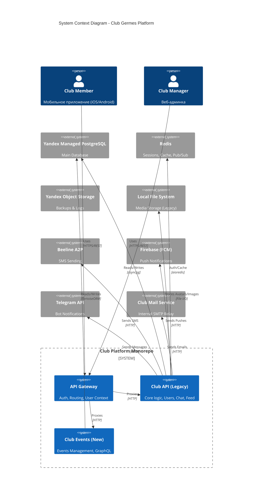

# Структура проекта

Этот проект представляет собой монорепозиторий, объединяющий бэкенд-микросервисы, фронтенд-приложения и инфраструктурные скрипты.

## Общая схема

```text
club-platform/
├── backend/                  # Все бэкенд-сервисы (Python)
│   ├── apps/
│   │   ├── club-api/         # Основной API (Legacy Core)
│   │   ├── club-users/       # Сервис пользователей и авторизации
│   │   ├── club-comments/    # Сервис комментариев
│   │   ├── club-events/      # Целевая архитектура (Litestar + GraphQL)
│   │   ├── club-gateway-m/   # API Gateway для мобильного приложения
│   │   └── club-media/       # Сервис загрузки и обработки медиа
│   ├── setup-all.sh          # Скрипт первоначальной настройки
│   └── start-all.sh          # Скрипт запуска (используется Makefile)
│
├── frontend/                 # Фронтенд-приложения
│   ├── club-manager/         # Админ-панель (Svelte + Tauri)
│   ├── club-client/          # Мобильное приложение (React Native / Expo)
│   └── ...
│
├── infrastructure/           # Инфраструктура
│   ├── postgres/             # Init-скрипты для БД
│   └── ...
│
├── club-docs/                # Документация (Writerside)
├── Makefile                  # Главная точка входа для управления проектом
└── docker-compose.yml        # Инфраструктура (Postgres, Redis)
```

## Контекстная диаграмма (C4 Context)



## Ключевые компоненты

### Backend
Весь бэкенд написан на **Python**.
Архитектура представляет собой набор микросервисов, работающих через **Honcho** в режиме разработки.

*   **Технологический стек:** Starlette, Uvicorn, asyncpg (или Tortoise ORM в новых сервисах).
*   **Межсервисное взаимодействие:** Преимущественно HTTP REST.
*   **База данных:** Единый инстанс PostgreSQL (разделение на схемы логическое).

#### Статусы сервисов
*   **club-api (Legacy):** Основной монолит, содержит большую часть бизнес-логики.
*   **club-events (Target):** Новый сервис на Litestar/GraphQL. Находится в стадии активной разработки и миграции функционала из монолита.
*   **club-gateway-m:** Точка входа для мобильного приложения (BFF).

### Frontend
*   **club-manager:** Настольное приложение для менеджеров клуба (Svelte).

### Infrastructure
Для локальной разработки используется гибридная схема:
*   **Docker:** Запускает только базы данных (Postgres, Redis).
*   **Local Process:** Микросервисы запускаются прямо в хост-системе через Python (venv).